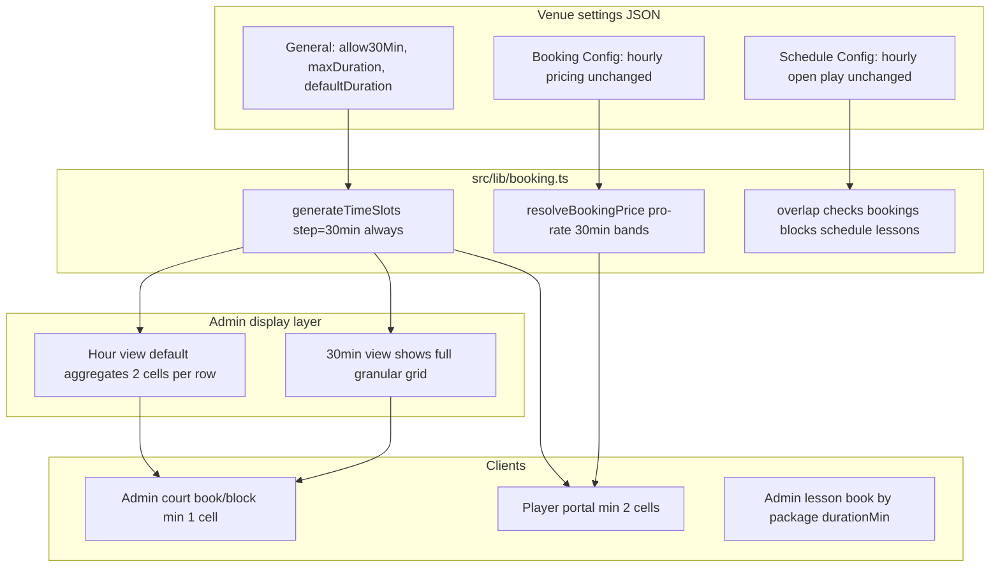

# 30-Minute Booking Grid Implementation Plan

## Architecture



### Constants and config shape

Extend [`BookingConfig`](src/lib/booking.ts) (stored in `venue.settings.bookingConfig`):

| Field | Default | Notes |
|-------|---------|-------|
| `gridGranularityMinutes` | `30` | Fixed constant in code; not exposed in admin UI |
| `allow30MinBookings` | `false` | General settings toggle |
| `defaultDurationMinutes` | `60` | Admin hint only in v1 |
| `maxDurationMinutes` | `480` (8h) | General settings |
| `slotDurationMinutes` | deprecated | Ignored for grid generation |

**Pricing rule:** each 30-min band = `0.5 × hourlyRate(startBand)`. Example: 18:00–19:30 with 100k@18h + 200k@19h → `100k + 0.5×200k = 200k`.

**Grid cell `priceValue`:** half-hour price; summing selected cells matches `resolveBookingPrice()` (server source of truth).

**API `slotCount`:** number of 30-min grid cells. `durationMinutes = slotCount × 30`.

**Start-time validation:** local minute must be `:00` or `:30`.

---

## Recheck log

| Topic | Resolution |
|-------|------------|
| **POST `/api/bookings`** | **Confirmed unused** — no caller in `src/` or `mobile/`. Staff uses `/api/staff/bookings`, player uses `/api/public/bookings`. **Remove POST handler** in Phase 3. |
| **`GET /api/bookings/availability`** | **Keep** — used by admin bookings, coaching, StaffBookingModal, EditBookingModalController |
| **`GET /api/bookings/mine` + `DELETE /api/bookings/[id]`** | Also unused by live frontend (player uses `/api/public/bookings`). Optional cleanup in Phase 3 — remove or leave with deprecation comment |
| **Admin grid density** | Default **1h view** (current UX); add **30min view** toggle — not 2× rows everywhere |
| **Admin lesson pricing** | Include in v1 (Phase 4b), not deferred |

---

## Branch setup (first step on execution)

```bash
git checkout -b feat/30min-booking-grid
```

Commit after each phase. Open a PR to `main` once all phases pass. Railway deploys on merge automatically.

---

## Phase 1 — Core kernel ([`src/lib/booking.ts`](src/lib/booking.ts))

1. **Add exports:** `GRID_GRANULARITY_MINUTES = 30`, `resolveBookingPrice(...)`, `intervalsOverlap(...)`
2. **Update `getBookingConfig()`** — new fields; ignore legacy `slotDurationMinutes`
3. **Rewrite `generateTimeSlots()`** — always 30-min steps; half-hour `priceValue`; no slot past close
4. **Fix `getAvailableSlots()`** — booking overlap; schedule hourly entries block on **any overlap**
5. **Replace `validateBookingConflict(courtId, date, startTime, endTime)`** — full span overlap
6. **Add helpers:** `validateBookingDuration`, `isValidGridStartTime`, `findConsecutiveAvailableSpan`

---

## Phase 2 — General settings UI

[`src/app/(admin)/admin/bookings/page.tsx`](src/app/(admin)/admin/bookings/page.tsx) — **`GeneralSettingsSection`** above Booking Config:

- Allow 30 min bookings (default off)
- Default booking duration — 60 min (30 if allow-on); admin hint only
- Max booking duration — 1h–8h (default 8h)

Remove `slotDurationMinutes` from Booking Config UI. Pricing grid stays hourly.

API/i18n/venue defaults per prior plan.

---

## Phase 3 — Booking write APIs + dead code removal

| Route | Action |
|-------|--------|
| [`src/app/api/public/bookings/route.ts`](src/app/api/public/bookings/route.ts) | `slotCount` = 30-min cells; `resolveBookingPrice`; player min 2 cells; span overlap in `$transaction`; max `maxDurationMinutes/30` |
| [`src/app/api/staff/bookings/route.ts`](src/app/api/staff/bookings/route.ts) | Same; staff min 1 cell |
| [`src/app/api/staff/bookings/[id]/route.ts`](src/app/api/staff/bookings/[id]/route.ts) | Reschedule preserves original duration; overlap + reprice |
| [`src/app/api/bookings/route.ts`](src/app/api/bookings/route.ts) | **Delete `POST` handler entirely** (only export nothing or remove file if empty — keep file absent POST) |
| [`src/app/api/bookings/availability/route.ts`](src/app/api/bookings/availability/route.ts) | **No change** — continues calling `getAvailableSlots` |
| [`src/app/api/bookings/mine/route.ts`](src/app/api/bookings/mine/route.ts) | Optional: remove if confirmed unused |
| [`src/app/api/bookings/[id]/route.ts`](src/app/api/bookings/[id]/route.ts) | Optional: remove DELETE if confirmed unused |

Verify with repo-wide grep before deleting mine/DELETE routes.

---

## Phase 4 — Admin grids: hour view (default) + 30min view

**Principle:** kernel always emits 30-min slots. Display layer aggregates for the default view.

### Grid granularity toggle

Add to [`VenueDayPlanner.tsx`](src/components/admin/VenueDayPlanner.tsx) (bookings + coaching day tabs):

- Toggle: **1h** (default) | **30min**
- Persist in `localStorage` (e.g. `bookings-slot-granularity`)
- **1h view:** current visual density — aggregate every 2 consecutive 30-min slots into one display row/column
- **30min view:** show raw 30-min grid (2× rows vs hour view)

[`StaffBookingModal.tsx`](src/components/admin/StaffBookingModal.tsx): same toggle (default **1h**); `compact` row height unchanged in hour view.

### [`BookingCourtGrid.tsx`](src/components/admin/BookingCourtGrid.tsx)

New prop: `displayGranularity: 'hour' | 'halfHour'` (default `'hour'`)

- **`halfHour`:** one row per 30-min slot (current span math: `durationMs / (30×60×1000)`)
- **`hour`:** aggregate pairs of slots for display:
  - Row label = hour start (9:00)
  - Row available if **both** underlying 30-min cells available (for display); click in hour view selects **2 cells** internally
  - Booking/lesson/block span cards: compute row span from actual timestamps against aggregated row height
  - Admin can switch to 30min view to book/block a single 30-min cell

### [`BookingTimeGrid.tsx`](src/components/admin/BookingTimeGrid.tsx)

Same `displayGranularity` prop:

- **Hour view:** aggregate pairs of 30-min columns into one hour column
- **30min view:** all columns (headers via `formatTime`)

### Selection + booking court flows

- [`BookingSelectionBar.tsx`](src/components/admin/BookingSelectionBar.tsx) — duration label (`1h 30`); price sum of cells
- [`bookings/page.tsx`](src/app/(admin)/admin/bookings/page.tsx) — block from ISO times; `availableSlotsForCourt` with N-cell span; no min cells for admin
- [`EditBookingModal.tsx`](src/components/admin/EditBookingModal.tsx) + controller — preserve duration on reschedule
- [`StaffBookingModal.tsx`](src/components/admin/StaffBookingModal.tsx) court mode — `maxDurationMinutes/30` cells

---

## Phase 4b — Admin coach lessons (1h / 1h30) in v1

New shared helper [`src/lib/lesson-slot-selection.ts`](src/lib/lesson-slot-selection.ts) (or extend [`coach-package-pricing.ts`](src/lib/coach-package-pricing.ts)):

```ts
cellsPerLesson(durationMin) => durationMin / 30   // 60→2, 90→3
lessonCount(selectedCells, durationMin) => selectedCells / cellsPerLesson
validateLessonSelection(cells, durationMin) => cells > 0 && cells % cellsPerLesson === 0
formatLessonDuration(durationMin) => "1h" | "1h30" | "2h"
lessonEndTime(start, durationMin, lessonCount) => start + durationMin * lessonCount
```

**Pricing:** `calculateSessionPrice(pkg, { slotCount: lessonCount, playerCount })` — **not** raw grid cell count.

**End time on create:** `startTime` + `pkg.durationMin × lessonCount` (API already accepts start/end; align client + [`src/app/api/admin/coach-lessons/route.ts`](src/app/api/admin/coach-lessons/route.ts) validation).

### [`StaffBookingModal.tsx`](src/components/admin/StaffBookingModal.tsx) lesson mode

- When package selected: require selection length = `cellsPerLesson × N` (N ≥ 1 consecutive lessons)
- Auto-snap or validate on submit; show `"1h30 · 1 session"` not `"3 slots (3h)"`
- Price via `calculateSessionPrice` with correct `slotCount`
- `submitLesson`: `endTime = start + durationMin × lessonCount`

### [`src/app/(admin)/admin/coaching/page.tsx`](src/app/(admin)/admin/coaching/page.tsx) — lesson edit/create panel

Same rules as StaffBookingModal (duplicate selection UI today at ~L832–1550):

- Replace `editSelectedSlots.length`h pricing with package-aware helpers
- Package form: duration preset **1h / 1h30 / 2h** → `durationMin` 60 / 90 / 120 (replace `parseInt(durationHours) * 60`)

### Server

- [`src/app/api/admin/coach-lessons/route.ts`](src/app/api/admin/coach-lessons/route.ts) — validate `(end - start) === durationMin × slotCount`; overlap on full lesson window

---

## Phase 5 — Player portal

[`book/page.tsx`](src/app/(book)/book/page.tsx) + [`confirm/page.tsx`](src/app/(book)/book/confirm/page.tsx):

- Always 30-min cells (no hour aggregation — matches tap picker spec)
- Min 2 cells unless `allow30MinBookings`
- Max from venue config; `formatTime` labels

---

## Phase 6 — CourtPass

[`courtpass-players/page.tsx`](src/app/(admin)/admin/courtpass-players/page.tsx) — 30-min start dropdown; cell-based `slotCount`; staff min 1.

---

## Phase 7 — Tests

[`src/lib/__tests__/booking-grid.test.ts`](src/lib/__tests__/booking-grid.test.ts):

- `resolveBookingPrice` cross-band example
- Slot generation + overlap
- `validateBookingDuration`
- Reschedule duration preservation

[`src/lib/__tests__/lesson-slot-selection.test.ts`](src/lib/__tests__/lesson-slot-selection.test.ts):

- 90-min package → 3 cells, 1 lesson, pricing slotCount = 1
- 2× 90-min back-to-back → 6 cells, slotCount = 2

---

## Phase 8 — Player coach portal (follow-up only)

- [`src/app/api/public/coaches/[id]/route.ts`](src/app/api/public/coaches/[id]/route.ts) — 30-min probe with `package.durationMin`; replace `isAnyCourtAvailableAtHour` with span overlap
- [`src/app/(book)/book/coaches/[coachId]/page.tsx`](src/app/(book)/book/coaches/[coachId]/page.tsx) — 30-min grid + lesson-slot-selection helpers; min 2 cells (60 min)

Admin coach work moves to **Phase 4b**.

---

## Migration and rollout

- No DB migration
- Existing bookings unchanged
- Default: `allow30Min: false`, `maxDuration: 480`, `defaultDuration: 60`
- Admin grid defaults to **1h view** — no visual regression for day-to-day staff

---

## Files touched (summary)

**Core:** `src/lib/booking.ts`, `src/lib/lesson-slot-selection.ts` (new)  
**API:** `public/bookings`, `staff/bookings`, `staff/bookings/[id]`, `admin/coach-lessons`; **remove** `POST` from `api/bookings/route.ts`  
**Admin UI:** `VenueDayPlanner`, `BookingCourtGrid`, `BookingTimeGrid`, `BookingSelectionBar`, `EditBookingModal*`, `CourtBlockModal`, `StaffBookingModal`, `admin/bookings/page.tsx`, `admin/coaching/page.tsx`  
**Player:** `book/page.tsx`, `book/confirm/page.tsx`  
**CourtPass:** `courtpass-players/page.tsx`  
**Tests:** `booking-grid.test.ts`, `lesson-slot-selection.test.ts`
