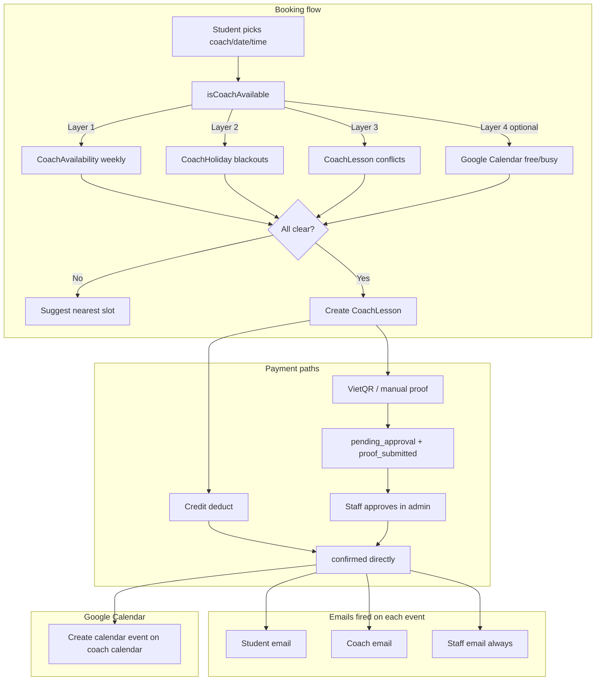

# Coach Lesson Booking Upgrade

## What the spec says vs. what the code confirms

The spec is accurate. A few clarifications from the code:

- The **booking UI already exists** (`/book/coaches/[coachId]/page.tsx`) with a full 3-step flow (profile → time picker → summary + credit/VietQR pay). No new CourtPass booking pages needed.
- The **availability endpoint** the UI uses is `GET /api/public/coaches/[id]?date=...`. This is the file to extend, not the court-availability route.
- `requirePortalAuth` only returns `{ playerId }`. To expose `isCoach`, it must also load the `Player.coachStaffId` from DB or the session token must carry it.
- `EmailLog` does **not** have a `recipientRole` column yet — migration needed.
- `CreditTransaction` model is **new** — migration needed.
- The existing `$executeRaw` credit deduct in the booking POST must be replaced with a proper transaction + `CreditTransaction` row.

---

## Architecture diagram



---

## Step 1 — Database migration

**File:** `prisma/schema.prisma` + new migration via `prisma migrate dev`

Changes:

- `CoachLessonStatus` enum: add `pending_approval`
- `StaffMember`: add `googleRefreshToken String?`, `googleCalendarId String?`, `calendarSyncEnabled Boolean @default(false)`, `creditPackageValidityDays Int @default(90)`
- `Player`: add `coachStaffId String?` + relation to `StaffMember`
- `EmailLog`: add `recipientRole String @default("student")`
- New model `CreditTransaction` (fields per spec §4.5)

Migration must be idempotent SQL (enum `ADD VALUE IF NOT EXISTS`, `IF NOT EXISTS` on table).

---

## Step 2 — `isCoachAvailable()` utility

**New file:** `src/lib/coach-availability.ts`

```typescript
export async function isCoachAvailable(
  coachId: string,
  date: Date,          // local-midnight
  startTime: Date,
  endTime: Date
): Promise<{ available: boolean; reason?: string }>
```

Four layers:
1. Query `CoachAvailability` for `dayOfWeek = date.getDay()`, check `startTime`/`endTime` strings overlap
2. Query `CoachHoliday` for date in `[startDate, endDate]`
3. Query `CoachLesson` for overlap with `status IN (confirmed, completed, pending_approval)`
4. If `StaffMember.calendarSyncEnabled`, call Google Calendar free/busy API using stored refresh token

Also export `findNextAvailableSlot(coachId, fromDate, durationMin)` for the "suggest nearest" UX.

**Wire into:**
- `GET /api/public/coaches/[id]` — replace the current simple lesson-conflict loop with `isCoachAvailable` for each hour slot
- `POST /api/public/coach-sessions` — call before creating the lesson, return 409 with nearest slot on failure

---

## Step 3 — `pending_approval` status + booking POST changes

**File:** `src/app/api/public/coach-sessions/route.ts`

- When paying by VietQR: create `CoachLesson` with `status: "pending_approval"` (not `confirmed`)
- When paying by credit: keep `status: "confirmed"` (payment already settled)
- Replace `$executeRaw` credit deduct with a Prisma `$transaction` that also creates a `CreditTransaction` row (`amount: -1, reason: "booked"`)
- `expiresAt` on `PlayerCoachCredit` at purchase: read `StaffMember.creditPackageValidityDays`, default 90

---

## Step 4 — Email notifications

**File:** `src/lib/email/send.ts`

Add `recipientRole: "student" | "coach" | "staff"` to `SendBookingEmailParams`. Build role-aware subject/body variants (coach and staff get slightly different copy than the student).

Add helper `sendLessonEventEmails(lesson, event)` that fires all three roles in parallel and logs each to `EmailLog` with the new `recipientRole` field.

**Wire into (each of these files):**
- `src/app/api/public/coach-sessions/[id]/proof/route.ts` — on proof submitted
- `src/modules/courtpay/lib/sepay.ts` → `handlePortalLessonPayment` and `handlePortalCreditPayment` — on auto-confirm
- `src/app/api/admin/coach-lessons/[id]/route.ts` (or wherever staff approves/rejects) — on approve/reject
- `POST /api/public/coach-sessions` — on credit booking confirmed

---

## Step 5 — Google Calendar sync

**New files:**
- `src/app/api/auth/coach-google-calendar/route.ts` — OAuth initiation (same `GOOGLE_CLIENT_ID`, scope `calendar.events`, `access_type: offline`, `prompt: consent`)
- `src/app/api/auth/callback/coach-google-calendar/route.ts` — exchanges code, stores `refresh_token` + `calendarId` on `StaffMember`
- `src/lib/google-calendar.ts` — `createCalendarEvent(refreshToken, calendarId, lesson)`, `deleteCalendarEvent(...)`, `getFreeBusy(refreshToken, calendarId, start, end)`

Wire:
- `createCalendarEvent` called when `CoachLesson.status` transitions to `confirmed`
- `deleteCalendarEvent` called on cancellation
- `getFreeBusy` called inside `isCoachAvailable()` layer 4

---

## Step 6 — Coach detection in CourtPass

**File:** `src/lib/portal-auth.ts`

Extend `requirePortalAuth` to also look up `Player.coachStaffId` and return `{ playerId, coachStaffId: string | null }`.

**File:** `src/app/(book)/book/components/usePlayerSession.tsx` (or equivalent hook)

Expose `isCoach: boolean` derived from `coachStaffId !== null`.

**File:** `src/app/(book)/book/components/BottomNav.tsx`

Add a 5th tab conditionally when `isCoach`:
```typescript
{ labelKey: "nav.myCoaching", href: "/book/coach-portal", icon: CoachPortalIcon, requiresAuth: true, coachOnly: true }
```

---

## Step 7 — CourtPass coach portal section

**New pages** under `src/app/(book)/book/coach-portal/`:
- `page.tsx` — hub with links to the three sub-sections
- `lessons/page.tsx` — My Lessons (read-only, upcoming + past), fetches from `GET /api/public/coach-sessions` filtered by `coachStaffId`
- `availability/page.tsx` — edit `CoachAvailability` + `CoachHoliday`, calls the existing `PUT /api/admin/coaches/[id]/weekly-availability` re-exposed as a coach-scoped public route

**New API route:** `PUT /api/public/coach-portal/availability` — validates that the authed player's `coachStaffId` matches the coachId being written, then delegates to the same Prisma calls as the admin route (no admin JWT needed).

Calendar Sync connect/disconnect button lives on the hub `page.tsx`, linking to the OAuth initiation route from step 5.

---

## Step 8 — Cancellation policy

**New API route:** `POST /api/public/coach-sessions/[id]/cancel`

Logic:
- Check `CoachLesson.startTime - now > 48h` → allow self-cancel; otherwise return 403 with "contact staff" message
- Update `CoachLesson.status = cancelled`, set `cancelledAt`
- If `paymentMethod === "credit"`: decrement `usedSessions` on `PlayerCoachCredit`, create `CreditTransaction(amount: +1, reason: "cancelled_refund")`
- If one-time paid: no refund logic
- Fire emails to all three roles

---

## Key files summary

| Area | Files to create or modify |
|---|---|
| Schema | `prisma/schema.prisma` + new migration |
| Availability logic | `src/lib/coach-availability.ts` (new) |
| Booking POST | `src/app/api/public/coach-sessions/route.ts` |
| Proof upload | `src/app/api/public/coach-sessions/[id]/proof/route.ts` |
| Cancellation | `src/app/api/public/coach-sessions/[id]/cancel/route.ts` (new) |
| Email util | `src/lib/email/send.ts` |
| Sepay webhook | `src/modules/courtpay/lib/sepay.ts` |
| Google Calendar | `src/lib/google-calendar.ts` (new), 2 new OAuth routes |
| Coach availability API | `src/app/api/public/coaches/[id]/route.ts` |
| Public coach-portal API | `src/app/api/public/coach-portal/availability/route.ts` (new) |
| BottomNav | `src/app/(book)/book/components/BottomNav.tsx` |
| Coach portal pages | 3 new pages under `src/app/(book)/book/coach-portal/` |
| portal-auth | `src/lib/portal-auth.ts` |
