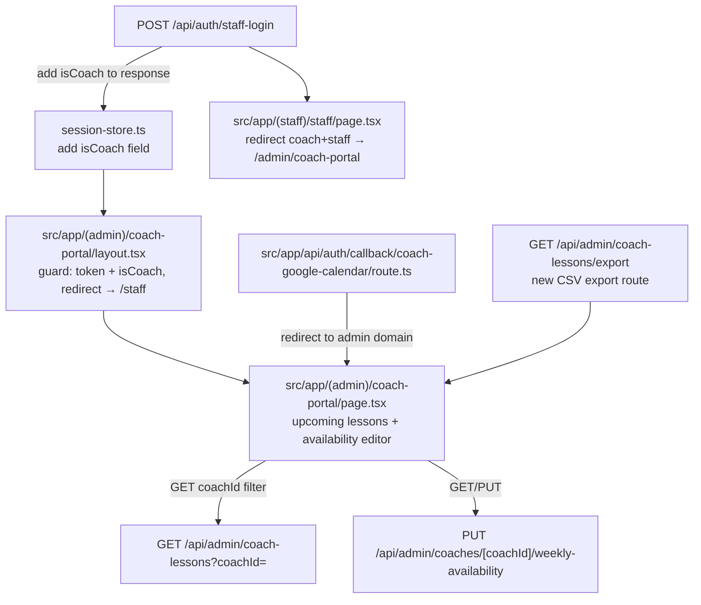

# Coach Staff Portal Plan

## Pre-implementation Findings

**Q1 — Can staff already mark lessons `completed`?** Yes. The Edit Lesson modal in `src/app/(admin)/admin/coaching/page.tsx` (line 1379) has four status buttons: `confirmed`, `completed`, `no_show`, `cancelled`. Staff can flip any lesson to `completed` there today. No code change needed; the CSV export will correctly count completed hours.

**Q2 — CSV auth hard check:** The route does not exist yet. Will be implemented as a hard server-side gate:
```ts
if (auth.id !== coachId && auth.role !== "manager" && auth.role !== "superadmin") {
  return NextResponse.json({ error: "Forbidden" }, { status: 403 });
}
```
This is enforced server-side, not just described in the plan.

**Q3 — OAuth callback cross-domain:** The CourtPass coach portal (`src/app/(book)/book/coach-portal/page.tsx` line 128) has a "Connect Calendar" button pointing to `/api/auth/coach-google-calendar`. After the callback redirect change, that button will still work — it will just redirect to `/admin/coach-portal` on success instead of staying on CourtPass. This is acceptable; no button removal needed.

**Q4 — Manager + isCoach:** Managers/superadmins with `isCoach: true` use the regular admin Coaching section. They are never routed to `/coach-portal`. Confirmed intentional.

**No migration needed.** `CoachLessonStatus` enum already has all required values.

## Architecture



## 1. Staff login — add `isCoach` to response

**File:** [`src/app/api/auth/staff-login/route.ts`](src/app/api/auth/staff-login/route.ts)

- The DB query already fetches from `staff_members`. Add `isCoach: true` to the `select`.
- Add `isCoach: staff.isCoach` to the response body alongside `role`, `name`, etc.

## 2. Session store — add `isCoach` field

**File:** [`src/stores/session-store.ts`](src/stores/session-store.ts)

- Add `isCoach: boolean | null` to `AuthState` interface (default `null`).
- `clearAuth` already resets all fields via spread — add `isCoach: null` to the reset.

## 3. Staff page — coach redirect logic

**File:** [`src/app/(staff)/staff/page.tsx`](src/app/(staff)/staff/page.tsx)

After `setAuth(...)`, add a check **before** `setShowRoleChoice(true)` in the `role === "staff"` branch:

```ts
if (data.staff.isCoach && data.staff.role === "staff") {
  router.replace("/admin/coach-portal");
  return;
}
```

Managers/superadmins with `isCoach: true` are unaffected — they fall through to the existing `setShowRoleChoice(true)` path.

Also pass `isCoach: data.staff.isCoach` in the `setAuth(...)` call.

## 4. Coach portal layout + page

### Layout guard
**New file:** `src/app/(admin)/coach-portal/layout.tsx`

Client component. Reads `token`, `role`, `isCoach` from `useSessionStore`. After hydration:
- No token → `router.replace("/staff")`
- `isCoach !== true` → `router.replace("/staff")`
- Renders children with no admin sidebar — just a minimal shell.

No relation to `src/app/(admin)/admin/layout.tsx` (that wraps `/admin/*` only; this wraps `/coach-portal/*`).

### Page
**New file:** `src/app/(admin)/coach-portal/page.tsx`

Three sections, dark theme matching existing admin styling:

**Header:** Coach name from `staffName` in session store + Logout button (`clearAuth()` → `/staff`).

**Upcoming Lessons (next 7 days):**
- Client fetch: `GET /api/admin/coach-lessons?coachId={staffId}` — already supports `coachId` filter.
- Date range: today → today+7, iterate dates or use a broader query and filter client-side.
- Display: list/table with date, time, player name, lesson type, status badge. Existing `STATUS_COLORS` and `STATUS_LABELS` pattern from [`src/app/(admin)/admin/coaching/page.tsx`](src/app/(admin)/admin/coaching/page.tsx).

**Edit Availability:**
- Reuse `GET /api/admin/coaches/[coachId]/weekly-availability` to load current schedule.
- Reuse `PUT /api/admin/coaches/[coachId]/weekly-availability` to save.
- UI: same day-toggle + time-range editor already in the `CoachProfileEditor` component — extract or reuse it directly.
- Coach's own `staffId` from session store = `coachId` param.

**Lesson History + CSV Export:**
- Date range filter (default last 30 days).
- Table: date, time, duration, player name, package/lesson type, status.
- Summary line: total completed hours in range.
- Export CSV button pattern from [`src/app/(admin)/admin/payroll/page.tsx`](src/app/(admin)/admin/payroll/page.tsx) — fetch blob, create anchor, click.

**New API route for CSV:** `src/app/api/admin/coach-lessons/export/route.ts`
- `GET ?coachId=&from=&to=&status=` (status defaults to `completed`, `all` includes all).
- Auth: `requireManagerOrSuperAdmin` OR validate that `auth.id === coachId` (staff self-access).
- Returns `text/csv` with columns: Date, Start Time, End Time, Duration (hours), Player Name, Lesson Type, Status.
- Summary row at bottom: total completed hours.

## 5. Google Calendar OAuth callback — update redirect

**File:** [`src/app/api/auth/callback/coach-google-calendar/route.ts`](src/app/api/auth/callback/coach-google-calendar/route.ts)

Replace all `${cpBase}/coach-portal` redirects (success + all error cases) with the admin-domain path `/admin/coach-portal`:

```ts
// Before
const cpBase = getCourtPassBase();
return NextResponse.redirect(`${cpBase}/coach-portal?calendarConnected=1`);

// After  
const appUrl = process.env.APP_URL ?? getBaseUrl(req);
return NextResponse.redirect(`${appUrl}/admin/coach-portal?calendarConnected=1`);
```

This covers the 1 success redirect and 4 error redirects. `APP_URL` is already set in `.env`.

## Files Changed / Created

- **Modified:** `src/app/api/auth/staff-login/route.ts` — add `isCoach` to response
- **Modified:** `src/stores/session-store.ts` — add `isCoach` field
- **Modified:** `src/app/(staff)/staff/page.tsx` — coach redirect + pass `isCoach` to `setAuth`
- **New:** `src/app/(admin)/coach-portal/layout.tsx` — auth guard, no sidebar
- **New:** `src/app/(admin)/coach-portal/page.tsx` — full portal page
- **New:** `src/app/api/admin/coach-lessons/export/route.ts` — CSV export for history
- **Modified:** `src/app/api/auth/callback/coach-google-calendar/route.ts` — fix redirect URLs
