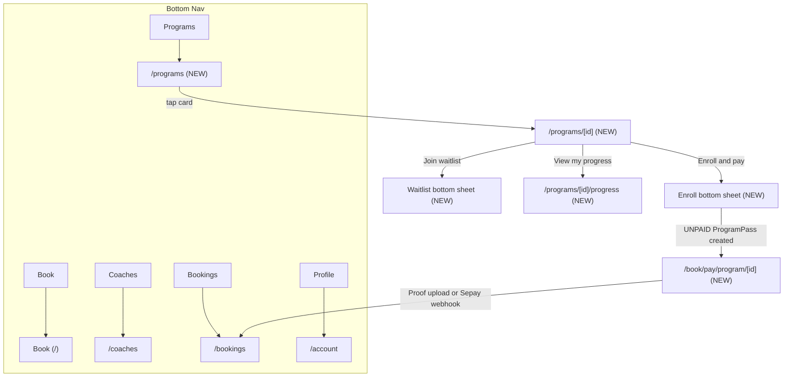

# CourtPass Programs Feature

## Scope

Six screens from the spec, all in the existing CourtPass PWA at `src/app/(book)/book/`. No new mobile native screens — the player UI is already a PWA.

## Architecture Overview



## Payment Flow (mirrors lesson flow exactly)

The enroll flow reuses the same pattern as `src/app/(book)/book/pay/lesson/[id]/page.tsx`:

1. Player taps "Enroll and pay" → bottom sheet shows order summary + "Confirm and pay" button
2. On confirm: `POST /api/public/program-runs/[id]/enroll` creates a `ProgramPass` (status `active`) + `ProgramPassPayment` (status `UNPAID`) and returns `{ programPassId, paymentRef, priceValue }`
3. Player is navigated to `/book/pay/program/[programPassId]` — a new page nearly identical to the lesson pay page
4. Page shows VietQR + payment ref + 5-min countdown (same hold timer pattern)
5. If `autoPayment` enabled: polls `/api/public/program-passes/[id]` every 5s; on `PAID` → redirect to `/book/bookings`
6. If not: player uploads proof → staff approves in admin → `PAID`

Key difference from the spec's open question: capacity is checked when `enrollInRun` is called (Step 2), not at QR generation. If the run fills before payment completes, the `ProgramPassPayment` remains `UNPAID` and staff handles manually (same as lesson payment).

`enrollInRun` needs a small change: currently it writes `status: "PAID"` immediately. We need to change it to accept an optional `paymentStatus` param and default to `"UNPAID"` for the CourtPass flow.

## Files to Create / Modify

### 1. Database — add `paymentRef` to `ProgramPassPayment`

The lesson pay page polls by `paymentRef`. `ProgramPassPayment` has no `paymentRef` column yet. Need a migration:

```sql
-- migrate:up
ALTER TABLE class_pass_payments
  ADD COLUMN IF NOT EXISTS payment_ref TEXT UNIQUE;

-- migrate:down
ALTER TABLE class_pass_payments DROP COLUMN IF EXISTS payment_ref;
```

Then `db:migrate` → `db:pull` → `prisma generate`.

### 2. Update `enrollInRun` in [`src/lib/program-run.ts`](src/lib/program-run.ts)

- Accept `paymentStatus?: "PAID" | "UNPAID"` (default `"UNPAID"` for portal, admin passes `"PAID"`)
- Accept `paymentRef?: string` and store it on `ProgramPassPayment`
- Return `{ programPassId, paymentId, paymentRef, enrolledCount, maxCapacity }`

### 3. Update `generatePaymentRef` in [`src/modules/courtpay/lib/payment-reference.ts`](src/modules/courtpay/lib/payment-reference.ts)

Add `"program-pass"` type → prefix `CF-PRG`. Add collision check against `class_pass_payments.payment_ref`.

### 4. New API routes (all under `src/app/api/public/`)

- `GET /program-runs?venueId=` — list upcoming/in-progress runs with `enrolledCount`, `passType`, `instances`, current player's enrollment status
- `GET /program-runs/[id]` — single run detail, full instance list, player enrollment + waitlist status  
- `POST /program-runs/[id]/enroll` — calls `enrollInRun` with `paymentStatus: "UNPAID"`, generates `paymentRef`, returns `{ programPassId, paymentRef, priceValue }`
- `GET /program-passes/[id]` — polling endpoint: returns `{ paymentStatus }` (used by pay page to detect `PAID`)
- `POST /program-passes/[id]/proof` — upload payment proof image (mirrors `coach-sessions/[id]/proof`)
- `POST /program-runs/[id]/waitlist` — write `ProgramRunWaitlistEntry` row
- `GET /program-runs/[id]/waitlist/status` — whether current player is on waitlist

All routes use the existing player JWT middleware (`requirePlayerAuth` from `src/lib/player-auth.ts`).

### 5. Sepay webhook handler — [`src/modules/courtpay/lib/sepay.ts`](src/modules/courtpay/lib/sepay.ts)

Add a `handleProgramPassPayment` handler (analogous to `handlePortalBookingPayment`). Match on `CF-PRG-` prefix from `extractPaymentRef`. On match: update `ProgramPassPayment.status = PAID`, `paidAt = now()`, `confirmedBy = "sepay"`.

Update `extractPaymentRef` in `payment-reference.ts` to also match `CF-PRG` references.

### 6. Bottom nav — [`src/app/(book)/book/components/BottomNav.tsx`](src/app/(book)/book/components/BottomNav.tsx)

Add Programs tab between Bookings and Profile:
```ts
{ labelKey: "nav.programs", href: "/book/programs", icon: ProgramsIcon, requiresAuth: false, coachOnly: false }
```

### 7. New PWA screens

- [`src/app/(book)/book/programs/page.tsx`](src/app/(book)/book/programs/page.tsx) — Screen 1: listing with filter pills, program cards, enrolled badge
- [`src/app/(book)/book/programs/[id]/page.tsx`](src/app/(book)/book/programs/[id]/page.tsx) — Screen 2: detail + CTA + bottom sheets for enroll/waitlist
- [`src/app/(book)/book/pay/program/[id]/page.tsx`](src/app/(book)/book/pay/program/[id]/page.tsx) — Screen 3 payment: VietQR + proof upload + Sepay polling (copy from lesson pay page, adapt for `ProgramPass`)
- [`src/app/(book)/book/programs/[id]/progress/page.tsx`](src/app/(book)/book/programs/[id]/progress/page.tsx) — Screen 5: session timeline with Attended/Next/Future states

Screen 4 (waitlist) is a bottom sheet within the detail page, not a separate route.

### 8. Bookings tab — [`src/app/(book)/book/bookings/page.tsx`](src/app/(book)/book/bookings/page.tsx)

Add a fourth `"programs"` sub-tab. Fetch enrolled programs from `GET /api/public/program-runs?enrolled=true`. Cards link to `/book/programs/[runId]/progress`.

### 9. i18n

Add a `programs` key group to:
- [`src/i18n/locales/book/en.json`](src/i18n/locales/book/en.json)
- [`src/i18n/locales/book/vi.json`](src/i18n/locales/book/vi.json)

Keys needed: `nav.programs`, `programs.title`, `programs.filterAll`, `programs.filterBeginner`, etc., `programs.full`, `programs.enrolled`, `programs.spotsLeft`, `programs.enroll`, `programs.joinWaitlist`, `programs.viewProgress`, `programs.emptyState`, `programs.confirmAndPay`, `programs.waitlistJoined`, `programs.sessionAttended`, `programs.sessionNext`, `programs.programComplete`.

## Build Order

1. Migration + `enrollInRun` update + `payment-reference` update + Sepay handler — these are backend foundations, no UI depends on them
2. All 7 new API routes — can be tested with curl/Postman before any UI
3. Bottom nav + Programs listing page (Screen 1)
4. Program detail page (Screen 2) with enroll/waitlist bottom sheets
5. Program pay page (Screen 3) — copy from lesson pay, adapt
6. Session progress page (Screen 5)
7. Bookings tab "Programs" sub-tab
8. i18n strings (can be done in parallel with any step)
