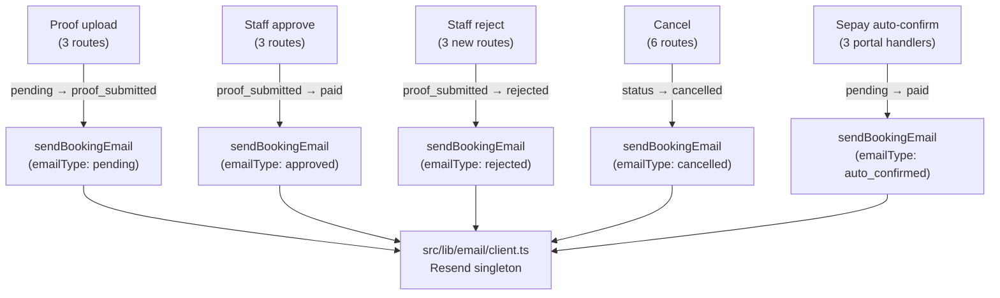

# Email Notifications — 7-Stage Implementation Plan

## Architecture



---

## Stage 1 — Resend setup

**New files:** `src/lib/email/client.ts`, `src/lib/email/send.ts`
**Modified:** `.env.example`, `package.json` (via npm install)

- `npm install resend`
- Add `RESEND_API_KEY=re_placeholder` to `.env.example`
- `client.ts` exports a lazy singleton: `new Resend(process.env.RESEND_API_KEY)`
- `send.ts` exports one function:

```ts
export async function sendBookingEmail(params: {
  to: string;
  playerName: string;
  bookingType: "court" | "open_play" | "coach";
  emailType: "pending" | "approved" | "rejected" | "cancelled" | "auto_confirmed";
  details: {
    venueName?: string;
    date?: string;
    time?: string;
    amount?: number;
    rejectionReason?: string;
  };
}): Promise<void>
```

- Five template strings inside (no React Email), one per `emailType`, adapting noun to `bookingType`
- Sender: `noreply_bookings@thecourtflow.com`
- The `resend.emails.send` call is wrapped in `try/catch` — errors are `console.error`'d and never re-thrown
- No calls to this function yet

---

## Stage 2 — EmailLog migration

**Modified:** `prisma/schema.prisma`
**New:** `prisma/migrations/YYYYMMDD_add_email_log/`

New model added to schema:

```prisma
model EmailLog {
  id              String   @id @default(cuid())
  playerId        String   @map("player_id")
  bookingType     String   @map("booking_type")
  bookingId       String   @map("booking_id")
  emailType       String   @map("email_type")
  resendMessageId String?  @map("resend_message_id")
  sentAt          DateTime @default(now()) @map("sent_at")
  status          String   @default("sent")

  @@index([bookingId, emailType])
  @@map("email_logs")
}
```

Migration name: `add_email_log`
The table is created but **nothing writes to it yet** (wired up later when needed).

---

## Stage 3 — Reject endpoints + schema columns

**Two operations, one migration.**

### 3a. Schema changes
Add to `Booking`, `OpenPlayRegistration`, and `CoachLesson` in `prisma/schema.prisma`:

```prisma
rejectedAt       DateTime? @map("rejected_at")
rejectedBy       String?   @map("rejected_by")
rejectionReason  String?   @map("rejection_reason")
```

Migration name: `add_payment_rejection_fields`

### 3b. Three new route files

**[`src/app/api/admin/bookings/[id]/reject-payment/route.ts`](src/app/api/admin/bookings/[id]/reject-payment/route.ts)**
- Auth: `requireAuth` (mirrors approve-payment in same dir)
- Guard: `paymentStatus !== "proof_submitted"` → 400
- Update: `{ paymentStatus: "rejected", rejectedAt: new Date(), rejectedBy: auth.id, rejectionReason: body.reason }`
- Include: `{ court: { select: { label: true } }, player: { select: { name: true } } }` (same shape as approve, no email yet)

**[`src/app/api/admin/open-play/[id]/reject-payment/route.ts`](src/app/api/admin/open-play/[id]/reject-payment/route.ts)**
- Auth: `requireManagerOrSuperAdmin` + `assertVenueAccess` (mirrors approve-payment in same dir)
- Same guard and field set
- Include: `{ player: { select: { name: true } } }`

**[`src/app/api/admin/coach-lessons/[id]/reject-payment/route.ts`](src/app/api/admin/coach-lessons/[id]/reject-payment/route.ts)**
- Auth: `requireManagerOrSuperAdmin` (mirrors approve-payment in same dir)
- Update: `{ paymentStatus: "rejected", paidAt: null, rejectedAt: new Date(), rejectedBy: auth.id, rejectionReason: body.reason }`
- Include: `{ coach: { select: { id: true, name: true } }, player: { select: { id: true, name: true } } }`

No email calls added in this stage.

---

## Stage 4 — Proof upload routes (emailType: `pending`)

**Modified files:**
- [`src/app/api/public/bookings/[id]/proof/route.ts`](src/app/api/public/bookings/[id]/proof/route.ts)
- [`src/app/api/public/open-play/[id]/proof/route.ts`](src/app/api/public/open-play/[id]/proof/route.ts)
- [`src/app/api/public/coach-sessions/[id]/proof/route.ts`](src/app/api/public/coach-sessions/[id]/proof/route.ts)

In all three: the `findFirst` guard query does **not** select the player, and the `update` has no `include`. After the `prisma.*.update` call, add a `prisma.player.findUnique({ where: { id: playerId }, select: { name: true, email: true } })` (using the `playerId` already in scope from `requirePortalAuth`), then call `sendBookingEmail`. No change to the upload logic itself.

---

## Stage 5 — Approve and reject routes (emailType: `approved` / `rejected`)

**Modified files (approve):**
- [`src/app/api/admin/bookings/[id]/approve-payment/route.ts`](src/app/api/admin/bookings/[id]/approve-payment/route.ts) — widen `player: { select: { name: true, email: true } }`
- [`src/app/api/admin/open-play/[id]/approve-payment/route.ts`](src/app/api/admin/open-play/[id]/approve-payment/route.ts) — same
- [`src/app/api/admin/coach-lessons/[id]/approve-payment/route.ts`](src/app/api/admin/coach-lessons/[id]/approve-payment/route.ts) — widen to `{ id: true, name: true, email: true }`

**Modified files (reject):** The three routes created in Stage 3 — widen their `player` select identically and add the `sendBookingEmail` call with `emailType: "rejected"` and `details.rejectionReason`.

All six: call `sendBookingEmail` after the `prisma.*.update`, using the `email` and `name` now available on `updated.player`.

---

## Stage 6 — Cancel routes (emailType: `cancelled`)

Six files, two strategies depending on whether the player is already in scope:

| File | Player in scope? | Strategy |
|---|---|---|
| [`src/app/api/public/bookings/[id]/route.ts`](src/app/api/public/bookings/[id]/route.ts) DELETE | `playerId` from `requirePortalAuth`, no email | Add `prisma.player.findUnique` after update |
| [`src/app/api/bookings/[id]/route.ts`](src/app/api/bookings/[id]/route.ts) DELETE | `auth.id` from `requireAuth`, no email | Add `prisma.player.findUnique` after update |
| [`src/app/api/staff/bookings/[id]/route.ts`](src/app/api/staff/bookings/[id]/route.ts) PATCH (cancelled only) | `player` included in update response | Widen `player` select to add `email`, use it directly; skip for `no_show` branch |
| [`src/app/api/public/open-play/[id]/route.ts`](src/app/api/public/open-play/[id]/route.ts) DELETE | `playerId` from `requirePortalAuth`, no email | Add `prisma.player.findUnique` after update |
| [`src/app/api/admin/open-play/[id]/route.ts`](src/app/api/admin/open-play/[id]/route.ts) PATCH action "cancel" | No include on `update` | Add `prisma.player.findUnique` after update using `updated.playerId` |
| [`src/app/api/admin/coach-lessons/[id]/route.ts`](src/app/api/admin/coach-lessons/[id]/route.ts) DELETE and PATCH status "cancelled" | `player` included in PATCH update, not in DELETE | PATCH: widen select; DELETE: add `prisma.player.findUnique` after update |

---

## Stage 7 — Sepay auto-confirm (emailType: `auto_confirmed`)

**Modified file:** [`src/modules/courtpay/lib/sepay.ts`](src/modules/courtpay/lib/sepay.ts)

**Only three functions are touched:**

| Function | Lines | Booking model | bookingType |
|---|---|---|---|
| `handlePortalBookingPayment` | 74–88 | `Booking` | `"court"` |
| `handlePortalLessonPayment` | 90–104 | `CoachLesson` | `"coach"` |
| `handlePortalOpenPlayPayment` | 106–120 | `OpenPlayRegistration` | `"open_play"` |

In all three, the current `findFirst` fetches only the record itself (no player relation). After the `prisma.*.update` that sets `paymentStatus: "paid"`, add a `prisma.player.findUnique` using the `booking/lesson/reg.playerId` to get `name` and `email`, then call `sendBookingEmail` with `emailType: "auto_confirmed"`.

**The `processSepayWebhook` function (lines ~147–283) and its `PendingPayment` update block (lines 199–207) are not touched at all.** This is the CourtPay check-in path and is explicitly out of scope.

Before making any edits in Stage 7, the full bodies of all three portal handler functions will be shown for confirmation as specified.
