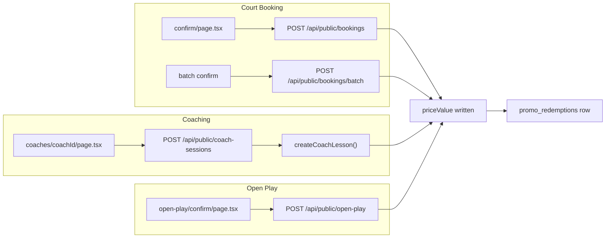

# Marketing Campaigns — Implementation Plan

## Spec Review Summary

The spec is solid and well-sequenced. A few adjustments based on codebase investigation:

| Topic | Spec says | Codebase reality | Recommendation |
|---|---|---|---|
| Primary keys | `uuid` | All models use `cuid()` | Use `cuid()` for consistency |
| Price columns | `numeric` | `Booking.priceValue`, etc. are `Int` (org currency units) | Use `INTEGER` for `discount_value`, `discount_amount`, `original_price`, `final_price` |
| Campaign name / ad copy | Not in schema | Mockup + your choice: persist them | Add `name`, `post_text`, `headline` columns to `promo_codes` |
| Channel column in list | Per-campaign badge | Channel is per-click/redemption (`utm_source`) | Derive "top channel" from `promo_redemptions` / `promo_link_clicks` aggregates, not a stored field |
| Funnel middle steps | "Reached booking" / "Started checkout" | No event logging exists (no PostHog, no funnel table) | **Defer** middle funnel steps in v1; show clicks → redeemed only; hide or label middle steps as "Coming soon" |
| Membership perk stacking | Reject if perk applied | No membership perk discount in checkout yet | Add validation hook in shared promo lib; returns `membership_discount_active` error code for future wiring |
| ID on redemption `booking_id` | Polymorphic FK | `Booking`, `CoachLesson`, `OpenPlayRegistration` are separate tables | Store `booking_id` + `booking_type` enum; no FK constraint (or three nullable FKs — prefer single id + type, matching spec) |

**Checkout flow map** (where price is set — promo must hook here):



**Session persistence**: CourtPass already uses `sessionStorage` (e.g. [`reset-login-prefill.ts`](src/app/(book)/book/lib/reset-login-prefill.ts)). Reuse that pattern for `promo`, `utm_source`, and a new `device_session_id` (generated once per browser session via `crypto.randomUUID()`).

**Promo link base URL**: Use `NEXT_PUBLIC_COURTPASS_URL` (same as [`middleware.ts`](src/middleware.ts) / magic links), format:
`{COURTPASS_URL}/book?promo={CODE}&utm_source={channel}`

---

## Stage 1 — Investigation (read-only, already done)

Key findings to carry forward:

- **CourtPass entry**: [`src/app/(book)/book/page.tsx`](src/app/(book)/book/page.tsx) — add promo param capture on mount
- **Confirm UIs**: [`confirm/page.tsx`](src/app/(book)/book/confirm/page.tsx), [`open-play/confirm/page.tsx`](src/app/(book)/book/open-play/confirm/page.tsx), [`coaches/[coachId]/page.tsx`](src/app/(book)/book/coaches/[coachId]/page.tsx)
- **Price authority**: server-side in [`bookings/route.ts`](src/app/api/public/bookings/route.ts), [`coach-lesson.ts`](src/lib/coach-lesson.ts), [`open-play/route.ts`](src/app/api/public/open-play/route.ts) — client URL `price` param is display-only
- **Venue scoping**: [`AdminVenuePicker`](src/components/admin/AdminVenuePicker.tsx) + `requireAdminAccess` pattern from [`memberships/route.ts`](src/app/api/admin/memberships/route.ts)
- **Drawer pattern**: right slide-over in [`memberships/page.tsx`](src/app/(admin)/admin/memberships/page.tsx) (lines 775–827)
- **Charts**: `recharts` already used in [`venue-analytics/page.tsx`](src/app/(admin)/admin/venue-analytics/page.tsx)
- **Currency**: read from `Organization.currency` via `Venue → Organization` join (not hardcoded VND)
- **No RN parity needed**: admin + CourtPass are PWA-only surfaces

---

## Stage 2 — Schema Migration

Create via `npm run db:new create_promo_codes`.

### New enums (idempotent `DO $$ ... $$`)
- `PromoDiscountType`: `percent`, `fixed`, `free`
- `PromoAppliesTo`: `court_booking`, `coaching`, `open_play`, `all`
- `PromoBookingType`: `court_booking`, `coaching`, `open_play`

### `promo_codes` table
All spec columns **plus**:
- `name TEXT NOT NULL` — display name ("Weekend Warmup 20%")
- `post_text TEXT` — ad body copy (nullable)
- `headline TEXT` — link card headline (nullable)

Use `TEXT` id with `@default(cuid())` (not uuid). Unique index on `(venue_id, UPPER(code))` via functional index or enforce uppercase on write.

`starts_at` / `ends_at`: `TIMESTAMP(6) WITHOUT TIME ZONE` — construct with `+07:00` offset per timezone rule.

### `promo_redemptions` + `promo_link_clicks`
Per spec, with indexes on `promo_code_id`, `player_id`, `device_session_id`.

After migrate: `npm run db:pull` + `npm run db:generate`. Commit migration SQL, `db/schema.sql`, `prisma/schema.prisma`.

---

## Module Structure

All marketing/promo code lives under a single isolated module: **`src/modules/marketing/`**. Nothing outside this folder imports from it except:
- Booking handlers (Stages 4–5) call the lib functions via `import { validatePromoCode, redeemPromoCode } from "@/modules/marketing/lib/promo-code"`
- Admin page and API routes import from the module's public surface

This mirrors how `src/modules/courtpay/` is structured today (lib/, components/, types.ts).

```
src/modules/marketing/
├── lib/
│   └── promo-code.ts          # core engine: normalize, compute, validate, redeem, logClick
├── components/
│   └── PromoCodeInput.tsx     # CourtPass "Have a promo code?" shared component
├── hooks/
│   └── usePromoCapture.ts     # sessionStorage capture hook (was book/lib/)
└── types.ts                   # shared TS types: PromoCode, PromoRedemption, ValidateResult, etc.
```

The admin API routes live at `src/app/api/admin/marketing-campaigns/` (standard Next.js route location, same as all other admin routes) and import from `@/modules/marketing/lib/promo-code`.

The CourtPass public API routes live at `src/app/api/public/promo/` and import from the same module lib.

**Isolation guarantee**: removing or disabling the entire marketing module requires only:
1. Deleting `src/modules/marketing/`
2. Removing the optional `promoCode`/`deviceSessionId` params from the 4 booking handlers (which are no-ops when absent)
3. Removing the admin nav entry and route folder

---

## Stage 3 — Shared Promo Library

New file: [`src/modules/marketing/lib/promo-code.ts`](src/modules/marketing/lib/promo-code.ts)

Shared types in [`src/modules/marketing/types.ts`](src/modules/marketing/types.ts) — exported interfaces used by both the lib and the API routes.

Core functions:

**`normalizePromoCode(code)`** — uppercase + trim.

**`computeDiscount(promo, originalPrice)`** — discount math only, no DB access:
- `percent`: `discountAmount = Math.round(originalPrice * value / 100)`, `finalPrice = originalPrice - discountAmount`
- `fixed`: `discountAmount = Math.min(value, originalPrice)` (never negative), `finalPrice = originalPrice - discountAmount`. The `discount_value` stored in the DB is already in the **venue's organization currency** (e.g. VND or THB) — the admin form label/hint must show the correct currency symbol (read from `Organization.currency` via the venue join when serving the create form); no currency conversion is performed here, just arithmetic on integers
- `free`: `discountAmount = originalPrice`, `finalPrice = 0`, `discount_value` is ignored entirely

**`validatePromoCode({ code, venueId, playerId, bookingType, originalPrice, tx? })`** — runs all 7 checks in order:
1. Code exists for venue (case-insensitive)
2. `is_active` is true
3. Current time within `starts_at` / `ends_at`
4. `applies_to` matches `bookingType` (or is `all`)
5. `redemption_count < max_redemptions` (if set)
6. Player's redemption count for this code `< max_redemptions_per_player` (if set)
7. **Membership stacking check** — this hook exists as a named check in the code with an explicit comment: `// TODO: when membership perk discounts ship, query active membership perks here and return { valid: false, reason: "membership_discount_active" } if one is applied to this booking. No-op today since no perk discounts exist in checkout yet.` — returns `{ valid: true }` in v1, but the check slot is present and documented so it cannot be forgotten.

Returns `{ valid: true, promo, discountAmount, finalPrice }` or `{ valid: false, reason: string }`.

**`redeemPromoCode({ promoId, playerId, bookingId, bookingType, originalPrice, discountAmount, finalPrice, deviceSessionId, utmSource, tx })`** — must run inside the same `$transaction` as the booking write:
- Atomically increments `redemption_count` using a conditional update (`WHERE redemption_count < max_redemptions OR max_redemptions IS NULL`); if 0 rows updated, the cap was just hit — return a distinct error so the caller can surface it gracefully
- Inserts `promo_redemptions` row with snapshotted `original_price`, `discount_amount`, `final_price`
- Attributes `first_click_id` by looking up the most recent `promo_link_clicks` row matching `promo_code_id` + (`device_session_id` OR `player_id`); sets `first_click_id` if found, leaves null if not

**`logPromoLinkClick({ code, venueId, utmSource, deviceSessionId, playerId? })`** — fire-and-forget; silent no-op if code not found (do not throw).

---

## CourtPass UX Decisions (confirmed)

### Marketing URL → auto-filled promo field
Flow is intentionally simple — one field, one source of truth:

1. Player clicks marketing link: `?promo=WARMUP20&utm_source=facebook`
2. On CourtPass load, capture `promo` + `utm_source` into `sessionStorage` (no validation yet)
3. At checkout, the **"Have a promo code?"** section opens with the input **pre-filled** from sessionStorage
4. On checkout load, **auto-apply** validation against the pre-filled code (player sees discount + updated total immediately)
5. Player can still edit or remove the code manually before confirming

No separate "hidden promo state" beyond sessionStorage + the visible input. The field the player sees is always what gets sent to the server on confirm.

### Free pass = 100% discount = FREE
`discount_type: free` means a **free pass** — functionally identical to 100% off:

- `final_price = 0` always (regardless of original price)
- `discount_amount = original_price` (full value waived)
- `discount_value` column is **null / unused** when type is `free`
- Admin Create form label: **"Free (100% off)"** — selecting it hides/disables the discount value input
- CourtPass checkout shows total as **FREE** / `0 ₫` (reuse existing free-session copy where applicable, e.g. open play)
- Redemption row snapshots `original_price` and `final_price = 0` for analytics

This is distinct from `percent` with value `100` only in that `free` is explicit in the schema and skips value validation — cleaner for "complimentary session" campaigns.

---

## Stage 4 — CourtPass: Capture + Checkout UI

### 4a. Capture on page load
New hook: [`src/modules/marketing/hooks/usePromoCapture.ts`](src/modules/marketing/hooks/usePromoCapture.ts)
- Read `promo` + `utm_source` from URL on [`book/page.tsx`](src/app/(book)/book/page.tsx) mount (and any deep-link entry that carries params)
- Persist to `sessionStorage` keys: `cf_promo_code`, `cf_utm_source`, `cf_device_session_id`
- Fire-and-forget `POST /api/public/promo/click` (new route, no auth required; accepts optional `playerId` from session)
- **Do not validate at capture time** — just store and carry forward

### 4b. "Have a promo code?" at checkout
New shared component: [`src/modules/marketing/components/PromoCodeInput.tsx`](src/modules/marketing/components/PromoCodeInput.tsx)
- Collapsed by default; **pre-fills input from sessionStorage** when a marketing URL was used
- **Auto-applies** validation on mount when pre-filled (calls `POST /api/public/promo/validate`)
- Player can edit or clear the field; re-validate on manual "Apply"
- Shows applied discount, updated total (FREE when `discount_type: free`), remove button, inline errors

Wire into:
- [`confirm/page.tsx`](src/app/(book)/book/confirm/page.tsx) — `bookingType: court_booking`
- [`open-play/confirm/page.tsx`](src/app/(book)/book/open-play/confirm/page.tsx) — `bookingType: open_play`
- [`coaches/[coachId]/page.tsx`](src/app/(book)/book/coaches/[coachId]/page.tsx) — injected into the booking drawer/modal's price summary step (there is no separate confirm page for coaching; the confirm flow is embedded inside this 900+ line page as an inline modal step around line 285)

Pass `promoCode` + `deviceSessionId` in the POST body when confirming.

### 4c. i18n
Add keys to **all three** CourtPass locale files: `src/i18n/locales/book/en.json`, `vi.json`, and `th.json` (Thai is also a supported language). Keys needed:
- `promo.haveCode` — "Have a promo code?"
- `promo.placeholder` — "Enter code"
- `promo.apply` — "Apply"
- `promo.remove` — "Remove"
- `promo.applied` — "Promo applied"
- `promo.discount` — "Discount"
- `promo.free` — "FREE"
- `promo.errors.notFound`, `promo.errors.expired`, `promo.errors.limitReached`, `promo.errors.notApplicable`, `promo.errors.alreadyUsed`

---

## Stage 5 — Backend: Validate + Redeem at Booking Creation

### New routes
- `POST /api/public/promo/click` — log click (Stage 3)
- `POST /api/public/promo/validate` — validate only (Stage 4 UI)

### Integrate redemption into booking POST handlers
In each handler, after computing `originalPrice` / `totalPrice`, before writing:

1. If `promoCode` present: call `validatePromoCode` again (race-safe)
2. If valid: set `priceValue = finalPrice`, then `redeemPromoCode` in same `$transaction`
3. If invalid at confirm time (cap hit): proceed at full price, return warning in response (don't block booking per spec)

Files to modify:
- [`src/app/api/public/bookings/route.ts`](src/app/api/public/bookings/route.ts)
- [`src/app/api/public/bookings/batch/route.ts`](src/app/api/public/bookings/batch/route.ts)
- [`src/lib/coach-lesson.ts`](src/lib/coach-lesson.ts) — accept optional `promoCode` + `deviceSessionId` in params; call `validatePromoCode` and `redeemPromoCode` imported from `@/modules/marketing/lib/promo-code`. **No promo logic is written inside this file** — it is a thin call-through only. The module owns all discount math, validation, and DB writes for promo tables.
- [`src/app/api/public/open-play/route.ts`](src/app/api/public/open-play/route.ts) + [`src/lib/open-play.ts`](src/lib/open-play.ts) — same pattern: accept promo params, call `validatePromoCode` / `redeemPromoCode` from the module. **No promo logic duplicated here either.**

**Isolation rule at this seam:** `src/lib/coach-lesson.ts` and `src/lib/open-play.ts` must contain zero promo-specific logic beyond:
1. Accepting the optional `promoCode` + `deviceSessionId` input params
2. A single import from `@/modules/marketing/lib/promo-code`
3. Three call sites: `validatePromoCode(...)`, `redeemPromoCode(...)` inside the transaction, and reading `finalPrice` as the `priceValue` to write

If at any point discount math, DB queries against `promo_codes`/`promo_redemptions`/`promo_link_clicks`, or redemption counting logic appears in these files, it is a module boundary violation and must be moved back into the module.

Clear promo sessionStorage keys after successful redemption.

---

## Stage 6 — Admin: Marketing Campaigns Page

### Nav
Add to CourtPass section in [`layout.tsx`](src/app/(admin)/admin/layout.tsx):
- Route: `/admin/marketing-campaigns`
- Icon: `Megaphone` (lucide)
- `requiresAccess: "courtpass_staff"`
- i18n: `nav.marketingCampaigns` in [`en.json`](src/i18n/locales/admin/en.json) + `vi.json`

### Page: [`src/app/(admin)/admin/marketing-campaigns/page.tsx`](src/app/(admin)/admin/marketing-campaigns/page.tsx)

Three tabs matching mockup ([`courtflow-marketing-campaigns (2).html`](UPDATE_Marketing/courtflow-marketing-campaigns%20(2).html)):

**Campaigns tab**
- KPI row: active campaigns, total redemptions (+ week delta), revenue generated, avg conversion (clicks → redeemed)
- Table: name + code, top channel (derived), status (active/scheduled/ended from dates + `is_active`), clicks, redeemed/cap, revenue, end date
- Row click → detail drawer

**Create tab**
- Form: name, code, discount type/value, applies_to, dates, max redemptions, max per player, post_text, headline
- Live Facebook preview card (static mock, driven by form state)
- Channel link list (Facebook, Instagram, WhatsApp, Zalo, Direct) with copy buttons
- "Launch campaign" → `POST /api/admin/marketing-campaigns`

**Analytics tab**
- Redemptions-by-day bar chart (`recharts`, same pattern as venue-analytics)
- Channel split (% by `utm_source` from redemptions)
- Conversion funnel: **v1 shows Link clicks + Redeemed only**; middle steps hidden or marked "Requires funnel tracking (follow-up)"
- Recent redemptions feed

**Detail drawer** (right slide-over, memberships pattern)
- KPIs: redemptions, revenue (`SUM(final_price)`), median time-to-convert (exclude null `first_click_id`)
- Redemption table: player name/phone, redeemed_at, discount_amount, convert badge (instant / same-day / deliberated / no click on record)

### Admin API routes
- `GET /api/admin/marketing-campaigns?venueId=` — list + aggregates (clicks, redemptions, revenue, status)
- `POST /api/admin/marketing-campaigns` — create promo_codes row
- `GET /api/admin/marketing-campaigns/[id]` — detail + redemption rows
- `PATCH /api/admin/marketing-campaigns/[id]` — toggle `is_active`, edit dates/limits
- `GET /api/admin/marketing-campaigns/analytics?venueId=&range=` — analytics tab aggregates

All routes use `requireAdminAccess` + venue scoping.

### Styling
Match existing admin dark theme (`neutral-950`, `neutral-800` borders, purple accents) rather than porting the mockup's orange theme wholesale — layout and information architecture from the HTML, visual tokens from the admin panel.

---

## Explicit Invariants (code must enforce these, not just the plan)

**No reversal on cancellation or refund**
When a booking that used a promo code is cancelled or refunded, the following must NOT happen:
- `promo_codes.redemption_count` must NOT be decremented
- `promo_redemptions` row must NOT be deleted or soft-deleted

This applies to all three booking types. Cancellation routes (`/api/public/bookings/[id]`, `/api/public/coach-sessions/[id]/cancel`, `/api/public/open-play/[id]`) must not touch promo tables at all. Leave a comment at each cancellation write point: `// Intentional: promo redemption_count is NOT reversed on cancellation — a cap slot is consumed permanently at redemption time.`

**Credit package purchases are excluded from promo eligibility in v1**
`applies_to` covers `court_booking`, `coaching`, `open_play`, and `all` — "all" means all three of these, not credit purchases. The `PromoCodeInput` component is NOT added to [`pay/credit/[id]/page.tsx`](src/app/(book)/book/pay/credit/[id]/page.tsx) or [`coaches/[coachId]/buy-credits/page.tsx`](src/app/(book)/book/coaches/[coachId]/buy-credits/page.tsx). No silent breakage — these flows simply don't have the promo field.

---

## Suggested Follow-ups (not blocking v1)

1. **Funnel event logging** — `promo_funnel_events` table or PostHog for "reached booking" / "started checkout" middle steps
2. **Membership perk integration** — wire real perk detection into the `validatePromoCode` check #7 stub (already scaffolded with a TODO comment) when membership checkout discounts ship
3. **Edit campaign** — v1 is create + kill switch (`is_active`); full edit form can come later
4. **Credit package promos** — if credit purchases should become promo-eligible, add `PromoCodeInput` to credit checkout flows and add a `credit_purchase` value to the `PromoAppliesTo` enum

---

## Test Plan

- Create a percent promo → copy Facebook link → open in incognito → confirm code **auto-fills and auto-applies** at court checkout → discount applied → `promo_redemptions` row with `first_click_id`
- Create a **free pass** promo → checkout total shows FREE / 0 → `final_price = 0`, `discount_amount = original_price` in redemption row
- Cap test: set `max_redemptions: 1`, two concurrent checkouts → one succeeds, one gets full price gracefully
- Per-player cap: same player redeems twice → second validate fails
- `applies_to: coaching` → rejected on court booking
- Admin drawer: median convert, "no click on record" for direct code entry
- Scheduled campaign: `starts_at` in future → status "Scheduled", validate returns not-yet-active
- Currency label in admin form reflects org currency (VND vs THB) — served from `Organization.currency` via venue join, not hardcoded
- Cancel a booking that used a promo → `promo_codes.redemption_count` unchanged, `promo_redemptions` row still present
- Enter a promo with `applies_to: coaching` on the court booking confirm screen → validate rejects with `notApplicable` error inline, booking can still proceed at full price
- Credit purchase flow has no promo field at all (not silently broken, simply absent)
