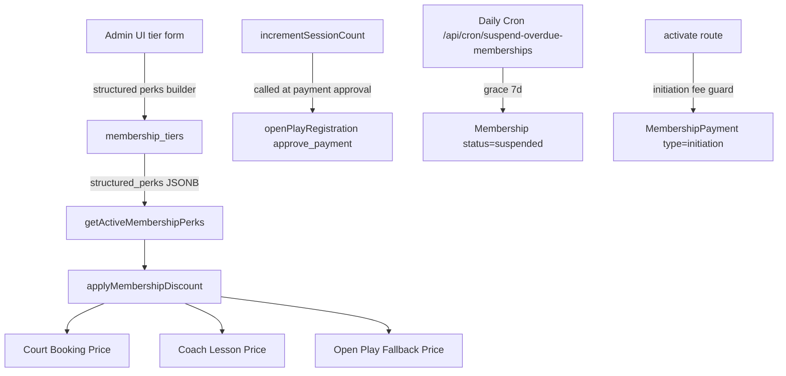

# Membership Perks Upgrade Plan

## Current State Summary

The key files involved:

- [`src/lib/membership.ts`](src/lib/membership.ts) — `checkSessionLimit`, `incrementSessionCount`, `checkAndResetCycle`, `expireMemberships` (all exist, none wired to Open Play)
- [`src/lib/open-play.ts`](src/lib/open-play.ts) — `createOpenPlayRegistration` is the **single shared function** for all Open Play registration paths; `incrementSessionCount` is never called here
- [`src/app/api/admin/memberships/activate/route.ts`](src/app/api/admin/memberships/activate/route.ts) — activation endpoint; no initiation-fee logic today
- [`src/app/api/admin/membership-tiers/route.ts`](src/app/api/admin/membership-tiers/route.ts) — tier CRUD; no `structured_perks`, `initiation_fee_value`, or `minimum_commitment_cycles`
- [`src/app/(admin)/admin/memberships/page.tsx`](src/app/(admin)/admin/memberships/page.tsx) — admin UI, ~1000 lines; perks are free-text only
- [`src/app/api/cron/expire-holds/route.ts`](src/app/api/cron/expire-holds/route.ts) — pattern to follow for the new suspension cron
- No `src/modules/memberships/` directory exists yet

**Key finding on Open Play check-in:** The spec mentions "coach roster tap, self-check-in QR, manual staff search" — these are all paths that create or update an `OpenPlayRegistration` record. All three ultimately call `createOpenPlayRegistration` in `src/lib/open-play.ts` or the `approve_payment` action. The session increment belongs at payment approval time (when the check-in is confirmed paid), not at registration. This needs to be confirmed before writing any decrement logic, as the spec requires.

---

## Architecture



---

## Execution Order

```
Phase A — Foundation (no pricing touched, self-contained)
  1. DB Migration
  2. Grace-period cron

Phase B — Enforcement library + discount wiring (verify each before next)
  3. Perk application library
  4. Court booking discount   ← verify with a real membership before 5
  5. Coach lesson discount    ← verify before continuing

Phase C — Admin UI + business rules (depend on A + B)
  6. Admin UI (perks builder, initiation fee, commitment fields)
  7. Initiation fee charge + minimum commitment cancel guard

Phase D — Open Play credit (independent after 3, can run in parallel with C)
  8. Open Play session counter wiring
```

---

## Step-by-step Prompts

### Prompt 1 — DB Migration

Create one migration file via `npm run db:new add_membership_tier_perks_and_commitment`, write the `-- migrate:up` block:

```sql
ALTER TABLE membership_tiers
  ADD COLUMN IF NOT EXISTS structured_perks JSONB NOT NULL DEFAULT '[]',
  ADD COLUMN IF NOT EXISTS initiation_fee_value INTEGER NOT NULL DEFAULT 0,
  ADD COLUMN IF NOT EXISTS minimum_commitment_cycles INTEGER;
```

Run `npm run db:migrate`, then `npm run db:pull` + `npx prisma generate`. Commit the 4 artifacts (SQL, schema.prisma, db/schema.sql, nothing else yet).

### Prompt 2 — Grace-Period Cron

New route: `src/app/api/cron/suspend-overdue-memberships/route.ts`

- GET handler, `CRON_SECRET` bearer auth (same pattern as [`expire-holds`](src/app/api/cron/expire-holds/route.ts))
- Constant: `const GRACE_DAYS = 7`
- Query: active memberships where latest `MembershipPayment` is `UNPAID` or `OVERDUE` and `periodEnd + 7 days < now` → set `status = 'suspended'`
- `expireMemberships()` in `src/lib/membership.ts` is dead code — fold its OVERDUE-marking logic into this cron and leave the function in place but document it as superseded
- Add to Railway schedule: daily, same pattern as other crons

### Prompt 3 — Perk Application Library

New module: `src/modules/memberships/`

```
src/modules/memberships/
  types.ts              — PerkType enum, Perk interface
  lib/
    getActivePerks.ts   — getActiveMembershipPerks(playerId, venueId): Promise<Perk[]>
    applyDiscount.ts    — applyMembershipDiscount(basePrice, perkType, perks): number
```

- `getActiveMembershipPerks`: load active `Membership` → join `MembershipTier.structured_perks` → parse JSONB array into `Perk[]`; return `[]` for no membership or non-active
- `applyMembershipDiscount`: pure function, no DB calls; returns `Math.round(base * (100 - pct) / 100)` or `base` if no matching perk

Perk types to implement in v1: `COURT_BOOKING_DISCOUNT_PERCENT`, `LESSON_DISCOUNT_PERCENT`, `OPEN_PLAY_DISCOUNT_PERCENT`, `ADVANCE_BOOKING_WINDOW_DAYS`

### Prompt 4 — Wire Court Booking Discount

In [`src/lib/booking.ts`](src/lib/booking.ts), find where the booking price is finalised before writing a `Booking` row. Call `getActiveMembershipPerks(playerId, venueId)` and `applyMembershipDiscount(basePrice, 'COURT_BOOKING_DISCOUNT_PERCENT', perks)`. If a promo code is also present, membership wins per spec section 5.2 (skip promo evaluation).

Update the booking creation API response to include `memberDiscountApplied: boolean`.

**Verify:** create a tier with `COURT_BOOKING_DISCOUNT_PERCENT: 10`, activate a membership, book a court for that player, confirm the price is 90% of normal before proceeding to Prompt 5.

### Prompt 5 — Wire Coach Lesson Discount

In `POST /api/admin/coach-lessons`, find where price is finalised. Same pattern as Prompt 4 with `LESSON_DISCOUNT_PERCENT`.

**Verify:** same manual check as above before proceeding to Prompt 6.

### Prompt 6 — Admin UI

Edit [`src/app/(admin)/admin/memberships/page.tsx`](src/app/(admin)/admin/memberships/page.tsx):

- Tier form modal additions:
  - "Free membership" checkbox → zeroes + disables price input, writes `priceValue: 0`
  - "Initiation fee" number field (optional, default 0)
  - "Minimum commitment" dropdown: No minimum / 1 / 2 / 3 / 6 / 12 cycles (labeled "≈ N × 30 days")
  - Structured perks builder: repeatable rows with type dropdown + value input; label/unit adapts to type; "Add perk" button; trash icon to remove; writes to `structured_perks`; also auto-appends human-readable string to legacy `perks` array
- Tier cards: show perk summary ("10% off courts · 20% off lessons"), initiation fee note, commitment note
- Update `Tier` TypeScript interface to include `structuredPerks`, `initiationFeeValue`, `minimumCommitmentCycles`
- Update tier create/update API calls to include new fields
- Update `PATCH /api/admin/membership-tiers/[id]` and `POST /api/admin/membership-tiers` to accept and persist new fields

### Prompt 7 — Initiation Fee + Commitment Enforcement

**Initiation fee:**

In [`src/app/api/admin/memberships/activate/route.ts`](src/app/api/admin/memberships/activate/route.ts):
- After the upsert, check `prisma.membershipPayment.findFirst({ where: { membershipId, type: 'initiation' } })` — if none exists and `tier.initiationFeeValue > 0`, create a separate `MembershipPayment` with a new `type` field value `'initiation'`
- This requires a small migration: `ALTER TABLE membership_payments ADD COLUMN IF NOT EXISTS payment_type TEXT NOT NULL DEFAULT 'recurring'`

**Minimum commitment (cancel guard):**

In `PATCH /api/admin/memberships/[id]` where `status: 'cancelled'` is requested:
- Load membership with `activatedAt` and tier `minimumCommitmentCycles`
- If `minimumCommitmentCycles` is set, compute `cyclesElapsed = Math.floor((now - activatedAt) / (30 * 86400000))`
- If `cyclesElapsed < minimumCommitmentCycles`, return `400` with message "Member is under minimum commitment (N cycles remaining)"

### Prompt 8 — Open Play Session Credit Wiring

*Can run after Prompt 3, independently of Prompts 4–7.*

**First, investigate** (as spec requires): confirm the exact code path that is called when payment is approved for Open Play across all three check-in paths. The primary suspect is `PATCH /api/admin/open-play/[id]/approve-payment/route.ts` and the `approve_payment` action in `PATCH /api/admin/open-play/[id]/route.ts`.

**Then wire:**

In `approve-payment/route.ts` (and the `approve_payment` action handler), after updating `paymentStatus = 'paid'`:
- Call `checkSessionLimit(reg.playerId, reg.venueId)` — if membership is limited and `allowed === false`, apply `OPEN_PLAY_DISCOUNT_PERCENT` perk via `applyMembershipDiscount` instead of blocking
- Call `incrementSessionCount(reg.playerId, reg.venueId)` only when sessions were still within limit (free session consumed); do not call it if fallback pricing was applied (session limit already exhausted)
- Staff override: add optional `{ overrideNoCount: true }` body field to skip the increment (for staff-granted exceptions per spec section 7 item 4)

---

## Files Changed Per Prompt

| Prompt | Files |
|---|---|
| 1 | `db/migrations/…sql`, `prisma/schema.prisma`, `db/schema.sql` |
| 2 | `src/app/api/cron/suspend-overdue-memberships/route.ts` |
| 3 | `src/modules/memberships/types.ts`, `lib/getActivePerks.ts`, `lib/applyDiscount.ts` |
| 4 | `src/lib/booking.ts`, booking creation API route |
| 5 | Coach lesson creation API route |
| 6 | `src/app/(admin)/admin/memberships/page.tsx`, `src/app/api/admin/membership-tiers/route.ts`, `src/app/api/admin/membership-tiers/[id]/route.ts` |
| 7 | `src/app/api/admin/memberships/activate/route.ts`, `src/app/api/admin/memberships/[id]/route.ts`, new migration for `payment_type` |
| 8 | `src/app/api/admin/open-play/[id]/approve-payment/route.ts`, `src/app/api/admin/open-play/[id]/route.ts`, `src/lib/membership.ts` |

---

## Out of Scope

- Program Passes, CourtPay, `PlayerSubscription`
- Player-facing purchase/checkout flow (Phase 2)
- Guest passes, pro shop discount (v1.1)
- Mobile (RN) membership UI — no existing RN consumer found for membership APIs; deferred
