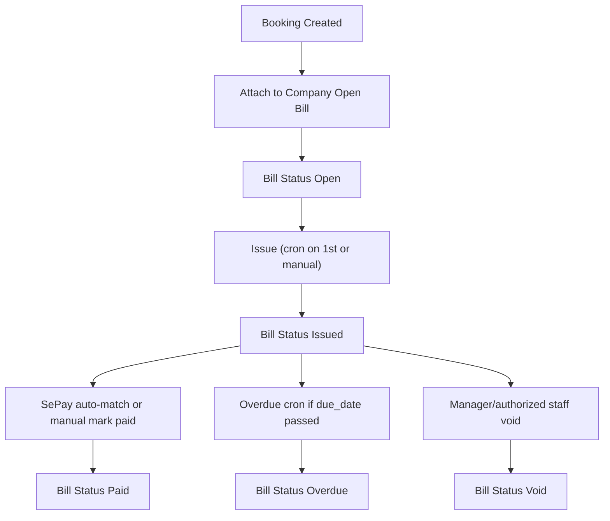

# Revised Plan — Open Bill B2B (Company-First, Audited Binary Settlement)

## Decisions Locked

- **Account architecture:** `company_accounts` now (company-first)
- **Settlement scope (this release):** binary (`issued/paid/overdue/void`) with strong audit controls
- **Deferred to later:** partial payments, overpayments, full AR ledger

---

## What from your comments is adopted now

### Adopted immediately (must-have)

1. **Company-first billing model**
   - Add `company_accounts` as billing owner
   - Link multiple players/contacts to one company account
   - `player_open_bills` replaced by `company_open_bills` (or compatibility bridge)

2. **Bill auditability and controls**
   - Add `notes` on bill
   - Add lifecycle controls: `voided_at`, `voided_by`, `void_reason`
   - Add immutable audit events table for status transitions

3. **Credit exposure controls**
   - Add `open_bill_credit_limit` (company-level)
   - Add behavior mode: `warn_only` vs `block_when_exceeded`

4. **Overdue automation and reminders**
   - Cron to age `issued -> overdue` when `due_date` passed
   - Reminder emails: pre-due (e.g., D-3), due-day, overdue notice
   - Manager notification on overdue transitions

5. **B2B invoicing fields**
   - Company legal/billing info, billing email, tax ID, VAT %, VAT mode, fixed discount
   - Invoice/PDF uses company billing entity, not player name/phone

6. **Blocked-booking messaging**
   - Replace static HTTP 400 with contextual reason (overdue amount + bill reference + payment instructions)

7. **Current release safety placeholders**
   - Add schema placeholders for future late fee policy fields (not active in calculations yet)

### Deferred to next phase (explicitly not in this release)

- Partial payments (`amount_paid`, per-bill residuals)
- Overpayment credits
- Previous balance roll-forward as AR ledger
- Item dispute workflow with line-level settlement

---

## Data Model Revision (Company-First)

## New core entities

- `company_accounts`
  - `id`, `venue_id`, `name`, `billing_email`, `tax_id`, `billing_address`
  - `is_open_bill_enabled`
  - `vat_percent` (default 10)
  - `price_vat_mode` (`excluded` default, `included`)
  - `fixed_discount_amount` (currency)
  - `open_bill_credit_limit` (nullable)
  - `credit_limit_mode` (`warn_only` default / `block`)
  - status fields + timestamps

- `company_account_players` (join table)
  - links many players to one company account
  - allows multi-booker consolidation into one monthly bill

- `company_open_bills`
  - owner: `company_account_id`
  - period, totals, VAT summary, status
  - payment reference, invoice number, PDF URL
  - `notes`
  - `voided_at`, `voided_by`, `void_reason`
  - due/paid timestamps

- `company_open_bill_events` (audit log)
  - append-only transitions: `open->issued`, `issued->overdue`, `issued->paid`, `issued->void`
  - actor + metadata snapshot

- `bookings`
  - reference `company_open_bill_id` (nullable)
  - optional denormalized `company_account_id` for query performance

## Placeholder policy fields (not active yet)

- `late_fee_enabled` (bool default false)
- `late_fee_type` (`percent`/`fixed` nullable)
- `late_fee_value` nullable

---

## Billing Calculation Rules (current release)

For business account invoices:

1. Sum period line-item subtotal (cancelled lines shown as 0)
2. Apply fixed discount
3. Clamp taxable base >= 0
4. Apply VAT based on mode:
   - `excluded`: VAT added on top
   - `included`: derive net + VAT split from gross
5. Final total due persisted on bill

No partial allocations in this release.

---

## Lifecycle and Automation

## Required scheduled jobs

1. **Issue cron (1st of month):** open -> issued + PDF + email
2. **Overdue aging cron (daily):** issued past due_date -> overdue
3. **Reminder cron (daily):**
   - upcoming due reminders
   - overdue reminders
   - manager escalation notifications

---

## API and UX Plan Updates

## Account administration

- New admin UI section: **Business Open Bill Accounts**
  - create/edit company profile
  - assign players/contacts
  - set VAT/discount/credit limit settings

## Player profile changes

- Player no longer the billing owner
- Player can be linked/unlinked from a company account
- On unlink/disable logic: trigger immediate consolidation/issue if policy requires

## Statement actions

- `Issue now`
- `Mark paid`
- `Void bill` (required reason)
- add/edit `notes`

## Blocking behavior

- If limit exceeded or overdue block active:
  - return contextual message with bill ref + amount due + support/payment instruction

---

## PDF / Client-facing Invoice Changes

Business invoice must include:

- Company legal entity block
- Billing email, address, tax ID
- VAT mode and rate
- Subtotal, discount, taxable base, VAT, grand total
- Outstanding exposure summary (current release = unpaid issued/overdue total, no ledger allocation)

Note: show **Outstanding Balance** summary (aggregate unpaid bills), but keep settlement binary.

---

## Risk Controls Added from Your Review

- Duplicate issue protection via unique `(company_account_id, period_start)` + idempotent issue command
- Void flow to recover from wrong period / dispute initiation / duplicate statements
- Audit trail for all lifecycle transitions
- Manager visibility on overdue events and reminders

---

## Migration Strategy

Given previous player-centric draft, migrate to company-first safely:

1. Create company tables and joins
2. Backfill one synthetic company account per existing open-bill player (temporary compatibility)
3. Repoint bill ownership to company accounts
4. Keep compatibility read layer during transition
5. Remove player-centric ownership paths after UI/API cutover

---

## Updated Phase Plan

1. **Foundation schema + migrations** (company-first tables, audit, void fields, notes, limits)
2. **Core issue/settle flows** (binary statuses, SePay/manual/void)
3. **Automation layer** (issue cron, overdue cron, reminders/escalation)
4. **Admin UX** (company account management, player linking, bill operations)
5. **PDF + email templates** (business fields + tax breakdown)
6. **Transition/backfill** from player-centric draft to company-first model
7. **QA/UAT hardening** (idempotency, overdue escalation, limit warnings/blocks)

---

## Effort Delta vs previous draft

Compared with prior player-centric Open Bill scope:

- Company-first architecture: +2 to 3 days
- Overdue/reminder/escalation automation: +1 to 1.5 days
- Void/audit controls: +0.5 to 1 day

**Net delta:** +3.5 to 5.5 days

---

## Document to Update

Revise client-facing proposal:
- [docs/open-bill-client-accounts.md](docs/open-bill-client-accounts.md)

Add sections:
- Business account ownership model
- Company-level billing identity
- Overdue and reminder policy
- Void and audit controls
- Outstanding balance summary rules

Update sign-off checklist to reflect company-first model and deferred partial-payment ledger.