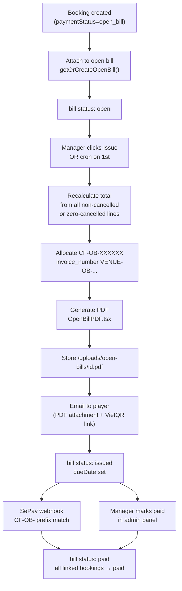
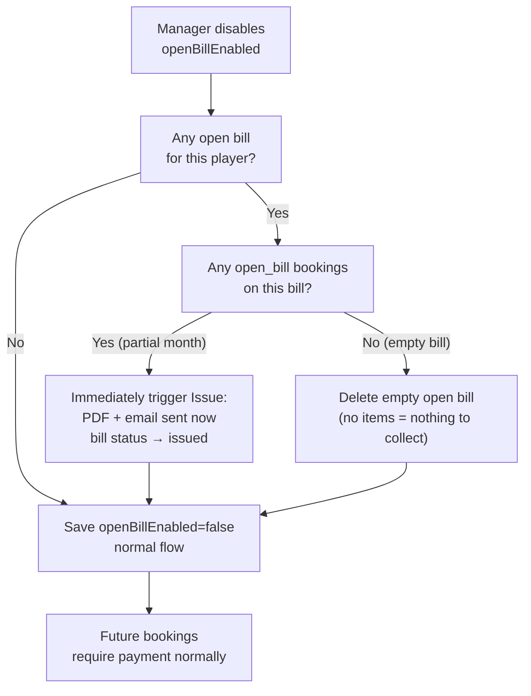

# Open Bill Player Accounts — Implementation Plan

## What this feature does

A **Manager** marks a Player account as an "Open Bill client." That player can then book courts through CourtPass without paying at booking time. Bookings accumulate as line items on a monthly bill. At month-end (or on demand), the manager issues a statement: a PDF with all 25 line items is generated and emailed to the client. The client pays via a single bank transfer (SePay auto-match) or the manager confirms manually. Disabling the Open Bill flag triggers an immediate statement for any in-progress balance.

---

## Data model changes

### New table: `player_open_bills`

```sql
CREATE TABLE player_open_bills (
  id              TEXT PRIMARY KEY DEFAULT gen_random_uuid(),
  player_id       TEXT NOT NULL REFERENCES players(id),
  venue_id        TEXT NOT NULL REFERENCES venues(id),
  period_start    DATE NOT NULL,
  period_end      DATE NOT NULL,
  status          TEXT NOT NULL DEFAULT 'open',
  -- statuses: open | issued | paid | overdue
  total_amount    INT  NOT NULL DEFAULT 0,
  payment_ref     TEXT UNIQUE,        -- CF-OB-XXXXXX
  invoice_number  TEXT UNIQUE,        -- VENUE-OB-2026-07-0001
  pdf_url         TEXT,
  issued_at       TIMESTAMPTZ,
  due_date        DATE,
  paid_at         TIMESTAMPTZ,
  payment_method  TEXT,
  proof_url       TEXT,
  confirmed_by    TEXT,
  created_at      TIMESTAMPTZ NOT NULL DEFAULT NOW(),
  updated_at      TIMESTAMPTZ NOT NULL DEFAULT NOW(),
  UNIQUE (player_id, venue_id, period_start)
);
CREATE INDEX ON player_open_bills(player_id, venue_id, status);
```

### Alter table: `players`

```sql
ALTER TABLE players ADD COLUMN IF NOT EXISTS open_bill_enabled BOOLEAN NOT NULL DEFAULT FALSE;
ALTER TABLE players ADD COLUMN IF NOT EXISTS open_bill_enabled_at TIMESTAMPTZ;
ALTER TABLE players ADD COLUMN IF NOT EXISTS open_bill_enabled_by TEXT;
```

### Alter table: `bookings`

```sql
ALTER TABLE bookings ADD COLUMN IF NOT EXISTS open_bill_id TEXT REFERENCES player_open_bills(id);
CREATE INDEX ON bookings(open_bill_id);
```

### `invoice_sequences` (existing) — no change needed

The existing `allocateInvoiceNumber()` function already supports new type codes. Add `"OB"` as a valid type.

---

## Booking flow changes

### `POST /api/public/bookings` — player self-booking

Check `player.openBillEnabled` after auth:

```
if openBillEnabled:
  paymentStatus = "open_bill"
  holdExpiresAt = null
  skip VietQR response
  attach to current open bill (create if none)
  send "booking confirmed" email (no pay link)
  return booking (no QR data)
else:
  existing flow unchanged
```

**Open bill attachment logic** (reusable function `getOrCreateOpenBill(playerId, venueId, date)`):
- Find `player_open_bills` where `player_id`, `venue_id`, and `period_start = first day of date's calendar month`, `status = 'open'`
- If none exists, create it with `period_start = first day of month`, `period_end = last day of month`
- **Exception — partial month on first enable**: if `player.openBillEnabledAt` is in the current month, `period_start = openBillEnabledAt` date

**Overdue block check** (before creating booking):
- Read venue `settings.openBill.blockUnpaidEnabled` (default `false`)
- If enabled: find any `issued` or `overdue` bill for this player older than `settings.openBill.blockAfterDays` days past `due_date`
- If found: return HTTP 400 with message "Your account has an overdue balance. Please contact the venue."

### `src/lib/booking.ts` — `getAvailableSlots()`

Treat `open_bill` the same as `paid` — slot is blocked immediately:

```ts
// existing filter:
OR: [
  { holdExpiresAt: null },
  { holdExpiresAt: { gt: new Date() } },
  { paymentStatus: { not: "pending" } },
]
// add: open_bill is never "pending", so already handled — but
// also ensure cron does NOT expire open_bill rows
```

### `GET /api/cron/expire-holds` — no change to expiry logic

The cron only targets `paymentStatus = "pending"`. `open_bill` is a distinct string — no accidental expiry. Confirm by auditing the existing WHERE clauses (already verified).

### Player portal — booking detail page `src/app/(book)/book/bookings/[id]/page.tsx`

When `paymentStatus === "open_bill"`:
- Show badge: **"On account"** (green, no pay button)
- Show amount as part of running monthly total (link to `/book/account/open-bill` — see below)

### Player portal — new page `/book/account/open-bill`

Running balance for current month (read-only):
- Period label ("July 2026")
- List of bookings on this bill (court, date, time, amount)
- Running total
- Past bills list with status + PDF download link

---

## Monthly bill lifecycle



### Issue statement action (manual trigger)

`POST /api/admin/open-bills/[billId]/issue`
- Requires `requireAdminAccess` (manager, superadmin, or staff with admin access)
- Recomputes `totalAmount` from linked bookings (cancelled = 0, others = full price)
- Allocates `paymentRef` (CF-OB-) and `invoiceNumber` (VENUE-OB-)
- Generates PDF via `@react-pdf/renderer` → saves to `/uploads/open-bills/{billId}.pdf`
- Sends email via `sendOpenBillEmail()` (new Resend helper, follows existing `sendBookingEmail` pattern)
- Sets `status = "issued"`, `issuedAt = now()`, `dueDate = issuedAt + settings.openBill.defaultDueDays`

### Auto-issue cron (1st of month)

Extend `GET /api/cron/generate-invoices`:
- If `isFirstOfMonth`: find all players with `openBillEnabled = true` and an `open` bill from previous month
- Call the same issue logic for each

### Payment — SePay auto-match

In `src/modules/courtpay/lib/sepay.ts`, add a new handler alongside existing ones:

```ts
if (ref.startsWith("CF-OB-")) return handleOpenBillPayment(payload, ref);
```

`handleOpenBillPayment()`:
- Find bill by `paymentRef`
- Verify amount >= `totalAmount - 5000` tolerance
- Set `status = "paid"`, `paidAt`, `confirmedBy = "sepay"`
- Cascade: `UPDATE bookings SET payment_status = 'paid' WHERE open_bill_id = billId AND payment_status = 'open_bill'`

### Payment — manual confirm (manager/staff)

`POST /api/admin/open-bills/[billId]/mark-paid`
- Body: `{ paymentMethod, ref?, proofUrl?, note? }`
- Auth: `requireStaff` (staff with courtpay access or admin)
- Same cascade as SePay path

### Player pay page — `/book/pay/open-bill/[billId]`

Reuses existing pay-page pattern. Shows:
- Statement summary (period, total, line-item count)
- VietQR for `totalAmount` with ref `CF-OB-XXXXXX`
- Bank details
- "I have paid" → upload proof → sets `proofUrl` + `status` stays `issued` (manager confirms)

---

## Close/disable flow

When manager **unticks** `openBillEnabled` on the player profile:



**API:** Extend `PATCH /api/admin/courtpass-players/[playerId]/edit` — when `openBillEnabled` changes `true → false`:
1. Find the current `open` bill (if any) for this venue
2. If it has linked bookings: run the Issue action (generate PDF, email, set `issued`)
3. If empty: delete it
4. Set `player.openBillEnabled = false`

This is atomic in a transaction.

---

## PDF — `OpenBillStatementPDF.tsx`

New component at `src/components/pdf/OpenBillStatementPDF.tsx`, extending `InvoicePDF.tsx` pattern (`@react-pdf/renderer`).

| Section | Content |
|---------|---------|
| Header | Venue logo, name, bank details, "STATEMENT" label |
| Bill-to | Player name, phone, email |
| Period | e.g. "1 Jul 2026 – 31 Jul 2026" |
| Line items | Row per booking: date, court, start–end time, duration, amount. Cancelled = strikethrough, 0 VND |
| Subtotal / Total | Sum of non-cancelled lines |
| Payment info | VietQR bank details, ref `CF-OB-XXXXXX`, due date |
| Footer | Venue contact details |

Served by new route `GET /api/admin/open-bills/[billId]/pdf` (same pattern as `/api/admin/invoices/[type]/[id]/pdf/route.ts`).

---

## Email

New helper `sendOpenBillEmail()` in `src/lib/email/send.ts`:
- Recipient: player email
- CC: `venue.settings.notificationEmail` (same as staff notifications)
- Types: `issued` (statement ready) and `paid` (confirmation)
- Includes PDF download link and VietQR pay link

---

## Admin UI — CourtPass Players detail panel

Location: `src/app/(admin)/admin/courtpass-players/page.tsx`

**Changes to player header (manager/superadmin only — `canEditPlayer` is already scoped):**
- Toggle: "Open Bill client" (inline checkbox or toggle)
- When enabled: show "Open Bill" badge in the header (alongside source badge)
- When enabling → save immediately via `PATCH /api/admin/courtpass-players/[playerId]/open-bill`
- When disabling → show confirmation modal: "This will issue and email the current month's statement immediately. Confirm?"

**New section in detail body: "Open Bill"** (only shown when `openBillEnabled = true`):
- Current month running total
- "Issue statement now" button
- Past bills table: period | total | status | issued date | paid date | PDF | Mark Paid

**Mark Paid modal:** method (cash/transfer/other), ref, optional proof upload, notes.

---

## Admin UI — General Settings tab

Location: `src/app/(admin)/admin/settings/page.tsx`

Add a new tab `open-bill` (next to "Settings" and "Email CourtPass"):

```
Icon: FileText  Label: "Open Bill"
```

**Settings card per venue** (stored in `venue.settings.openBill` JSON — no migration):

| Setting | Control | Default |
|---------|---------|---------|
| Block new bookings if unpaid | Toggle | Off |
| Block after N days | Number input (visible only when block enabled) | 14 |
| Auto-issue on 1st of month | Toggle | Off |
| Payment due days | Number input | 7 |

---

## `src/i18n/locales/admin/en.json` and `vi.json`

New keys under `openBill` namespace:
- `openBill.toggle`, `openBill.badge`, `openBill.currentPeriod`, `openBill.runningTotal`
- `openBill.issueNow`, `openBill.markPaid`, `openBill.history`
- `openBill.statusOpen`, `openBill.statusIssued`, `openBill.statusPaid`, `openBill.statusOverdue`
- `openBill.disableConfirm`, `openBill.settingsTitle` and sub-keys
- `openBill.blockAfterDays`, `openBill.dueDays`, `openBill.autoIssue`

Player portal (`src/i18n/locales/player/en.json` + `vi.json`):
- `openBill.onAccount`, `openBill.monthlyStatement`, `openBill.runningBalance`

---

## Player portal — booking pill update

`src/app/(book)/book/bookings/page.tsx` — `PaymentPill`:
- Add `"open_bill"` → label "On account", color green/teal

---

## Key files touched

| File | Change |
|------|--------|
| `db/migrations/YYYYMMDD_add_open_bill.sql` | New migration (3 changes above) |
| `prisma/schema.prisma` | `db pull` after migration |
| `src/app/api/public/bookings/route.ts` | Open bill branch in POST |
| `src/lib/booking.ts` | Slot availability (already correct; verify) |
| `src/app/api/cron/expire-holds/route.ts` | No change needed |
| `src/app/api/cron/generate-invoices/route.ts` | Add open bill auto-issue on 1st |
| `src/modules/courtpay/lib/sepay.ts` | Add `CF-OB-` handler |
| `src/modules/courtpay/lib/payment-reference.ts` | Add `"open-bill"` prefix |
| `src/lib/invoice-number.ts` | Add `"OB"` type |
| `src/components/pdf/OpenBillStatementPDF.tsx` | New PDF component |
| `src/lib/email/send.ts` | Add `sendOpenBillEmail()` |
| `src/app/api/admin/open-bills/[billId]/issue/route.ts` | New |
| `src/app/api/admin/open-bills/[billId]/mark-paid/route.ts` | New |
| `src/app/api/admin/open-bills/[billId]/pdf/route.ts` | New |
| `src/app/api/admin/courtpass-players/[playerId]/open-bill/route.ts` | New (PATCH toggle) |
| `src/app/(admin)/admin/courtpass-players/page.tsx` | Toggle UI + bill history section |
| `src/app/(admin)/admin/settings/page.tsx` | New "Open Bill" tab |
| `src/app/(book)/book/account/open-bill/page.tsx` | New player portal page |
| `src/app/(book)/book/pay/open-bill/[billId]/page.tsx` | New pay page |
| `src/app/(book)/book/bookings/page.tsx` | `PaymentPill` for `open_bill` |

---

## Auth matrix

| Action | Who |
|--------|-----|
| Enable/disable Open Bill on player | Manager, superadmin |
| Issue statement manually | Manager, superadmin, staff with admin access |
| Mark bill paid manually | Manager, superadmin, staff with admin access (`requireStaff` + courtpay) |
| Auto-issue cron | CRON_SECRET bearer |
| SePay auto-confirm | SePay webhook (existing pattern) |
| Player views own bill | Player (portal JWT) |
| Player pays via VietQR page | Player (portal JWT) |

---

## Implementation phases

| Phase | Deliverable |
|-------|-------------|
| A | Migration + `db pull` + `prisma generate` |
| B | `getOrCreateOpenBill()` + booking POST branch + slot availability audit |
| C | Manager toggle API + close/disable flow |
| D | Issue action: PDF generation + email |
| E | SePay `CF-OB-` handler + manual mark-paid API |
| F | Admin UI: player detail panel (toggle, bill history, modals) |
| G | General Settings "Open Bill" tab |
| H | Player portal: `on account` pill, running balance page, pay page |
| I | Cron auto-issue on 1st + i18n (en + vi) |
