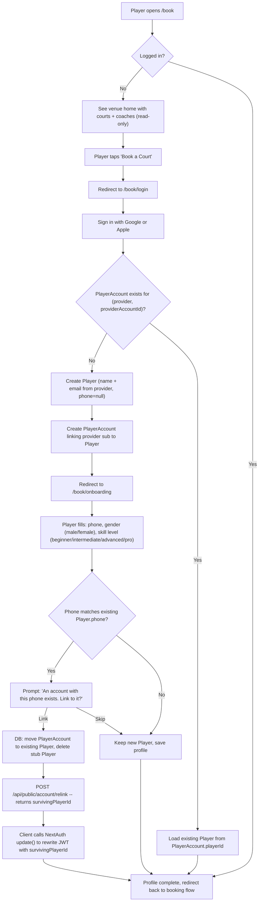
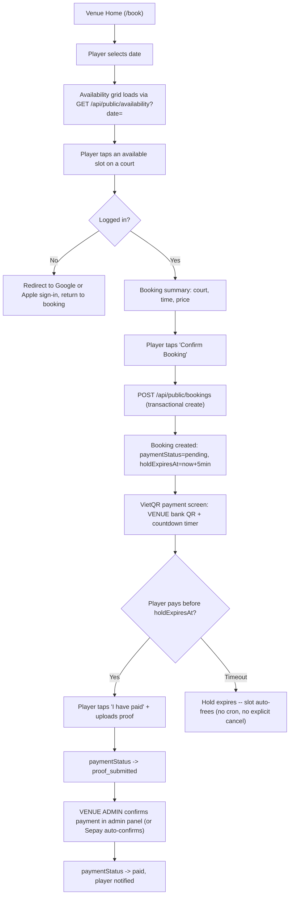
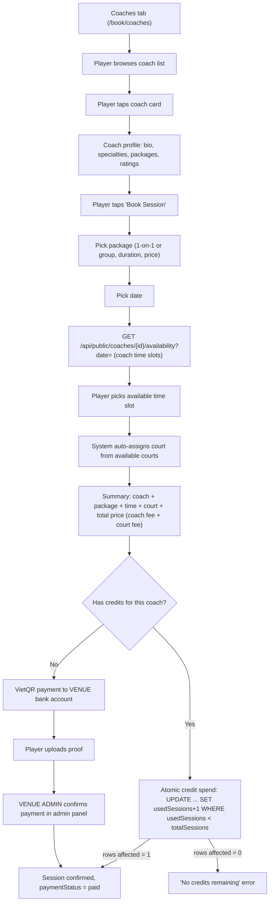
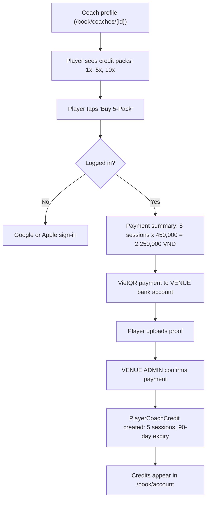
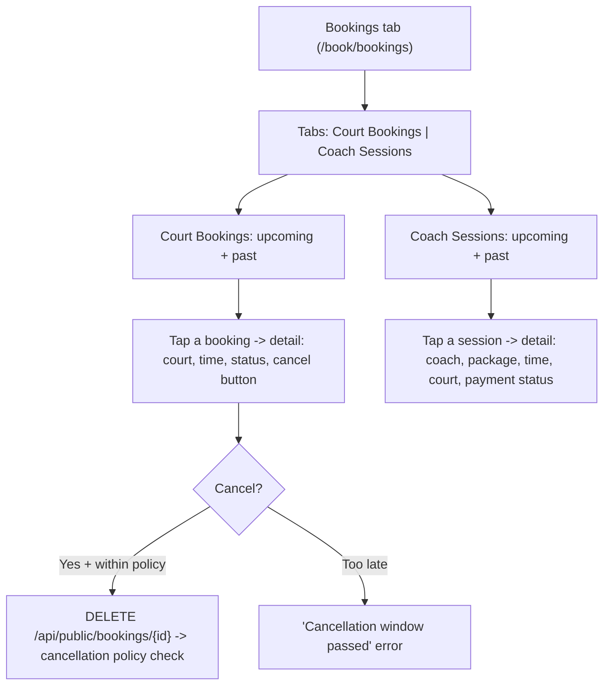
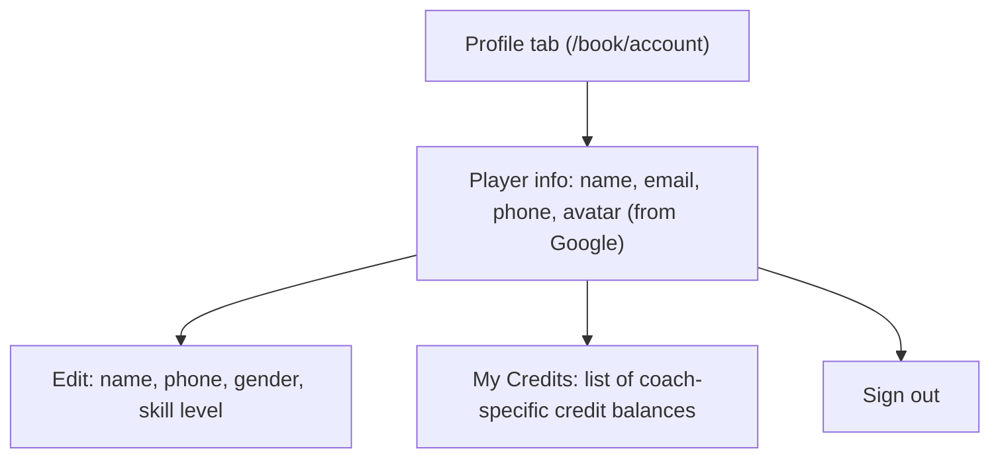
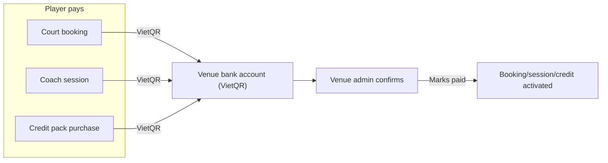

# Player Web Booking Portal (Single Venue)

## Current State

**What exists today:**
- **Player app** (`src/app/(player)/player/`) -- focused on open-play rotation (queue, court assignment, in-game). Auth is face recognition or wristband scan only.
- **Booking APIs** exist and work:
  - `POST /api/bookings` ([src/app/api/bookings/route.ts](src/app/api/bookings/route.ts)) -- creates a booking, uses `requireAuth` (any JWT role), calls `getBookingConfig`, `validateBookingConflict`, `resolveSlotPrice`
  - `GET /api/bookings/availability` ([src/app/api/bookings/availability/route.ts](src/app/api/bookings/availability/route.ts)) -- returns court x slot matrix via `getAvailableSlots(venueId, date)`
  - `GET /api/bookings/mine` ([src/app/api/bookings/mine/route.ts](src/app/api/bookings/mine/route.ts)) -- player's upcoming + past bookings
  - `DELETE /api/bookings/[id]` ([src/app/api/bookings/[id]/route.ts](src/app/api/bookings/[id]/route.ts)) -- cancel with policy check
- **Coaching** is admin-only:
  - `GET /api/admin/coaches` -- list coaches (behind `requireManagerOrSuperAdmin`)
  - `GET /api/admin/coaches/[id]/availability` -- coach hourly availability for a date
  - `POST /api/admin/coach-lessons` -- book a lesson (conflict detection for coach + court + existing bookings)
  - `GET /api/admin/coach-packages` -- list packages
- **Booking logic library** ([src/lib/booking.ts](src/lib/booking.ts)) -- fully reusable: `getAvailableSlots`, `resolveSlotPrice`, `validateBookingConflict`, `checkCancellationPolicy`. All venue-scoped, reads config from `Venue.settings.bookingConfig`.
- **Auth** -- custom JWT (`src/lib/auth.ts`) with roles `player | staff | manager | superadmin`. No OAuth.
- **Schema** -- `Player` uses `phone` as unique identifier. No `email` field. No `slug` on `Venue`.

---

## How We Link the Player to a Venue

This is a **single-venue product**. The portal serves one venue only.

### Strategy: `NEXT_PUBLIC_VENUE_ID` env var + optional `Venue.slug`

The venue is determined at deploy time, not at runtime by the player:

1. **Env var `NEXT_PUBLIC_VENUE_ID`** -- set per deployment (already partially exists as `COURTFLOW_VENUE_ID` in `.env.example`). The booking portal reads this to know which venue it serves.
2. **Add `slug` to `Venue` model** -- a URL-friendly identifier (e.g., `65th-street`) for SEO and clean URLs. The portal URL becomes `/book` (not `/book/65th-street`) because there is only one venue per deployment.
3. **All public APIs receive `venueId` implicitly** -- the server reads from the env var or from the NextAuth session's linked venue. The player never picks a venue.

**Why not a venue picker?** The COURTMAP spec (section 6) explicitly says: "There is no venue picker. The app is pre-branded for one club."

### How existing code wires in

The existing `getAvailableSlots(venueId, date)` already takes `venueId` as a parameter. The existing `POST /api/bookings` takes `venueId` in the body. We simply hardcode the venue from the env var in the public API layer:

```typescript
// src/lib/venue-config.ts
export function getPortalVenueId(): string {
  const id = process.env.NEXT_PUBLIC_VENUE_ID;
  if (!id) throw new Error("NEXT_PUBLIC_VENUE_ID is required");
  return id;
}
```

All public APIs call `getPortalVenueId()` instead of accepting `venueId` from the client.

---

## Player Flows (Detailed User Journeys)

### Flow 1: First Visit -- Sign Up via Google or Apple



**Identity model decisions:**

- **OAuth providers: Google AND Apple** via NextAuth. We use the **JWT session strategy** (not database sessions), so the standard NextAuth `User`/`Account`/`Session` tables are NOT used. We chose OAuth deliberately because a future mobile app will reuse the same providers.
- **Lookup key is `(provider, providerAccountId)`, NEVER email.** Apple may return a private relay email (e.g. `xyz@privaterelay.appleid.com`) and only sends the user's name on the first authorization. The `providerAccountId` (the stable `sub` claim) is the only reliable identifier.
- **No email-based dedup against existing players.** Existing CourtFlow/CourtPay Player records have no email field. We do NOT attempt to match by email on sign-in.
- **Phone-based soft linking at onboarding.** When the player enters their phone number, we check if a Player record already exists with that phone. If it does, we prompt the player to link their OAuth account to the existing record. Phone is unverified (no OTP, no SMS) -- it is only a linking hint, never an auth gate. Worst case is a typo creating a new record.
- **Stale JWT after phone-link merge.** When the player links to an existing Player and the stub is discarded, the NextAuth JWT still holds the stub's `playerId` which now points to a deleted row. The merge must refresh the token. Flow: the relink API returns the `survivingPlayerId`; the client immediately calls NextAuth's `update()` method (available in v5 / Auth.js) which re-invokes the `jwt` callback with a `trigger: "update"` signal and the new `playerId`, rewriting the cookie. The session is then consistent before the player proceeds.
- **Face recognition is the authoritative merge.** When a portal player later checks in by face at the venue kiosk and matches an existing face-enrolled Player, the system links/merges the portal `PlayerAccount` onto that record, preserving face photo and check-in history as canonical. This merge happens at face-match time in the existing kiosk check-in flow. The same JWT-refresh mechanism applies: the portal must re-fetch its session after a face-based merge so `playerId` reflects the surviving record.
- **No phone-OTP auth.** The portal does not support OTP login. Phone is collected for profile/contact purposes only.
- Browsing is anonymous (venue home, court grid, coach list). Login required only when booking.
- Onboarding collects exactly three fields: phone, gender (`male` | `female` -- same values as CourtPay), skill level (`beginner` | `intermediate` | `advanced` | `pro` -- same `SkillLevel` enum as existing Player model).

**NextAuth custom callbacks (the trickiest part):**

```typescript
callbacks: {
  async signIn({ account, profile }) {
    // Find or create Player + PlayerAccount by (provider, providerAccountId)
    // Apple: profile.name may be null after first auth -- handle gracefully
    // Returns true to allow sign-in
  },
  async jwt({ token, account, profile, trigger, session: updateData }) {
    // On initial sign-in: look up PlayerAccount, embed playerId + onboardingComplete
    // On trigger === "update": overwrite token.playerId with updateData.playerId
    //   (this is how the post-merge JWT refresh works)
    // On subsequent requests: token already has playerId, pass through
  },
  async session({ session, token }) {
    // Expose playerId and onboardingComplete from token into session object
    // so client components can access session.playerId
  },
}
```

### Flow 2: Book a Court



**Payment model:** All payments (court bookings AND coach sessions) go to the **venue's bank account** (using `Venue.bankName`, `Venue.bankAccount`, `Venue.bankOwnerName`). The venue owns the revenue. Coaches are venue employees/contractors -- the venue pays them separately, outside the app.

**Confirmation model:** The **venue admin** confirms all payments via the existing admin panel. There is no coach-side confirmation. This aligns with the existing CourtFlow model where `StaffMember.isCoach` means the coach belongs to the venue.

**Double-booking prevention (concurrency-safe):**

The existing `validateBookingConflict` + `Booking.create` is a check-then-act pattern that is NOT safe under concurrent public traffic. We replace it with two layers that work together correctly:

**Layer 1 — Partial unique index (hand-written SQL migration, required).**

The existing `@@unique([courtId, date, startTime])` on `Booking` in `prisma/schema.prisma` (verified) is a plain unique index. A plain index cannot serve as the slot guard because:
- It blocks cancelled bookings from being reused (cancelled rows still occupy the unique slot).
- It blocks expired pending holds from being reused for the same reason.

Prisma's `@@unique` cannot express a partial index, so this must be a **hand-written SQL migration**:

```sql
-- Drop the plain unique index Prisma manages
DROP INDEX IF EXISTS "bookings_court_id_date_start_time_key";

-- Replace with a partial unique index that excludes only cancelled rows.
-- PostgreSQL requires all functions in an index predicate to be IMMUTABLE.
-- NOW() is STABLE, not IMMUTABLE, so hold_expires_at comparisons cannot appear here.
-- Expired hold rows are cleared by Layer 2 (transactional deleteMany) instead.
CREATE UNIQUE INDEX bookings_slot_unique
  ON bookings (court_id, date, start_time)
  WHERE status <> 'cancelled';
```

This index correctly handles all slot states:
- **Live pending hold** (`status = 'confirmed'`, `paymentStatus = 'pending'`, `holdExpiresAt` in the future): non-cancelled, so it blocks concurrent inserts. ✓
- **Expired pending hold** (`status = 'confirmed'`, `paymentStatus = 'pending'`, `holdExpiresAt` in the past): also non-cancelled, so it still blocks inserts. **Layer 2 deletes it first** before the new insert runs. ✓
- **Cancelled booking**: excluded by the predicate, slot is freely rebookable. ✓

The migration lives in `prisma/migrations/` as a raw SQL file alongside the schema migration that adds `holdExpiresAt` and `paymentStatus`.

**Layer 2 — Transactional clear-then-insert.**

Inside the booking `$transaction`:
1. Delete any `pending` booking for the same `(courtId, date, startTime)` whose `holdExpiresAt < now`. Because expired holds still appear in the partial index (their `status` is `'confirmed'`, not `'cancelled'`), this delete must run first or the subsequent insert would hit `P2002`.
2. Insert the new booking. If another concurrent request wins the race after the delete, the partial index rejects the second insert with `P2002`, which is caught and returned as "slot taken". The `P2002` catch is already present in `src/app/api/bookings/route.ts` (verified). The portal endpoint inherits this pattern.

```typescript
await prisma.$transaction(async (tx) => {
  // Clear expired holds for this slot
  await tx.booking.deleteMany({
    where: {
      courtId, date, startTime,
      paymentStatus: "pending",
      holdExpiresAt: { lt: new Date() },
    },
  });
  // Insert -- partial index rejects concurrent duplicates
  return tx.booking.create({ data: { ...bookingData, holdExpiresAt, paymentStatus: "pending" } });
});
```

**Payment hold without a cron:**

There is no background job. Instead:

1. **On create:** booking is saved with `paymentStatus = "pending"` and `holdExpiresAt = now + 5 minutes`.
2. **On availability check:** `getAvailableSlots` treats a pending booking as slot-blocking ONLY while `holdExpiresAt > now`. An expired pending hold is invisible to the grid -- the slot appears free.
3. **On new booking:** the transactional clear-then-insert deletes the expired hold row before inserting, so the partial index never sees it.
4. **Coach session auto-assignment** uses the same hold-aware availability check to find an open court.

The `@@unique([courtId, date, startTime])` directive in `schema.prisma` must be **removed** (it is replaced by the partial index in the hand-written migration). Removing it from the schema prevents Prisma from re-creating the plain unique index on the next `migrate deploy`.

**Wiring to existing code:**
- `GET /api/public/availability` calls `getAvailableSlots(portalVenueId, date)` from [src/lib/booking.ts](src/lib/booking.ts) -- **modified** to exclude pending bookings whose `holdExpiresAt` has passed
- `POST /api/public/bookings` reuses `resolveSlotPrice` and creates a `Booking` record with the same schema -- auth comes from NextAuth session. Uses transactional create with unique constraint as the concurrency guard.
- VietQR generation uses venue bank details from `Venue.bankName/bankAccount/bankOwnerName` -- same fields already used by CourtPay
- Cancel via `DELETE /api/public/bookings/[id]` reuses `checkCancellationPolicy` -- **same code path**

**Schema note:** The existing `BookingStatus` enum has `confirmed | cancelled | completed | no_show`. We add `paymentStatus` (`pending | proof_submitted | paid`), `holdExpiresAt` (nullable DateTime), and `paymentProofUrl` to `Booking` rather than changing the booking status lifecycle, keeping backward compatibility with the admin panel.

A portal booking is always created with `status = 'confirmed'` (the existing enum value) and `paymentStatus = 'pending'`. The `status` field drives the partial unique index guard — a live hold is `status = 'confirmed'` so it correctly blocks concurrent inserts. `paymentStatus` tracks the payment lifecycle independently. Admin-created bookings have `paymentStatus = null` and `holdExpiresAt = null`.

### Flow 3: Book a Coach Session



**Payment goes to the venue, not the coach.** The player pays the full amount (coach fee + court fee) to the venue's bank account. The venue compensates the coach separately (payroll, manual transfer, etc.) -- this happens outside the app.

**Confirmation by venue admin, not coach.** When a player uploads payment proof, it appears in the admin panel for the venue manager to review and confirm. The coach has no confirmation step. This matches the existing CourtFlow model where coaches are `StaffMember` records that belong to the venue via `StaffVenueAssignment`.

**Credit spend atomicity:** Spending a coaching credit must be an atomic conditional update, not a read-then-write, to prevent overspend under concurrency:

```typescript
const result = await prisma.$executeRaw`
  UPDATE player_coach_credits
  SET used_sessions = used_sessions + 1, updated_at = NOW()
  WHERE id = ${creditId}
    AND used_sessions < total_sessions
    AND payment_status = 'paid'
    AND expires_at > NOW()
`;
if (result === 0) throw new Error("No credits remaining or credit expired");
```

This is a single atomic SQL statement -- no TOCTOU race. The `rows affected = 0` case means either the credit is exhausted, expired, or unpaid.

**Wiring to existing code:**
- Coach list: adapts `GET /api/admin/coaches` query -- same Prisma query, just removes `requireManagerOrSuperAdmin` gate, adds `where: { venueAssignments: { some: { venueId: portalVenueId } } }`
- Coach availability: adapts `GET /api/admin/coaches/[id]/availability` -- same conflict check logic against `CoachLesson` records
- Book session: adapts `POST /api/admin/coach-lessons` -- same conflict detection (coach schedule + court booking + court lesson overlap), same `CoachLesson.create` call. Auth comes from NextAuth session.
- VietQR shows venue bank details (not coach bank details) -- reads from `Venue.bankName/bankAccount/bankOwnerName`
- **Court auto-assignment**: new logic. When player books a coach session, the server picks the first available court at that time using the hold-aware availability check (same `holdExpiresAt` filter as court bookings) and assigns the first open court.

### Flow 4: Buy a Credit Package



**Same payment model:** Credit pack payment goes to the venue, confirmed by venue admin. The venue collects all revenue.

**Wiring to existing code:**
- Credit packages map to the existing `CoachPackage` model (has `sessionsIncluded`, `priceInCents`, `durationMin`)
- Player credits: new `PlayerCoachCredit` model (coach-specific credits). We do NOT reuse `PlayerSubscription` because that model is tied to CourtPay venue subscriptions (different concept -- per-session check-in packages, not coaching credits).

### Flow 5: My Bookings



**Wiring:** Directly reuses existing `GET /api/bookings/mine` query + `DELETE /api/bookings/[id]` cancellation logic.

### Flow 6: Account Management



---

## Payment & Confirmation Model

This is a key departure from the COURTMAP spec. In our implementation:

### All money flows to the venue



**Why:** Coaches are venue employees (`StaffMember.isCoach = true`, linked to venue via `StaffVenueAssignment`). The venue collects all revenue and compensates coaches separately (payroll, cash, bank transfer -- outside the app). There is no coach-owned bank account in the system.

### Confirmation is always by venue admin

| Booking type | Who confirms payment | Where in admin panel |
|---|---|---|
| Court booking | Venue admin/manager | Admin > Bookings (new "Payment Proofs" tab or inline on day planner) |
| Coach session | Venue admin/manager | Admin > Coaching > Lessons (existing page, add payment proof column) |
| Credit pack purchase | Venue admin/manager | Admin > Coaching > Credit Purchases (new section) |

The coach has **no confirmation step**. The coach sees their schedule (lessons assigned to them) but does not handle payments.

### VietQR generation

The portal MUST reuse the existing `buildVietQRUrl()` helper in [src/lib/vietqr.ts](src/lib/vietqr.ts) exactly as CourtPay does. No reimplementation of QR generation.

```typescript
import { buildVietQRUrl } from "@/lib/vietqr";

buildVietQRUrl({
  bankBin: venue.bankName,        // NAPAS BIN stored in bankName field
  accountNumber: venue.bankAccount,
  accountName: venue.bankOwnerName,
  amount: totalPrice,
  description: paymentRef,         // e.g. "CF-BK-A3K7NP"
})
```

**Pre-launch verification:** Before enabling the portal for a venue, confirm that `Venue.bankName` contains the NAPAS BIN (e.g. `"970422"` for MB Bank), `Venue.bankAccount` contains the account number, and `Venue.bankOwnerName` contains the account holder name. These are the exact values `buildVietQRUrl` expects (see `VietQRParams` interface). Since CourtPay already produces working VietQR codes from these fields for the same venue, reusing the same helper inherits that correctness -- if CourtPay QR works, portal QR works.

### Payment references (for Sepay auto-confirm)

New reference prefixes, extending the existing pattern in [src/modules/courtpay/lib/payment-reference.ts](src/modules/courtpay/lib/payment-reference.ts):

| Type | Prefix | Example | Model |
|---|---|---|---|
| CourtPay session (existing) | `CF-SES-` | `CF-SES-A3K7NP` | `PendingPayment` |
| CourtPay subscription (existing) | `CF-SUB-` | `CF-SUB-B8M2QR` | `PendingPayment` |
| Billing invoice (existing) | `CF-BILL-` | `CF-BILL-ABCD-2026W16` | `BillingInvoice` |
| **Court booking (new)** | `CF-BK-` | `CF-BK-C5R9WT` | `Booking` |
| **Coach lesson (new)** | `CF-CL-` | `CF-CL-D7P4XN` | `CoachLesson` |
| **Credit purchase (new)** | `CF-CR-` | `CF-CR-E2L8YK` | `PlayerCoachCredit` |

### Sepay auto-confirm integration

If the venue has `autoPaymentEnabled = true` and `sepayEnabled = true` in `Venue.settings` (configured via Admin > CourtPay Settings > Auto-payment tab), then portal payments can be auto-confirmed too. The existing Sepay webhook at `/api/webhooks/sepay` ([src/app/api/webhooks/sepay/route.ts](src/app/api/webhooks/sepay/route.ts)) calls `processSepayWebhook()` which:

1. Extracts a payment ref from the bank transfer description via `extractPaymentRef()`
2. Looks up the matching record
3. Auto-confirms if the venue has Sepay enabled

We extend `extractPaymentRef()` to recognize the new `CF-BK-`, `CF-CL-`, `CF-CR-` prefixes, and add handlers in `processSepayWebhook()` to confirm bookings, coach lessons, and credit purchases. **Same Sepay config, same webhook, same venue settings** -- no new payment configuration needed.

If Sepay is NOT enabled for the venue, payments fall back to manual confirmation by the venue admin (upload proof + admin reviews).

---

## Schema Changes

### New model: `PlayerAccount`

```prisma
model PlayerAccount {
  id                String   @id @default(cuid())
  playerId          String   @map("player_id")
  provider          String   // "google" | "apple"
  providerAccountId String   @map("provider_account_id")  // stable sub claim -- the ONLY reliable key
  email             String?  // may be Apple private relay; never used for lookup
  name              String?  // Apple only sends name on first auth; may be null on subsequent logins
  image             String?
  createdAt         DateTime @default(now()) @map("created_at")

  player Player @relation(fields: [playerId], references: [id], onDelete: Cascade)

  @@unique([provider, providerAccountId])
  @@index([playerId])
  @@map("player_accounts")
}
```

### New model: `PlayerCoachCredit`

```prisma
model PlayerCoachCredit {
  id             String   @id @default(cuid())
  playerId       String   @map("player_id")
  coachId        String   @map("coach_id")
  venueId        String   @map("venue_id")
  packageId      String   @map("package_id")
  totalSessions  Int      @map("total_sessions")
  usedSessions   Int      @default(0) @map("used_sessions")
  priceInCents   Int      @map("price_in_cents")
  paymentRef     String?  @unique @map("payment_ref")  // "CF-CR-xxxx" for VietQR matching
  paymentStatus  String   @default("pending") @map("payment_status")  // "pending" | "proof_submitted" | "paid"
  proofUrl       String?  @map("proof_url")
  confirmedBy    String?  @map("confirmed_by")  // staff ID who confirmed payment
  confirmedAt    DateTime? @map("confirmed_at")
  expiresAt      DateTime @map("expires_at")
  createdAt      DateTime @default(now()) @map("created_at")
  updatedAt      DateTime @updatedAt @map("updated_at")

  player  Player       @relation(fields: [playerId], references: [id], onDelete: Cascade)
  coach   StaffMember  @relation(fields: [coachId], references: [id])
  venue   Venue        @relation(fields: [venueId], references: [id])
  package CoachPackage @relation(fields: [packageId], references: [id])

  @@index([playerId, coachId])
  @@index([venueId])
  @@map("player_coach_credits")
}
```

### Changes to existing models

- **`Player`**: add `email String?` (NOT unique -- Apple relay emails are not meaningful for dedup), add `accounts PlayerAccount[]` relation, add `coachCredits PlayerCoachCredit[]` relation
- **`Venue`**: add `slug String? @unique` for clean URLs
- **`Booking`**: add the following fields:
  - `paymentStatus String?  @map("payment_status")` -- `"pending"` | `"proof_submitted"` | `"paid"` | `null` (null for admin-created bookings)
  - `holdExpiresAt DateTime? @map("hold_expires_at")` -- payment hold deadline; null for admin-created bookings
  - `paymentProofUrl String? @map("payment_proof_url")` -- uploaded proof screenshot
  - `paymentRef String? @unique @map("payment_ref")` -- `"CF-BK-XXXXXX"` for Sepay matching
  - **Remove** the existing `@@unique([courtId, date, startTime])` directive from `schema.prisma`. It is replaced by a hand-written partial unique index (see double-booking prevention above). Keeping the Prisma directive would cause `migrate deploy` to re-create the plain index, which would break slot reuse for cancelled bookings.
- **`CoachLesson`**: add `paymentProofUrl String?`, `paymentRef String? @unique` for portal-booked lessons
- **`StaffMember`**: add `coachCredits PlayerCoachCredit[]` reverse relation
- **`CoachPackage`**: add `credits PlayerCoachCredit[]` reverse relation

---

## How Existing Venue Management Wires In

The portal is a **read-only consumer** of the admin's configuration. The admin panel gains new responsibilities for managing portal bookings.

### Portal reads from admin config (no duplication)

| Admin configures | Portal reads via |
|---|---|
| Courts (add, edit, set `isBookable`) | `prisma.court.findMany({ where: { venueId, isBookable: true } })` -- same query as `getAvailableSlots` |
| Booking hours + slot duration | `Venue.settings.bookingConfig` -- parsed by existing `getBookingConfig()` |
| Pricing rules (day/hour bands) | `Venue.settings.bookingConfig.pricingRules` -- resolved by existing `resolveSlotPrice()` |
| Weekly schedule (open play, competitions) | `Venue.settings.scheduleConfig` -- parsed by existing `getScheduleConfig()`, blocked slots show as unavailable |
| Court blocks (maintenance, events) | `CourtBlock` records -- already checked by `getAvailableSlots()` |
| Coach profiles (bio, photo, `isCoach`) | `StaffMember` where `isCoach: true` |
| Coach packages (name, price, duration) | `CoachPackage` records |
| Cancellation policy hours | `Venue.settings.bookingConfig.cancellationHours` -- used by existing `checkCancellationPolicy()` |
| Venue bank details for VietQR | `Venue.bankName`, `Venue.bankAccount`, `Venue.bankOwnerName` |
| Venue info (name, location, logo) | `Venue` record fields |

### Admin panel gains new management screens

The venue admin needs to manage bookings and payments coming from the portal:

| Admin action | Where | Implementation |
|---|---|---|
| View all court bookings (portal + admin-created) | Admin > Bookings day planner | Already exists -- portal bookings are `Booking` records with the same schema, they appear on the grid automatically |
| Confirm court booking payment | Admin > Bookings | New: payment proof review column/drawer on existing booking list |
| View coach sessions (portal + admin-created) | Admin > Coaching > Lessons | Already exists -- portal lessons are `CoachLesson` records, they appear in the lesson list |
| Confirm coach session payment | Admin > Coaching > Lessons | New: payment proof + confirm button on existing lesson detail |
| View/confirm credit pack purchases | Admin > Coaching | New section: "Credit Purchases" list with proof review + confirm |
| Cancel/refund a portal booking | Admin > Bookings | Existing cancel flow works -- same `BookingStatus` lifecycle |

**Key insight:** Portal bookings and admin-created bookings are the SAME database records. The existing admin day planner grid will automatically show portal bookings because it queries all `Booking` records for the venue. Same for coach lessons -- the existing lesson list in the coaching section will include portal-booked lessons. The only net-new admin work is adding payment proof review/confirm UI to the existing pages.

---

## Architecture: Auth Coexistence

Two auth systems running side by side, no conflict:

| Surface | Auth system | How it works |
|---|---|---|
| Admin panel (`/admin/*`) | Custom JWT via `requireManagerOrSuperAdmin` | Unchanged |
| Staff/CourtPay (`/staff/*`) | Custom JWT via `requireStaff` | Unchanged |
| Player open-play (`/player`) | Custom JWT (face/wristband) | Unchanged |
| **Booking portal (`/book/*`)** | **NextAuth (Google + Apple, JWT strategy)** | **New** |
| Public API (`/api/public/*`) | NextAuth session check via `getServerSession` | **New** |

**NextAuth configuration:**
- **Providers:** Google + Apple OAuth
- **Session strategy:** `jwt` (NOT `database`). No NextAuth `User`/`Account`/`Session` tables. The JWT contains `playerId` and `onboardingComplete` embedded by custom callbacks.
- **Adapter:** None. We manage `Player` + `PlayerAccount` ourselves in the `signIn` callback.
- **Why JWT strategy:** Stateless, matches the existing custom JWT pattern used elsewhere in the app. The NextAuth JWT is httpOnly-cookie-based and separate from the custom JWT used by staff/admin.

NextAuth uses `/api/auth/[...nextauth]` as its catch-all route. The existing auth routes (`/api/auth/staff-login`, `/api/auth/register`, etc.) use explicit paths and do not conflict.

---

## Key Files to Create / Modify

| File | Change |
|---|---|
| `prisma/schema.prisma` | Add `PlayerAccount`, `PlayerCoachCredit`, `slug` on Venue, `email` on Player, `paymentStatus`+`holdExpiresAt`+`paymentProofUrl`+`paymentRef` on Booking, `paymentProofUrl`+`paymentRef` on CoachLesson; **remove** `@@unique([courtId, date, startTime])` from Booking |
| `prisma/migrations/<ts>_portal_booking/migration.sql` | Hand-written SQL: drop old plain unique index, create partial unique index `bookings_slot_unique WHERE status <> 'cancelled' AND NOT (payment_status = 'pending' AND hold_expires_at <= NOW())` |
| `src/app/api/public/account/relink/route.ts` | New -- moves `PlayerAccount` to surviving Player, deletes stub, returns `survivingPlayerId` for JWT refresh |
| `package.json` | Add `next-auth` |
| `src/lib/venue-config.ts` | New -- `getPortalVenueId()` helper |
| `src/app/api/auth/[...nextauth]/route.ts` | New -- NextAuth config with Google + Apple providers (JWT strategy, custom signIn/jwt/session callbacks) |
| `src/lib/booking.ts` | Modified -- `getAvailableSlots` updated to treat pending bookings with expired `holdExpiresAt` as non-blocking |
| `src/modules/courtpay/lib/payment-reference.ts` | Modified -- `extractPaymentRef` extended with `CF-BK-`, `CF-CL-`, `CF-CR-` prefixes |
| `src/modules/courtpay/lib/sepay.ts` | Modified -- `processSepayWebhook` extended with handlers for booking/lesson/credit confirmation |
| `src/app/(book)/layout.tsx` | New -- portal shell with SessionProvider, bottom nav |
| `src/app/(book)/page.tsx` | New -- venue home (availability grid + coach highlights) |
| `src/app/(book)/coaches/page.tsx` | New -- coach list |
| `src/app/(book)/coaches/[coachId]/page.tsx` | New -- coach profile + book |
| `src/app/(book)/bookings/page.tsx` | New -- my bookings |
| `src/app/(book)/packages/page.tsx` | New -- credit packages |
| `src/app/(book)/account/page.tsx` | New -- profile + credits |
| `src/app/(book)/login/page.tsx` | New -- sign-in page |
| `src/app/api/public/venue/route.ts` | New -- venue info |
| `src/app/api/public/availability/route.ts` | New -- wraps `getAvailableSlots` |
| `src/app/api/public/bookings/route.ts` | New -- create + list bookings |
| `src/app/api/public/bookings/[id]/route.ts` | New -- cancel booking |
| `src/app/api/public/coaches/route.ts` | New -- list coaches |
| `src/app/api/public/coaches/[id]/route.ts` | New -- coach profile + availability |
| `src/app/api/public/coach-sessions/route.ts` | New -- book coach session |
| `src/app/api/public/packages/route.ts` | New -- list + buy packages |
| `src/app/api/public/account/route.ts` | New -- player profile + credits |
| `src/app/(book)/onboarding/page.tsx` | New -- post-OAuth onboarding (phone, gender, skill level) with phone-based soft linking |

---

## What This Does NOT Change

- Existing admin panel auth and all admin APIs -- untouched
- Existing player open-play app (`/player`) -- untouched
- CourtPay mobile app -- untouched
- Staff/manager API endpoints -- untouched
- Venue settings management -- untouched (portal is read-only consumer)
