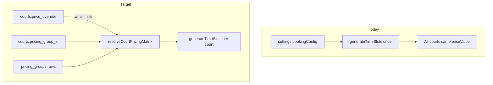

# Pricing Groups Implementation Plan

## Decision (confirmed)

**Hybrid normalized model:** `pricing_groups` table + `courts.pricing_group_id` FK + `courts.price_override` JSONB. Requires a **dbmate migration**. Non-pricing `bookingConfig` fields (hours, cancellation, duration limits) stay in `venue.settings`.

---

## Current state (baseline)

- Single matrix at `venue.settings.bookingConfig.{defaultPriceValue, pricingRules}` — parsed by [`getBookingConfig()`](src/lib/booking.ts).
- All courts share one price set: [`getAvailableSlots()`](src/lib/booking.ts) calls `generateTimeSlots()` once and clones to every court.
- Admin grid: [`BookingConfigSection`](src/app/(admin)/admin/bookings/page.tsx) (~L1463); court cards: [`CourtsManager`](src/components/admin/CourtsManager.tsx).
- Server price truth: `resolveBookingPrice()` / `resolveGroupBookingPrice()` — 6 API write routes + 2 availability routes (see investigation report).



---

## 1. Database schema (dbmate migration)

New migration file via `npm run db:new pricing_groups`.

### `pricing_groups` table

| Column | Type | Notes |
|---|---|---|
| `id` | `text` PK | cuid |
| `venue_id` | `text` FK → `venues` | indexed |
| `name` | `text` | e.g. "Standard", "Premium Pickleball" |
| `sort_order` | `int` | display order in admin tabs |
| `is_default` | `boolean` | exactly one `true` per venue — enforced by partial unique index |
| `is_unconfigured` | `boolean DEFAULT false` | set by backfill when source had zero/missing pricing; cleared on first real save |
| `default_price_value` | `int` | whole VND |
| `pricing_rules` | `jsonb` | `[{ dayOfWeek, startHour, endHour, priceValue }]` |
| `created_at` / `updated_at` | timestamps | |

**One-default constraint is a hard Postgres partial unique index, not just API enforcement:**

```sql
CREATE UNIQUE INDEX pricing_groups_one_default_per_venue
  ON pricing_groups (venue_id)
  WHERE is_default = true;
```

This fires at the DB level: even a manual `UPDATE` or a future API bug cannot create two defaults. API code still handles the "swap default" logic in a transaction (unset old → set new), but the index is the final guard.

### `courts` alterations

```sql
ALTER TABLE courts ADD COLUMN IF NOT EXISTS pricing_group_id text REFERENCES pricing_groups(id) ON DELETE SET NULL;
ALTER TABLE courts ADD COLUMN IF NOT EXISTS price_override jsonb;
```

`price_override` shape (nullable — when set, **replaces the whole group matrix** for that court; the admin must enter the full 7×24 grid, not just the changed cells):

```json
{ "defaultPriceValue": 120000, "pricingRules": [{ "dayOfWeek": 5, "startHour": 18, "endHour": 22, "priceValue": 200000 }] }
```

This is a deliberate **full-replace** design: the override takes the place of the group matrix entirely. There is no partial-merge / sparse-diff path. The override modal in the admin UI presents the same full 7×24 grid editor as the group tab, pre-populated with the group's current values as a starting point so the admin only has to change what differs.

### Data backfill (in same migration `migrate:up`)

For every venue with existing `settings.bookingConfig`:

1. Insert one `pricing_groups` row: `name = 'Standard'`, `is_default = true`, copy `defaultPriceValue` + `pricingRules` from JSON (handle legacy `priceInCents` / `defaultPriceInCents` aliases).
2. `UPDATE courts SET pricing_group_id = <new group id> WHERE venue_id = <venue>`.
3. **Do not delete** legacy keys from `bookingConfig` yet — keep for one-release read fallback, strip in a follow-up.

**Zero-price venues — explicit warning, not silent default:**

Venues with empty/missing `bookingConfig` (i.e. `defaultPriceValue` is 0 or absent) still get a default group so courts are always assigned, but the migration SQL emits a `RAISE NOTICE` for each such venue and also inserts a row into a `migration_warnings` scratch table (a simple `CREATE TEMP TABLE` is not durable enough — use a regular `DO $$ ... $$` block that `RAISE NOTICE`s to the Railway/dbmate log). Additionally, the `pricing_groups` row for these venues gets `is_unconfigured = true` (a `boolean DEFAULT false` column on `pricing_groups`), which the superadmin dashboard can surface as a warning badge. Before deploying to production, review the Railway migration log for these notices.

The `is_unconfigured` flag is cleared when an admin saves a non-zero price on that group.

### `migrate:down` (reversal)

```sql
-- migrate:down
ALTER TABLE courts DROP COLUMN IF EXISTS pricing_group_id;
ALTER TABLE courts DROP COLUMN IF EXISTS price_override;
DROP TABLE IF EXISTS pricing_groups;
```

This fully reverses the schema. The backfill data (group rows) disappears with the table drop. Pricing falls back to the legacy `bookingConfig` keys in `venue.settings`, which are still present (not deleted in `migrate:up`).

After migrate: `npm run db:pull` + `npm run db:generate`.

---

## 2. Types and resolution logic

### New types in [`src/lib/booking.ts`](src/lib/booking.ts)

```ts
export interface PricingMatrix {
  defaultPriceValue: number;
  pricingRules: PricingRule[];
}

export interface ResolvedCourtPricing {
  matrix: PricingMatrix;
  source: "override" | "group" | "default_group" | "legacy";
  groupId?: string;
  groupName?: string;
}
```

### New helpers (same file)

| Function | Purpose |
|---|---|
| `parsePricingMatrix(raw)` | Normalize rules + legacy aliases |
| `resolveCourtPricingMatrix(court, groups, legacyBookingConfig?)` | Priority: `court.priceOverride` → `court.pricingGroupId` → default group → legacy `bookingConfig` fallback. The override is a **frozen snapshot** stored in `courts.price_override`; it is never auto-updated when the group matrix changes. Changing `pricing_group_id` while an override is set has no effect on prices until the override is cleared — this is intentional and documented in the UI. |
| `resolveCourtBookingPrice(matrix, startTime, durationMinutes, tz)` | Thin wrapper around existing cell loop (reuse `resolveSlotPrice` with a `PricingMatrix`) |
| `generateTimeSlotsForMatrix(localMidnight, matrix, venueHours, tz)` | Extract from current private `generateTimeSlots`, taking matrix + `bookingStartHour`/`bookingEndHour` from venue-level config |

### Update existing functions

- **`getBookingConfig()`** — stop returning `defaultPriceValue` / `pricingRules` as authoritative (keep parsing for legacy fallback only; mark deprecated in JSDoc).
- **`getAvailableSlots()`** — for each court: load `pricingGroupId`, `priceOverride`, venue's groups; resolve matrix; generate slots per court (cache by `groupId` + override hash to avoid N duplicate generations).
- **`resolveBookingPrice()`** — add overload or new `resolveCourtBookingPrice(courtId, ...)` that loads court + groups inside, or require callers to pass pre-resolved matrix.
- **`resolveGroupBookingPrice()`** — price each court independently via its own resolved matrix.

### Venue-level config split

`BookingConfig` retains operational fields only:

`bookingStartHour`, `bookingEndHour`, `cancellationHours`, `allow30MinBookings`, `defaultDurationMinutes`, `maxDurationMinutes`, `allowMultiCourtBookings`, `maxCourtsPerBooking`, `slotDurationMinutes` (deprecated).

---

## 3. API changes

### New admin routes

| Route | File | Behavior |
|---|---|---|
| `GET /api/admin/venues/[id]/pricing-groups` | new | List groups for venue, ordered by `sort_order` |
| `POST /api/admin/venues/[id]/pricing-groups` | new | Create group; validate name; if first group, set `is_default` |
| `PATCH /api/admin/pricing-groups/[id]` | new | Update name, matrix, `sort_order`; toggle `is_default` (unset previous default in transaction) |
| `DELETE /api/admin/pricing-groups/[id]` | new | Block delete if `is_default` or courts still assigned; reassign or require explicit target |

Follow patterns from [`membership-tiers`](src/app/api/admin/membership-tiers/route.ts): `requireAdminAccess`, `assertVenueAccess`.

### Existing route updates

| Route | Change |
|---|---|
| [`PATCH /api/courts/[courtId]`](src/app/api/courts/[courtId]/route.ts) | Accept `pricingGroupId` (nullable) and `priceOverride` (nullable object); validate group belongs to same venue |
| [`PUT .../booking-config`](src/app/api/admin/venues/[id]/booking-config/route.ts) | Stop accepting `pricingRules` / `defaultPriceValue` in body (or ignore with warning); operational fields only |
| [`GET /api/public/venue`](src/app/api/public/venue/route.ts) | Remove flat `pricingRules` from response (or return `pricingGroups` summary without full matrices — player portal doesn't need matrices, only availability slots) |
| All 6 booking write routes | Pass `courtId` into new price resolver |

### Availability routes (unchanged URLs)

[`GET /api/public/availability`](src/app/api/public/availability/route.ts) and [`GET /api/bookings/availability`](src/app/api/bookings/availability/route.ts) — behavior changes inside `getAvailableSlots()` only.

### Admin venue list

[`GET /api/admin/venues`](src/app/api/admin/venues/route.ts) — include `pricingGroups` in response (or separate fetch on settings tab) so `BookingConfigSection` tabs can render without extra round-trip.

---

## 4. Admin UI changes

### A. Court cards — [`CourtsManager.tsx`](src/components/admin/CourtsManager.tsx)

Extend `Court` interface:

```ts
{ pricingGroupId: string | null; priceOverride: PricingMatrix | null; }
```

Per card (when `showBookable`):

- **Pricing group `<select>`** — options from venue's groups; PATCH on change.
  - **When a `priceOverride` is active on the court, the selector is still enabled** (the admin can switch groups), but it renders a persistent inline warning directly below it:
    > "This court has a price override — the group selection has no effect until the override is cleared."
  - The warning uses the same amber style as other "unsaved changes" indicators so it cannot be missed. The override badge and "Edit override" / "Clear override" actions are co-located on the same card row as the selector, not on a separate section.

- **Override indicator** — badge always visible on the card when `priceOverride` is set (not just on hover); click opens a modal with the same full 7×24 grid editor (`PricingScheduleGrid`). Includes a "Clear override" button that NULLs the column and reverts the court to its group pricing. This is a **full-replace** — no partial-diff logic required.

  **Pre-fill source and frozen-value notice:** The modal is pre-populated with the court's `price_override` values if an override already exists, or with the assigned group's current matrix when opening for the first time. A tooltip / sub-label in the modal header reads:
  > "This override is a snapshot — it does not update automatically if the group's pricing changes later. To inherit future group changes, clear the override."

  This copy is also shown as a one-line note at the bottom of the saved override badge on the card, so it is visible without opening the modal.

- Pass `pricingGroups` prop from parent.

Parent [`bookings/page.tsx`](src/app/(admin)/admin/bookings/page.tsx) settings tab loads groups alongside `venueDetails`.

### B. Pricing Schedule — refactor [`BookingConfigSection`](src/app/(admin)/admin/bookings/page.tsx)

Extract shared grid utilities to e.g. [`src/components/admin/PricingScheduleGrid.tsx`](src/components/admin/PricingScheduleGrid.tsx):

- `rulesToGrid`, `gridToRules`, cell edit UX (currently inline ~L1437–1631).

Replace single grid with:

- **Horizontal tabs** — one tab per `pricing_groups` row (+ "Manage groups" affordance).
- Each tab edits that group's matrix; Save → `PATCH /api/admin/pricing-groups/[id]`.
- **"+ Add group"** — modal (name input) → POST create.
- Rename / delete group (with guard if courts assigned).
- **Default group** star/badge on tab; "Set as default" action.
- Move `defaultPriceValue` field into each group's tab (not venue-global).

[`GeneralSettingsSection`](src/app/(admin)/admin/bookings/page.tsx) unchanged (hours, 30-min, multi-court limits still save to `booking-config`).

### C. i18n

Add keys to [`src/i18n/locales/staff/en.json`](src/i18n/locales/staff/en.json) + `vi.json` for: pricing group, override, set default, add group, cannot delete assigned group, override-active warning on group selector ("This court has a price override — the group selection has no effect until the override is cleared"), override frozen-snapshot tooltip ("This override is a snapshot — it does not update automatically if the group's pricing changes later. To inherit future group changes, clear the override"). (RN parity N/A — no mobile admin booking settings.)

---

## 5. Client surfaces (no matrix UI, slot-sum unchanged)

These sum `slot.priceValue` from availability — **no code change** once `getAvailableSlots` returns per-court prices:

- [`src/app/(book)/book/page.tsx`](src/app/(book)/book/page.tsx)
- [`src/app/(book)/book/confirm/page.tsx`](src/app/(book)/book/confirm/page.tsx)
- [`src/components/admin/BookingSelectionBar.tsx`](src/components/admin/BookingSelectionBar.tsx)
- [`src/components/admin/StaffBookingModal.tsx`](src/components/admin/StaffBookingModal.tsx)

---

## 6. Tests

Update / add in [`src/lib/__tests__/booking-grid.test.ts`](src/lib/__tests__/booking-grid.test.ts) and [`booking-multi-court.test.ts`](src/lib/__tests__/booking-multi-court.test.ts):

- `resolveCourtPricingMatrix` priority: override > assigned group > default group > legacy.
- Two courts, two groups → different `priceValue` in same hour from `getAvailableSlots` (mock prisma).
- `resolveGroupBookingPrice` with courts on different groups → independent totals.
- Backfill: venue with legacy `bookingConfig` produces one default group.

---

## 7. Rollout and backward compatibility

| Phase | Action |
|---|---|
| Migration | Backfill creates "Standard" group; all courts assigned |
| Read path | `resolveCourtPricingMatrix` falls back to `bookingConfig` if no groups row (safety net) |
| Write path | Admin saves matrices only via pricing-groups API; `booking-config` PUT ignores pricing fields |
| Cleanup (later) | Remove `pricingRules` / `defaultPriceValue` from `bookingConfig` JSON in venues; remove legacy fallback code |

Existing **bookings** keep stored `priceValue` snapshot — no repricing of historical rows.

---

## 8. Files touched (summary)

| Area | Files |
|---|---|
| Migration | `db/migrations/YYYYMMDD_pricing_groups.sql`, `db/schema.sql`, `prisma/schema.prisma` |
| Core logic | [`src/lib/booking.ts`](src/lib/booking.ts) |
| APIs | new `pricing-groups` routes; [`courts/[courtId]/route.ts`](src/app/api/courts/[courtId]/route.ts); 6 booking routes; [`booking-config/route.ts`](src/app/api/admin/venues/[id]/booking-config/route.ts); [`public/venue/route.ts`](src/app/api/public/venue/route.ts) |
| Admin UI | [`CourtsManager.tsx`](src/components/admin/CourtsManager.tsx), new `PricingScheduleGrid.tsx`, [`bookings/page.tsx`](src/app/(admin)/admin/bookings/page.tsx) |
| i18n | `en.json`, `vi.json` |
| Tests | `booking-grid.test.ts`, `booking-multi-court.test.ts` |

---

## 9. MCP / AI Booking Agent — impact assessment

**Result: the MCP is not a breaking change surface for court pricing.**

The MCP server (`mcp-handler.ts`) exposes six tools — all coach-lesson oriented:

| Tool | Pricing contact |
|---|---|
| `check_coach_availability` | None — queries `CoachAvailability` schedule and conflicts only |
| `list_available_coaches` | None — returns `hourlyRate` from `StaffMember`, not `bookingConfig` |
| `get_default_package_for_coach` | None — reads `CoachPackage.priceValue` directly |
| `create_player_account` | None |
| `create_coach_lesson` | Calls `createCoachLesson()` in `src/lib/coach-lesson.ts` |
| `generate_login_link` | None |

**`create_coach_lesson` does call `getBookingConfig()`**, but only to read `bookingStartHour` and `bookingEndHour` as bounds for `findNextAvailableSlot`. It **does not read `pricingRules` or `defaultPriceValue`** — coach lesson pricing is package-based via `calculateSessionPrice(pkg, ...)` and is entirely unaffected by this migration.

**`GET /api/public/venue` is not called by the MCP** — the agent talks directly to lib functions, not the HTTP surface.

**No action required for the MCP.** The one touch point (`getBookingConfig` in `coach-lesson.ts`) uses only the operational fields (`bookingStartHour`/`bookingEndHour`) that remain in `venue.settings.bookingConfig` after this change.

---

## 10. Out of scope (v1)

- Sport-type auto-assignment of groups (`Venue.sportType` is venue-level, not per-court).
- RN mobile admin parity (no mobile booking settings today).
- Member discount pricing (listed as future in PRD).
- Repricing existing confirmed bookings when matrix changes.
