# Program Passes Admin UI — Stage 3

## Architecture overview

```mermaid
flowchart TD
    Page["page.tsx\n/admin/program-passes"] --> TabA["Program Passes tab\n(default)"]
    Page --> TabB["Pass Types tab"]

    TabA --> KPI["3 KPI cards\n(collected, unpaid, overdue)"]
    TabA --> FiltersRow["Filters + Activate button"]
    TabA --> PassTable["Passes table\n(Player, Pass Type, Status, Usage, Cycle ends, Actions)"]
    TabA --> ActivateModal["Activate modal\n2-step: player search → pass details"]
    TabA --> CheckInModal["Check-in modal\n(today's ClassInstances)"]
    TabA --> PauseModal["Pause modal\n(deferred date picker)"]

    TabB --> PassTypeCards["Pass type cards per venue\n(name, price, sessions, coach tags)"]
    TabB --> PassTypeModal["Add/Edit pass type modal\n(multi-select coaches)"]

    Page --> API1["GET /api/admin/program-passes\n?venueId="]
    Page --> API2["POST /api/admin/program-passes/activate"]
    Page --> API3["PATCH /api/admin/program-passes/[id]"]
    Page --> API4["GET /api/admin/program-passes/types\n?venueId="]
    Page --> API5["POST /api/admin/program-passes/types"]
    Page --> API6["PATCH /api/admin/program-passes/types/[id]"]
    Page --> API7["DELETE /api/admin/program-passes/types/[id]"]
    Page --> API8["POST /api/admin/program-passes/check-in\n(already exists)"]
```



## Step 0 — Database migration + schema sync

**New file:** `db/migrations/20260704000003_add_program_pass_type_coaches.sql`

```sql
-- migrate:up
CREATE TABLE "program_pass_type_coaches" (
  "id" TEXT NOT NULL DEFAULT gen_random_uuid()::text,
  "pass_type_id" TEXT NOT NULL REFERENCES "program_pass_types"("id") ON DELETE CASCADE,
  "coach_id" TEXT NOT NULL REFERENCES "staff_members"("id") ON DELETE CASCADE,
  "created_at" TIMESTAMPTZ NOT NULL DEFAULT NOW(),
  PRIMARY KEY ("id"),
  UNIQUE ("pass_type_id", "coach_id")
);
CREATE INDEX ON "program_pass_type_coaches"("pass_type_id");

-- migrate:down
DROP TABLE "program_pass_type_coaches";
```

Run sequence:
1. `npm run db:migrate` — applies locally
2. `npm run db:pull` — introspects into `schema.prisma`; manually restore model name `ProgramPassTypeCoach` with `@@map("program_pass_type_coaches")` and add relation to `ProgramPassType`
3. `npx prisma generate`

After pull the schema additions will be:
- New model `ProgramPassTypeCoach` with `passTypeId`, `coachId`, `createdAt` and relations to `ProgramPassType` and `StaffMember`
- New `coaches ProgramPassTypeCoach[]` relation on `ProgramPassType`

## Step 1 — API routes

### Pass Types routes

**`src/app/api/admin/program-passes/types/route.ts`** — GET + POST
- GET: `prisma.programPassType.findMany({ where: { venueId, isActive: true }, include: { coaches: { include: { coach: { select: { id, name } } } }, _count: { select: { programPasses: { where: { status: 'active' } } } } } })`
- POST: create `ProgramPassType` then create `ProgramPassTypeCoach` rows for each `coachIds[]` entry

**`src/app/api/admin/program-passes/types/[id]/route.ts`** — PATCH + DELETE
- PATCH: update name/price/sessionsIncluded; if `coachIds` provided, delete existing coaches rows and re-insert
- DELETE: `prisma.programPassType.update({ data: { isActive: false } })` — blocked if active passes exist

### Program Passes routes

**`src/app/api/admin/program-passes/route.ts`** — GET
- `prisma.programPass.findMany` with `player`, `passType` (include coaches), latest payment; compute `currentPaymentStatus` same as memberships route; return KPI summary (collected this month, unpaidCount, overdueCount) alongside rows

**`src/app/api/admin/program-passes/activate/route.ts`** — POST
- Body: `{ playerId, venueId, passTypeId, paymentMethod, amountValue, note?, cycleStart }`
- Compute `cycleEnd` = last day of cycleStart's month
- Prisma transaction: create `ProgramPass` + create `ProgramPassPayment` (status UNPAID unless paymentMethod provided)

**`src/app/api/admin/program-passes/[id]/route.ts`** — PATCH
- Handles three operations dispatched by body fields:
  - `{ status: 'paused', deferredStartDate }` → pause
  - `{ status: 'active', clearDeferred: true }` → resume
  - `{ status: 'cancelled' }` → cancel

### Coaches source
Fetch coaches for the venue using the existing `GET /api/admin/coaches?venueId=` (already returns `id` + `name`).

### Players search
Uses existing `GET /api/admin/players?search=&limit=10` — already used in the memberships page (returns `{ players: [{ id, name, phone }] }`).

## Step 2 — Page component

**Replace:** [`src/app/(admin)/admin/program-passes/page.tsx`](src/app/(admin)/admin/program-passes/page.tsx)

Structure mirrors [`src/app/(admin)/admin/memberships/page.tsx`](src/app/(admin)/admin/memberships/page.tsx):

- `useAdminVenuePicker({ autoSelect: true })` for venue selection
- `AdminVenuePicker` in the header
- Two tabs: `"passes"` (default) | `"passTypes"`

### Local helper components (bottom of file, same file)
- `PassStatusBadge` — green/amber/neutral pills matching `ClassPassStatus` values: `active`, `paused`, `expired`, `cancelled`
- `AmountInput` — copy the same local pattern from `courtpay-billing/page.tsx`: controlled string state with VND comma formatting, `onChange(number)`
- `PassTypeFormModal` — modal with name, price (AmountInput), sessions, coaches multi-select
- `ActivateModal` — 2-step: step 1 player search, step 2 pass details + payment method + discount toggle
- `CheckInModal` — lists today's `ClassInstance` rows for venue; staff picks one; calls existing check-in route
- `PauseModal` — date picker for deferred resume date, defaults to first of next month

### Key state
```ts
activeTab: "passes" | "passTypes"
passTypes: PassType[]          // from /types endpoint
passes: ProgramPass[]          // from root endpoint
kpi: { collected, unpaidCount, overdueCount }
filterPassType: string         // "all" | passTypeId
filterStatus: string           // "all" | status
coaches: Coach[]               // for multi-select in pass type form
showActivate / showPause / showCheckIn / showPassTypeForm: boolean
selectedPass: ProgramPass | null
```

### Pass Types tab — card layout
Same grid as membership tier cards (`grid gap-3 sm:grid-cols-2 lg:grid-cols-4`). Each card:
- Name + price + sessions count
- Coach name tags (`flex gap-1 flex-wrap` with small pill badges)
- Active pass count (`_count.programPasses`)
- Edit (Pencil) + Deactivate (Trash2) icons

### Program Passes tab — table columns
`Player | Pass Type | Status | Usage | Cycle ends | Actions`

Action logic per row:
```
active + sessionsUsed < sessionsIncluded  → CheckIn icon + Pause icon
active + sessionsUsed === sessionsIncluded → Lock icon only
paused                                    → RotateCcw (resume) + XCircle (cancel)
expired / cancelled                       → —
```

### Activate modal — cycle start logic
```ts
const today = new Date();
const cycleStart = today.getDate() <= 15
  ? new Date(today.getFullYear(), today.getMonth(), 1)
  : new Date(today.getFullYear(), today.getMonth() + 1, 1);
```

## File list

New files to create:
- `db/migrations/20260704000003_add_program_pass_type_coaches.sql`
- `src/app/api/admin/program-passes/route.ts`
- `src/app/api/admin/program-passes/activate/route.ts`
- `src/app/api/admin/program-passes/[id]/route.ts`
- `src/app/api/admin/program-passes/types/route.ts`
- `src/app/api/admin/program-passes/types/[id]/route.ts`

File to replace:
- `src/app/(admin)/admin/program-passes/page.tsx`

Files to update (schema sync only, no logic change):
- `prisma/schema.prisma` — add `ProgramPassTypeCoach` model + relation after `db pull`

## Execution order
1. Create migration SQL file
2. `npm run db:migrate` locally
3. `npm run db:pull` + manually fix model names + `npx prisma generate`
4. Build API routes (types first, then passes)
5. Replace page.tsx
6. `tsc --noEmit` → 0 errors
7. Commit: `feat(admin): program passes full UI — pass types, activation, check-in, pause/resume`
