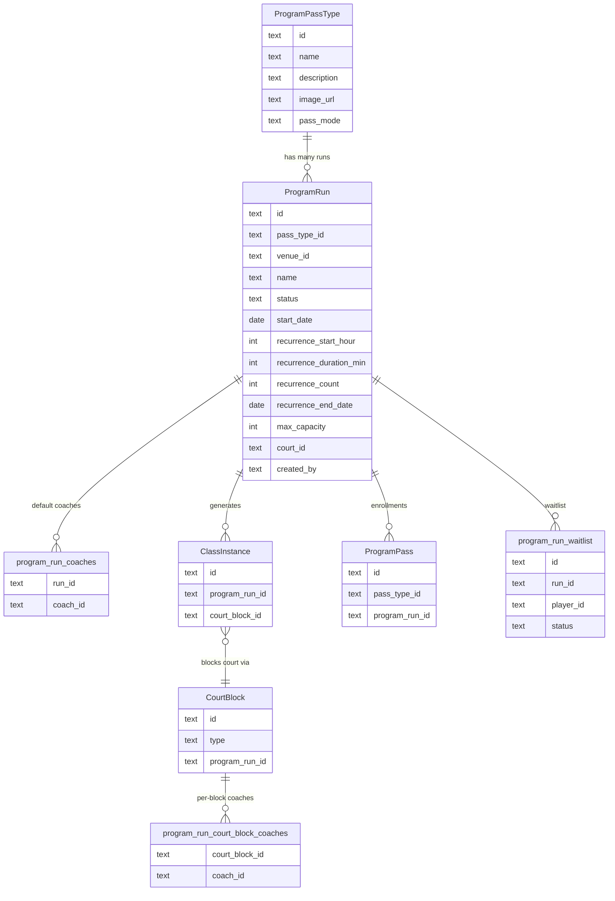
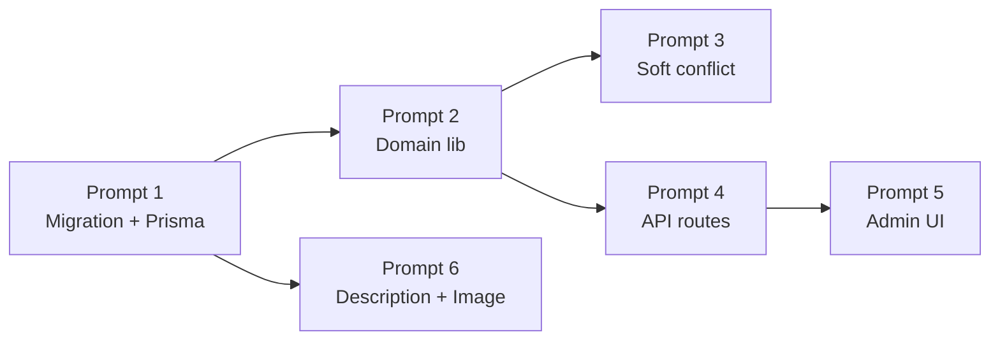

# Program Passes Cohort Model — Phase 1 Build Plan

## Data model overview



## Prompt 1 — Migration + Prisma sync

**New file:** [`db/migrations/20260716120000_program_run_cohort.sql`](db/migrations/20260716120000_program_run_cohort.sql)

`migrate:up` steps (in dependency order):

1. `ALTER TYPE "CourtBlockType" ADD VALUE IF NOT EXISTS 'program_class'` inside a `DO $$ BEGIN ... EXCEPTION` guard — same pattern as [`db/migrations/20260706055400_add_alobo_court_block_type.sql`](db/migrations/20260706055400_add_alobo_court_block_type.sql)
2. Add `program_run_id` (nullable, no FK constraint yet — `program_runs` table doesn't exist yet) to `court_blocks`. **Do NOT add a `coach_id` column here.** Coach-to-block assignment is handled exclusively by the `program_run_court_block_coaches` join table (step 3) to support multiple coaches per block without a duplicate source of truth.
3. Create `program_run_court_block_coaches` join table (`court_block_id TEXT REFERENCES court_blocks(id) ON DELETE CASCADE`, `coach_id TEXT REFERENCES staff_members(id) ON DELETE CASCADE`, `PRIMARY KEY (court_block_id, coach_id)`). This is the single source of truth for which coaches are assigned to a given block.
4. Create `program_runs` table — fields: `id`, `pass_type_id`, `venue_id`, `name`, `status TEXT DEFAULT 'upcoming'`, `start_date DATE` (the calendar date of the first occurrence — local date, no timezone), `recurrence_start_hour INT`, `recurrence_duration_min INT`, `recurrence_count INT`, `recurrence_end_date DATE`, `max_capacity INT`, `court_id` (nullable FK → `courts`), `note`, `created_by`, timestamps. Indexes: `(pass_type_id)`, `(venue_id, status)`. **No `starts_at TIMESTAMPTZ` and no `recurrence_day_of_week` column** — the day-of-week is derived at runtime via `new Date(start_date + 'T12:00:00+07:00').getDay()` so there is no redundant stored fact.
5. Add deferred FK: `ALTER TABLE court_blocks ADD CONSTRAINT fk_court_blocks_program_run FOREIGN KEY (program_run_id) REFERENCES program_runs(id) ON DELETE SET NULL`
6. Create `program_run_coaches` join table (`run_id TEXT REFERENCES program_runs(id) ON DELETE CASCADE`, `coach_id TEXT REFERENCES staff_members(id) ON DELETE CASCADE`, `PRIMARY KEY (run_id, coach_id)`) — stores the run's default coaches that get copied to each `program_run_court_block_coaches` row during schedule generation.
7. `ALTER TABLE class_passes ADD COLUMN IF NOT EXISTS program_run_id TEXT REFERENCES program_runs(id) ON DELETE SET NULL` + index
8. `ALTER TABLE class_instances ADD COLUMN IF NOT EXISTS program_run_id TEXT REFERENCES program_runs(id) ON DELETE SET NULL` and `court_block_id TEXT REFERENCES court_blocks(id) ON DELETE SET NULL` + indexes; `DROP COLUMN IF EXISTS court_id`
9. `ALTER TABLE program_pass_types ADD COLUMN IF NOT EXISTS description TEXT, ADD COLUMN IF NOT EXISTS image_url TEXT`
10. Create `program_run_waitlist` table (`run_id`, `player_id`, `status TEXT DEFAULT 'waiting'`, `promoted_at`, `note`, unique `(run_id, player_id)`) — schema only, no promotion logic (Phase 2 scope, included now to avoid a second migration)

`migrate:down` reverses each step in reverse order. Enum removal is a known non-reversible operation (documented comment only).

After migration: `npm run db:migrate` → `npm run db:pull` → manually set Prisma model names (`ProgramRun @@map("program_runs")`, `ProgramRunCoach @@map("program_run_coaches")`, `CourtBlockCoach @@map("program_run_court_block_coaches")`, `ProgramRunWaitlistEntry @@map("program_run_waitlist")`) → `npx prisma generate`.

## Prompt 2 — Domain library

**New file:** [`src/lib/program-run.ts`](src/lib/program-run.ts)

Plain async functions, no React, no Next.js imports:

- `generateRunSchedule(runId, tx?)` — inside a serializable transaction: loads the Run + its coaches + court; derives the recurrence day-of-week from `new Date(run.start_date + 'T12:00:00+07:00').getDay()` — never stored redundantly; iterates `recurrence_count` (or dates until `recurrence_end_date`), advancing by 7 days per occurrence from `start_date`; creates one `CourtBlock` (type `program_class`, `programRunId`, `courtIds: [run.court_id]`) and one `ClassInstance` (linked via `courtBlockId`, `programRunId`) per occurrence; creates `program_run_court_block_coaches` rows from the run's coaches (copied from `program_run_coaches`). Guard: if any ClassInstances already exist for this run, return early with the existing list (idempotent). Returns `{ instanceCount, blockIds[] }`.
- `checkProgramBlockConflict(coachId, date, startTime, endTime)` — queries `court_blocks` where `type = 'program_class'`, `date`, overlapping time range, joined to `program_run_court_block_coaches` where `coach_id = coachId`; returns `{ hasConflict: boolean, blockInfo?: { programRunId, title } }`.
- `enrollInRun(runId, playerId, venueId, ...)` — serializable transaction: `COUNT(*)` from `class_passes` where `programRunId = runId` to get current enrollment; check against `max_capacity`; create `ProgramPass` with `programRunId`; create `ProgramPassPayment`. Typed error codes: `RUN_FULL`, `ALREADY_ENROLLED`, `RUN_NOT_UPCOMING`.
- `updateRunCapacity(runId, newMax)` — derive current enrollment via COUNT; reject if `newMax < enrolled`; update `max_capacity`.
- `rescheduleInstance(instanceId, newDate, newStartAt, newEndAt)` — updates linked `CourtBlock` + `ClassInstance` only; no effect on siblings.

## Prompt 3 — Coach soft-conflict in admin lesson route

**File:** [`src/app/api/admin/coach-lessons/route.ts`](src/app/api/admin/coach-lessons/route.ts)

After the existing `coachLesson.findFirst` conflict check (~line 186), add:

```typescript
const programConflict = await checkProgramBlockConflict(
  body.coachId, date, startTime, endTime
);
// Do NOT reject — proceed to create the lesson
```

Change the success response from `json(lesson, 201)` to:

```typescript
json({
  lesson,
  ...(programConflict.hasConflict
    ? { warning: { code: "COACH_PROGRAM_CONFLICT", blockInfo: programConflict.blockInfo } }
    : {}),
}, 201);
```

**File:** [`src/components/admin/StaffBookingModal.tsx`](src/components/admin/StaffBookingModal.tsx) (lesson create path, ~line 915)

After a successful lesson POST: if the response body contains `warning`, render a yellow `AlertTriangle` banner below the confirmation showing which program the coach is assigned to. Staff dismisses and carries on. No change to the court-booking or player-facing routes — those stay as hard rejects.

## Prompt 4 — Admin API routes

**New folder:** `src/app/api/admin/program-runs/`

| File | Method | Purpose |
|---|---|---|
| `route.ts` | `GET ?venueId=&passTypeId=` | List runs with derived enrollment count, coaches, capacity |
| `route.ts` | `POST` | Create a run (no instances yet); validates court + coaches exist |
| `[id]/route.ts` | `PATCH` | Edit name, status, capacity (calls `updateRunCapacity`), note, coaches (replace join rows) |
| `[id]/generate/route.ts` | `POST` | Call `generateRunSchedule(runId)` — guard against double-generation |
| `[id]/instances/route.ts` | `GET` | List ClassInstances for a run, include CourtBlock date/time and check-in count |
| `[id]/instances/[instanceId]/route.ts` | `PATCH` | Call `rescheduleInstance` or update coaches for a single instance |

All routes: `requireSuperAdmin` auth guard (same as program-passes routes).

## Prompt 5 — Admin UI: Program Runs tab

**File:** [`src/app/(admin)/admin/program-passes/page.tsx`](src/app/(admin)/admin/program-passes/page.tsx)

Add a third tab `"programRuns"` alongside `"passes"` and `"passTypes"`.

Program Runs tab contents:
- Run cards: name, pass type badge, status badge (`upcoming` → purple, `in_progress` → green, `completed` → neutral, `cancelled` → red), capacity gauge (`X / Y enrolled`), date range, coach name tags, court label
- "Generate Schedule" button (only visible if `instanceCount === 0`) — calls `POST .../generate`, then refreshes
- "Edit" (pencil) → Edit Run modal: name, capacity (with guard error if lowered below enrolled), coaches multi-select, status dropdown
- Expandable instance list per run: date, start/end time, coach tags, check-in count, "Reschedule" action per row

Create Run modal (2-step):
- Step 1: select Pass Type, name the run, pick court, set capacity, select coaches (multi-select same as Pass Type form)
- Step 2: recurrence — day of week picker, start time, duration (minutes), number of occurrences or end date; preview showing the generated dates before confirming

## Prompt 6 — Pass Type description + image

**File:** [`src/app/(admin)/admin/program-passes/page.tsx`](src/app/(admin)/admin/program-passes/page.tsx) — `PassTypeFormModal` (~line 579)

Add to the form:
- `description` textarea (optional)
- Image picker: shows current image if `imageUrl` is set, file input → `POST /api/admin/program-passes/types/[id]/image` on save

**New file:** [`src/app/api/admin/program-passes/types/[id]/image/route.ts`](src/app/api/admin/program-passes/types/[id]/image/route.ts)

`POST` multipart/form-data. Pattern mirrors [`src/app/api/venues/[venueId]/logo/route.ts`](src/app/api/venues/[venueId]/logo/route.ts):
- Accept PNG, JPEG, WebP (same `ALLOWED_TYPES` list, 5 MB cap)
- `const raw = Buffer.from(await file.arrayBuffer())`
- `const webp = await sharp(raw).resize(800, 800, { fit: 'inside' }).webp({ quality: 80 }).toBuffer()`
- Write to `/uploads/program-passes/{id}.webp` (create dir if needed via `mkdir -p`)
- `prisma.programPassType.update({ imageUrl: '/uploads/program-passes/{id}.webp' })`
- Return `{ imageUrl }`

Do **not** hardcode `.jpg` or trust the uploaded file extension — always run through sharp and always output `.webp`. This matches the logo and face-thumbnail patterns already in the codebase.

Also update the Pass Type cards in the tab to show the description excerpt and image thumbnail when present.

## Build sequence



Prompt 6 (description + image) only depends on the migration columns added in Prompt 1 (`description`, `image_url` on `program_pass_types`). It has no dependency on the domain library or API routes and can be run in parallel with Prompts 2–5 immediately after Prompt 1 lands. Prompts 3 and 4 are independent of each other after Prompt 2.

## Key constraints to carry across all prompts

- Timezone: all `setHours` local, never `setUTCHours`; Prisma DATE writes use `T12:00:00+07:00` noon pattern
- All conflict/availability checks in `generateRunSchedule` use local day-of-week (`getDay()`)
- `enrolled_count` is always a live COUNT from `class_passes WHERE program_run_id = ?` inside a serializable transaction — never a stored counter
- `program_class` CourtBlock type blocks the court uniformly in `getAvailableSlots()` with no special-casing needed (confirmed from investigation)
- Module shape: if any program-run logic grows beyond `src/lib/program-run.ts`, mirror `src/modules/courtpay/` exactly: `types.ts` + `lib/` + `components/`, no barrel `index.ts`, no `hooks/` directory

---

## Phase 2 — What is NOT built in Phase 1

Everything below requires Phase 1 to be stable and shipped first.

### CourtPass player-facing UI

- Program listing page in CourtPass: display active Runs per venue — name, description, image, coach, full schedule, price, spots remaining
- Run detail page: expanded schedule with dates/times, coach bio, enrollment CTA
- Enrollment + prepayment flow: player selects a Run, pays in full via the existing payment flow; only confirmed payment reserves the capacity slot (no partial or deferred payment)
- Enrollment produces the same `ProgramPass` record as admin activation so admin reporting stays unified
- "Run is full" state on the listing page — hides the enroll button, shows waitlist CTA when waitlist is implemented
- Mobile parity: same listing + enrollment flow in the React Native app (`mobile/src/`)

### Waitlist

- `program_run_waitlist` table is already created by the Phase 1 migration (schema only)
- Phase 2 adds the promotion logic: when capacity is raised or a confirmed enrollment is cancelled, the first `waiting` entry is automatically promoted and notified
- Player-facing "join waitlist" button when a Run is at capacity
- Admin panel: view and manually promote/remove waitlist entries per Run
- Push notification to waitlisted player when their spot opens

### Automated Run lifecycle

- Auto-transition Run status from `upcoming` → `in_progress` when the first class date passes
- Auto-transition to `completed` when the last class date passes
- Optional: auto-create a new Run (next cohort) when one completes, for recurring programs

### Refunds and cancellations

- Player cancellation flow: staff marks a player's enrollment as cancelled; contacting the player and issuing a refund is a manual staff action (call/message the player directly)
- Run cancellation flow: staff sets the Run status to `cancelled`; the enrollment slots are freed; refunding all affected players is a manual process — no automated refund system, not even in Phase 2
- No payment reversal or credit automation at any phase — this was an explicit spec decision

### Per-session no-show / attendance status

- Currently tracked via `sessionsUsed` and the existing check-in log only
- Phase 2 option: add an explicit `attended / no_show / excused` status per ClassInstance per player if reporting needs it

### Program analytics

- Fill rate per Run (enrolled / max_capacity over time)
- Coach utilization across program blocks
- Revenue attribution by program type
- Surface on the CEO/admin dashboard alongside existing booking revenue metrics

### Technical debt (safe to defer, not blocking Phase 1)

- Rename `class_passes` → `program_passes` and `class_instances` → `program_class_instances` at the DB level (migration + Prisma sync) — flagged during investigation as an inconsistency but not blocking