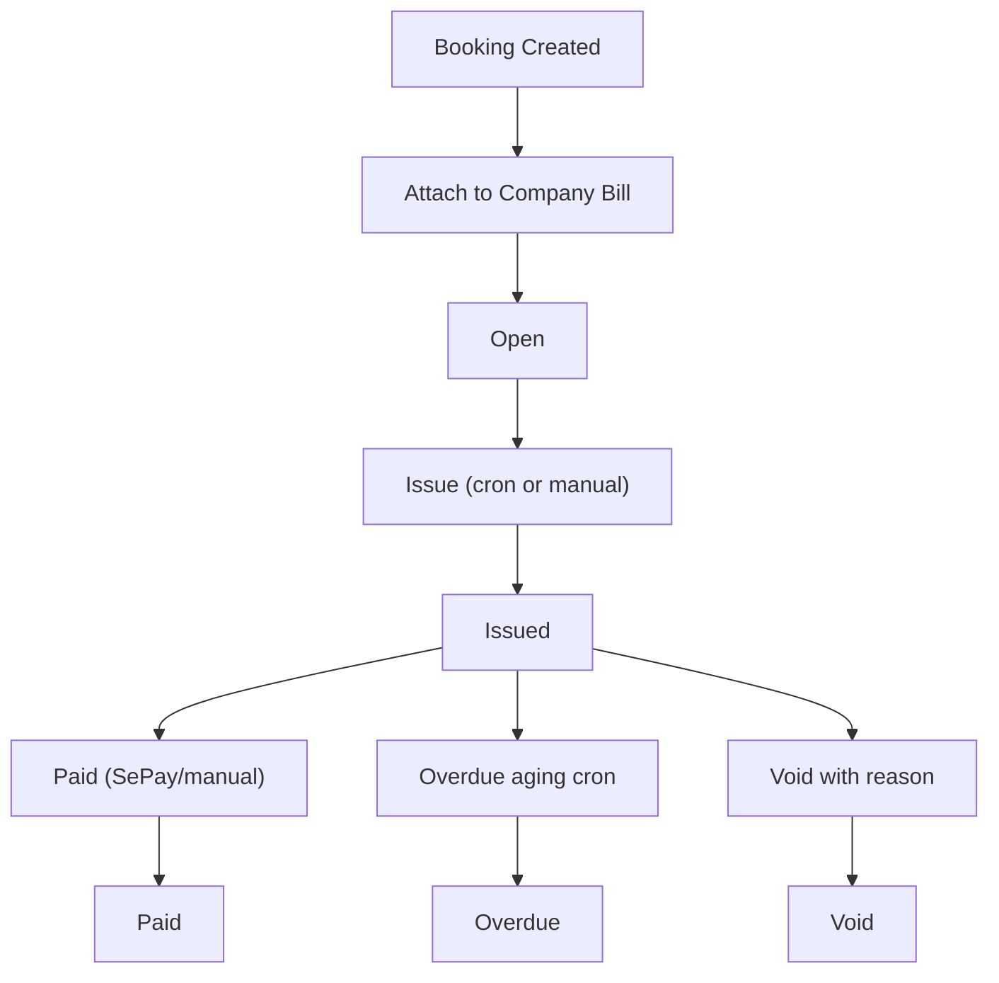

# Revised Plan — Open Bill B2B (v3)

## Locked Product Rules

- Open Bill uses a **company-first ownership model**.
- **Venue manager creates the Business Open Bill account and links one or more players; clients do not self-create accounts.**
- Business owners can view/pay statements, but provisioning and player linkage remain manager-controlled.
- Settlement in this release is binary (`issued`, `paid`, `overdue`, `void`) with full audit.

---

## Scope

### In scope (this release)

- `company_accounts` as the only billing owner for Open Bill
- Support both:
  - multi-player business accounts
  - solo accounts (`is_solo = true`) under the same company-first model
- VAT settings, fixed discount, payment terms, credit limit policy
- Statement issue, payment confirm (auto/manual), overdue automation, reminders, manager escalation
- Void flow and audit trail

### Out of scope (deferred)

- Partial payments and line-level dispute settlement
- Overpayment/credit carry-forward ledger
- Full AR ledger roll-forward

---

## Ownership and User Journeys

## Admin / Manager Journey

1. Manager creates a Business Open Bill account in admin.
2. Manager fills company billing profile (name, tax info, VAT mode, terms, discount, billing email).
3. Manager links one or more players to the account.
4. Monthly usage accumulates from linked players under the same bill owner.
5. Manager/staff can issue statements, mark paid, void (with reason), and manage overdue follow-up.

## Business Owner Journey

1. Business owner does **not** create accounts.
2. Business owner receives issued statement (PDF/email/pay link).
3. Business owner pays via transfer/SePay reference.
4. Business owner receives paid/overdue reminders and status updates.

---

## Data Model Updates

## `company_accounts`

- `id`, `venue_id`
- `name`
- `billing_email`
- `tax_id`
- `billing_address`
- `vat_percent` (default 10)
- `price_vat_mode` (`excluded` default, `included`)
- `fixed_discount_amount`
- `payment_terms_days` (nullable, account-level override)
- `open_bill_credit_limit` (nullable)
- `credit_limit_mode` (`warn_only` default / `block`)
- `primary_player_id` (FK players)
- `contact_phone`
- `is_solo` (default false)

## `company_account_players`

- join table linking multiple players to one account

## `company_open_bills`

- ownership: `company_account_id`
- period fields + totals + tax summary + due/paid timestamps
- `status` (`open`, `issued`, `paid`, `overdue`, `void`)
- `notes`
- `voided_at`, `voided_by`, `void_reason`
- `payment_ref`, `invoice_number`, `pdf_url`

## `company_open_bill_events`

- append-only status/event audit log

## Booking linkage

- bookings reference `company_open_bill_id`
- line item projection includes `booker_player_id` + `booker_name` snapshot

---

## Calculation Rules

1. Compute line-item subtotal (cancelled lines displayed as 0).
2. Apply fixed discount.
3. Clamp taxable base to >= 0.
4. Apply VAT:
   - excluded mode: add VAT on top
   - included mode: derive net + VAT split from gross

No partial allocation logic in this release.

---

## Automation and Operations

Required jobs:

- Issue cron on 1st of month
- Daily overdue aging cron
- Reminder cron (pre-due, due-day, overdue)
- Manager escalation notification on overdue transitions

---

## PDF / Statement Rules

For business accounts:

- include company legal/billing block, tax ID, VAT mode/rate
- include subtotal, discount, taxable base, VAT, total
- include line-item **Booker** column for multi-player accounts

For solo accounts:

- same ownership model (`company_accounts`)
- simplified display allowed (optional header suppression), but data model still stores booker identity

---

## Permissions (explicit)

- Manager/superadmin:
  - create/edit company accounts
  - link/unlink players
  - configure billing/tax/terms/limits
  - issue/void/mark paid
- Staff with CourtPass admin access:
  - issue/void/mark paid (per policy)
- Business owner:
  - view/pay statements only
  - cannot create accounts or change player linkage

---

## Migration Strategy

- Migrate from prior player-centric draft to company-first ownership.
- Backfill one account per existing open-bill player where needed.
- Repoint bill ownership and keep compatibility read layer during transition.

---

## Updated Delivery Phases

1. Company-first schema + migration + backfill design
2. Core billing lifecycle + audit + void controls
3. Overdue/reminder/escalation automation
4. Admin UI for account creation + player linkage + bill ops
5. PDF/email updates (business + solo display rules)
6. QA hardening (limits, blocking messages, idempotency)

---

## Effort Delta (vs earlier v2)

- Minor scope clarification only (manager provisioning rule made explicit)
- No major technical delta beyond already selected company-first architecture

Estimated remains within previously stated company-first range.