# CourtMap — Single Venue Edition
## Product Management Specification

**Version:** 1.0  
**Date:** June 12, 2026  
**Product:** CourtMap Single Venue (white-label booking app for one pickleball club)  
**Audience:** Product, design, operations, venue stakeholders  
**Status:** Draft for review

---

## Document Purpose

This specification describes a **simplified CourtMap product** built for **one venue only**. It removes marketplace discovery (maps, search, multi-venue comparison) and focuses on helping a single club sell court time and coaching sessions to its players.

This is a **product management document**. It defines *what* to build and *why*, not *how* to implement it.

**Parent reference:** [COURTMAP_PRODUCT_SPEC.md](./COURTMAP_PRODUCT_SPEC.md) (full multi-venue marketplace)

---

## Table of Contents

1. [Executive Summary](#1-executive-summary)
2. [Scope — In vs Out](#2-scope--in-vs-out)
3. [Problem & Opportunity](#3-problem--opportunity)
4. [Product Principles](#4-product-principles)
5. [User Roles](#5-user-roles)
6. [Information Architecture](#6-information-architecture)
7. [Core User Journeys](#7-core-user-journeys)
8. [Court Booking](#8-court-booking)
9. [Coach Program](#9-coach-program)
10. [Credit System](#10-credit-system)
11. [Payments](#11-payments)
12. [Court Owner / Admin](#12-court-owner--admin)
13. [Trust & Safety](#13-trust--safety)
14. [Notifications](#14-notifications)
15. [Success Metrics](#15-success-metrics)
16. [Product Roadmap](#16-product-roadmap)
17. [Open Questions](#17-open-questions)
18. [Glossary](#18-glossary)

---

## 1. Executive Summary

### What it is

A branded mobile app (and optional web booking page) for **one pickleball venue**. Players open the app and land directly on their club — no searching, no maps, no competing venues.

### What it does

| Capability | Description |
|------------|-------------|
| **Book a court** | Pick date → pick court → pick time slot → pay via bank transfer (VietQR) |
| **Book a coach** | Browse coaches *at this venue* → book session (includes court time) → pay |
| **Manage bookings** | View upcoming and past court bookings and coaching sessions |
| **Buy session credits** | Pre-pay coaching packages with a specific coach at this venue |
| **Run the venue** | Admin dashboard for courts, pricing, bookings, coaches, and reports |

### One-sentence pitch

> *"Your club's own booking app — courts and coaches in one place, no marketplace noise."*

### Product positioning

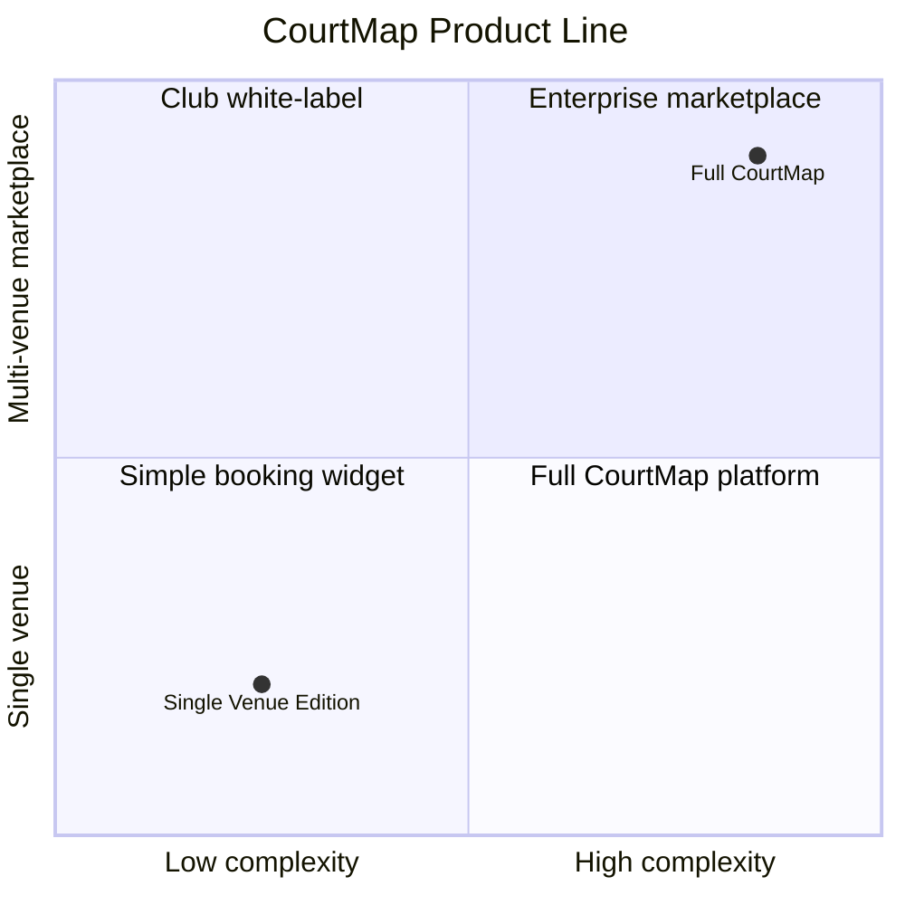

---

## 2. Scope — In vs Out

### ✅ In scope

| Area | Included |
|------|----------|
| **Venue** | One pre-configured venue (name, address, hours, amenities, photos) |
| **Courts** | All courts at that venue with live availability |
| **Pricing** | Time-band pricing, member vs walk-in rates, holiday overrides |
| **Court booking** | Self-serve slot selection and VietQR payment |
| **Coaches** | Coaches affiliated with this venue only |
| **Coach sessions** | 1-on-1 and group sessions (2–4 players) |
| **Credits** | Coach-specific prepaid session packs |
| **Payments** | VietQR bank transfer + payment proof upload |
| **Reviews** | 4-dimension coach ratings after completed sessions |
| **Admin** | Venue dashboard for bookings, courts, coaches, reports |
| **Trust controls** | Phone verification for reviews, booking limits, review visibility rules |

### ❌ Out of scope

| Area | Reason |
|------|--------|
| **Map explore** | Only one venue — no geographic discovery needed |
| **Venue search / filters** | No catalog of 1,000+ venues |
| **Saved venues** | Nothing to save — user is always at their club |
| **Distance / radius sort** | Irrelevant for single venue |
| **Multi-venue coach partnerships** | Coaches belong to this club only |
| **Coach self-registration across venues** | Coach onboarding is venue-managed |
| **AloBo data overlay** | Venue owns its own slot data |
| **Marketplace SEO / discovery** | Not a consumer marketplace |
| **Cross-venue analytics** | Reports scoped to one venue |

### Scope diagram

```
┌─────────────────────────────────────────────────────────────┐
│                    FULL COURTMAP                             │
│  ┌─────────────────────────────────────────────────────┐    │
│  │  Map · Search · 1,976 venues · Saved · Compare      │    │
│  │  ┌───────────────────────────────────────────────┐  │    │
│  │  │     SINGLE VENUE EDITION (this document)     │  │    │
│  │  │  • One venue home                             │  │    │
│  │  │  • Court booking                              │  │    │
│  │  │  • Venue coaches                              │  │    │
│  │  │  • Credits & sessions                         │  │    │
│  │  │  • Venue admin                                │  │    │
│  │  └───────────────────────────────────────────────┘  │    │
│  └─────────────────────────────────────────────────────┘    │
└─────────────────────────────────────────────────────────────┘
```

---

## 3. Problem & Opportunity

### Player pain points

| Pain | How we solve it |
|------|-----------------|
| Booking via Zalo/phone is slow and error-prone | Self-serve slot grid with instant confirmation |
| Coach booking is separate from court booking | One app: book coach + court together |
| No visibility into coach quality | Verified reviews after real sessions |
| Prepaying for lessons is informal | Structured credit packs with clear expiry rules |

### Venue pain points

| Pain | How we solve it |
|------|-----------------|
| Double bookings and manual slot tracking | Centralized availability per court |
| Coach sessions block courts without visibility | All bookings (direct + coach) on one timeline |
| Revenue split between walk-in and coaching is unclear | Reports: direct vs coach-mediated revenue |
| Payment reconciliation is manual | Payment proof workflow with status tracking |

### Opportunity

A single-venue edition is the **fastest path to value** for a club that wants CourtMap's booking and coaching features without building or joining a nationwide marketplace. It can later upgrade to multi-venue if the operator expands.

---

## 4. Product Principles

1. **Club-first** — The venue brand is front and center. The app feels like *their* app, not a generic marketplace.
2. **Zero discovery friction** — Open app → see your club. No search step.
3. **Coach + court in one transaction** — Player pays once; coach handles court fee settlement with the venue offline.
4. **Auto-confirm coach bookings** — No manual accept/decline. Better UX, fewer drop-offs.
5. **Trust by design** — Reviews only from verified players who completed real sessions.
6. **VietQR-native** — Payments match how Vietnamese users already pay (bank transfer + QR).
7. **Start simple, grow later** — Ship court booking first; add coaches and credits in phase 2.

---

## 5. User Roles

### 5.1 Player

Primary mobile user. Books courts and coaching sessions at the club.

| Goal | Key actions |
|------|-------------|
| Play pickleball | Book a court for a date/time |
| Improve skills | Browse venue coaches, book a session |
| Stay organized | View and cancel bookings |
| Save money on coaching | Buy credit packs with a coach |

### 5.2 Coach

Mobile user with a coach account, scoped to **this venue only**.

| Goal | Key actions |
|------|-------------|
| Fill schedule | Set weekly availability on venue courts |
| Earn income | Receive VietQR payments from players |
| Retain players | Sell credit packs, track player history |
| Manage sessions | View today’s schedule, mark sessions complete |

### 5.3 Court Owner / Venue Manager

Web admin user. Manages the venue day-to-day.

| Goal | Key actions |
|------|-------------|
| Maximize occupancy | Manage courts, pricing, slot blocks |
| Oversee coaches | Invite coaches, view coach activity |
| Reconcile payments | Confirm VietQR proofs for court bookings |
| Understand performance | Revenue and utilization reports |

### Role relationship diagram

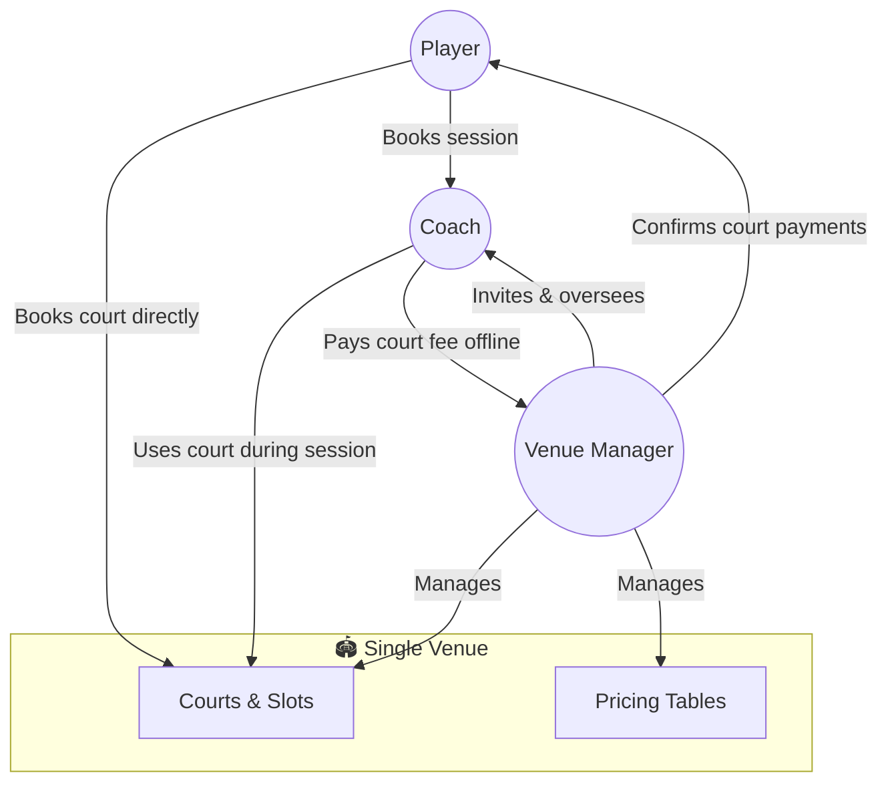

---

## 6. Information Architecture

### 6.1 Player mobile app

No Maps tab. No Saved tab. Home is the venue.

```
┌──────────────────────────────────────────────────┐
│                                                  │
│              [Current Screen Content]            │
│                                                  │
├──────────┬──────────┬───────────┬────────────────┤
│   Book   │  Coaches │ Bookings  │    Profile     │
│   🏓    │   🎓    │    📋    │      👤       │
└──────────┴──────────┴───────────┴────────────────┘
```

| Tab | Purpose |
|-----|---------|
| **Book** | Venue home → court availability → book |
| **Coaches** | List of coaches at this venue → profile → book session |
| **Bookings** | Court bookings + coach sessions (segmented) |
| **Profile** | Name, phone, credits, settings |

### 6.2 Coach mobile app

Same app, different navigation after coach login.

```
┌──────────────────────────────────────────────────┐
│                                                  │
│              [Current Screen Content]            │
│                                                  │
├──────────┬──────────┬───────────┬────────────────┤
│  Today   │ Schedule │  Players  │    Profile     │
│   📅    │   🗓    │    👥    │      ⚙       │
└──────────┴──────────┴───────────┴────────────────┘
```

### 6.3 Venue admin (web)

```
Admin Sidebar
├── Dashboard        ← occupancy, today's timeline
├── Bookings         ← court + coach sessions
├── Courts           ← court list, slot management
├── Coaches          ← roster, invite, deactivate
├── Pricing          ← time bands, member rates
├── Schedule         ← date overrides, blocks
├── Reports          ← revenue, utilization
└── Settings         ← venue info, payment details
```

### 6.4 App entry flow

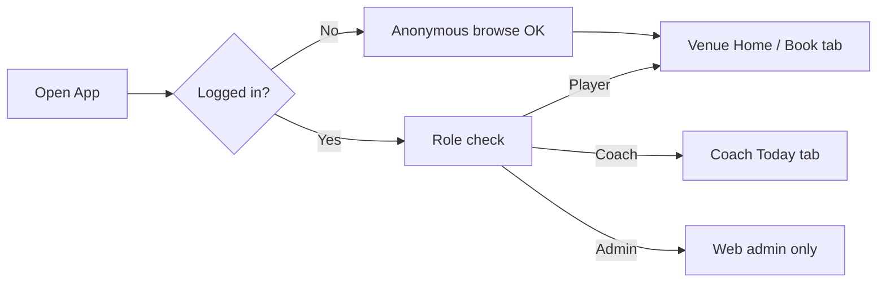

There is **no venue picker**. The app is pre-branded for one club.

---

## 7. Core User Journeys

### 7.1 Journey map — Player

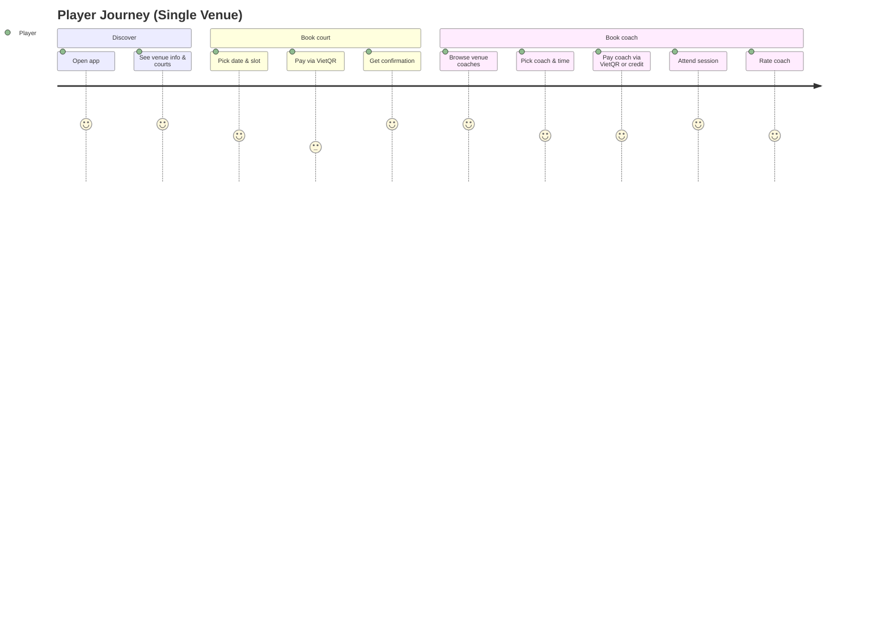

### 7.2 Journey map — Coach

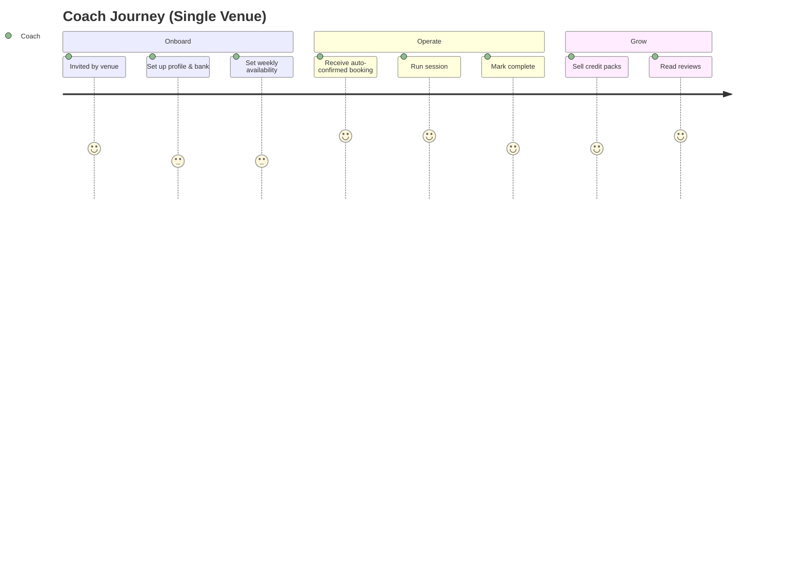

### 7.3 Journey map — Venue Manager

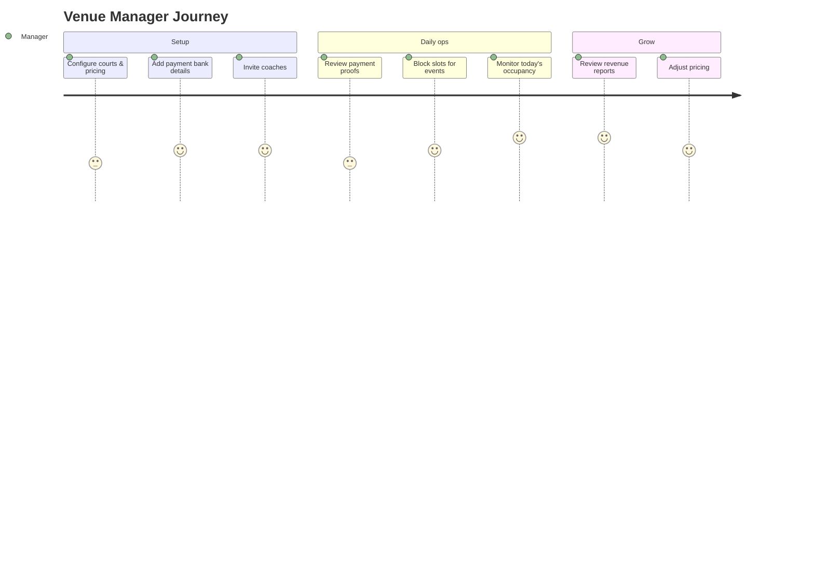

---

## 8. Court Booking

### 8.1 Flow overview

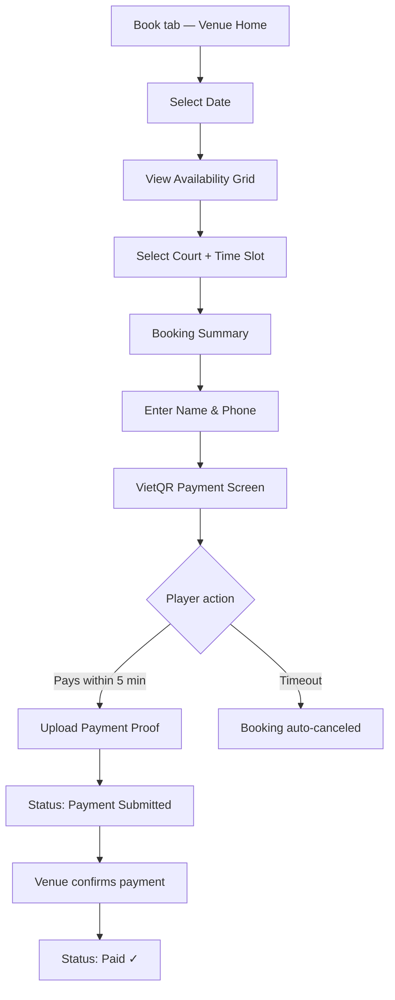

### 8.2 Booking status lifecycle

```
┌─────────┐     ┌───────────────────┐     ┌──────┐
│ pending │────▶│ payment_submitted │────▶│ paid │
└────┬────┘     └───────────────────┘     └──────┘
     │                    │
     │                    │
     ▼                    ▼
┌──────────┐        ┌──────────┐
│ canceled │◀───────│ canceled │
└──────────┘        └──────────┘
  (player/timeout)    (admin reject)
```

| Status | Meaning | Player sees |
|--------|---------|-------------|
| `pending` | Slots reserved, 5-minute payment window | "Complete payment" |
| `payment_submitted` | Proof uploaded, awaiting review | "Verifying payment" |
| `paid` | Confirmed by venue | "Confirmed" |
| `canceled` | Booking voided, slots freed | "Canceled" |

### 8.3 Venue home screen (Book tab)

The first screen players see. No search bar.

```
┌──────────────────────────────────────┐
│  65th Street Pickleball              │
│  ⭐ 4.6 · Open until 22:00           │
│  📍 123 Nguyen Van Linh, Q.7        │
├──────────────────────────────────────┤
│                                      │
│  ── Book a Court ──                  │
│                                      │
│  Select date:  [ Today ▼ ]           │
│                                      │
│  ┌────────────────────────────────┐  │
│  │ Sân 1  │ 07 08 09 10 11 12 ... │  │
│  │ Sân 2  │ 07 08 09 10 11 12 ... │  │
│  │ Sân 3  │ 07 08 09 10 11 12 ... │  │
│  └────────────────────────────────┘  │
│  🟢 Available  ⬛ Booked  🟡 Selected │
│                                      │
├──────────────────────────────────────┤
│  ── Venue Info ──                    │
│  🅿️ Parking · 🚿 Showers · 🏪 Pro shop│
│  [View pricing] [Call venue]         │
│                                      │
├──────────────────────────────────────┤
│  ── Our Coaches ──                   │
│  Coach Nguyen · ⭐ 4.8  [Book →]     │
│  Coach Tran   · ⭐ 4.9  [Book →]     │
│  [See all coaches]                   │
│                                      │
└──────────────────────────────────────┘
```

### 8.4 Court booking rules

| Rule | Detail |
|------|--------|
| Payment deadline | 5 minutes after reservation |
| Slot hold | Slots locked during `pending` |
| Edit booking | Only while `pending` (before payment submitted) |
| Cancel | Player can cancel `pending`; paid bookings per venue policy |
| Member pricing | Shown if venue has member rates configured |

---

## 9. Coach Program

### 9.1 How coaches join (single venue)

Unlike full CourtMap, coaches do **not** browse a national venue catalog. They are onboarded by the venue.

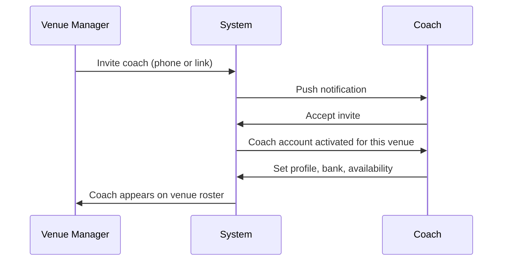

**Removed from single-venue edition:**
- Coach searches venues by radius
- Coach requests partnership with unknown venues
- Coach operates at multiple unrelated venues

### 9.2 Coach discovery (player view)

Coaches tab shows **only coaches at this venue**. Filters are about coaching style, not location.

```
┌──────────────────────────────────────┐
│  Our Coaches                         │
├──────────────────────────────────────┤
│  🔍 Search by name...                │
│                                      │
│  Specialties:                        │
│  [Beginner] [Advanced] [Drills] [Kids]│
│                                      │
│  Sort: ⭐ Rating  💰 Price           │
│                                      │
│  ┌────────────────────────────────┐  │
│  │ Coach Nguyen Van A             │  │
│  │ ⭐ 4.8 · IPTPA Level 2         │  │
│  │ Beginner · Drills              │  │
│  │ From 400,000 VND/h             │  │
│  │ 🟢 Available today             │  │
│  └────────────────────────────────┘  │
│                                      │
│  ┌────────────────────────────────┐  │
│  │ Coach Tran Thi B                 │  │
│  │ ⭐ 4.9 · PPR Certified          │  │
│  │ Advanced · Match Play          │  │
│  │ From 600,000 VND/h             │  │
│  │ Next: Thu Apr 10               │  │
│  └────────────────────────────────┘  │
│                                      │
└──────────────────────────────────────┘
```

### 9.3 Session booking flow

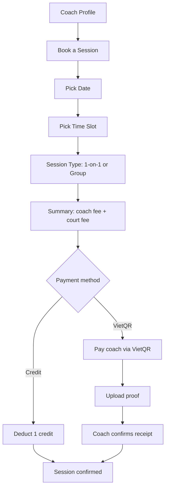

**Key rules:**
- Bookings are **auto-confirmed** on creation (no coach accept/decline step)
- Court is **auto-assigned** from coach availability (player does not pick from full venue grid)
- Player pays **coach fee + court fee** in one amount to the coach
- Coach pays court fee to venue **outside the app**

### 9.4 Session types

| Type | Players | Who pays | Split |
|------|---------|----------|-------|
| **1-on-1** | 1 player | That player | Full coach + court fee |
| **Group** | 2–4 players | Primary booker only | Friends reimburse offline; app shows suggested per-person split |

### 9.5 Coach subscription (platform revenue)

Coaches pay a monthly subscription to appear on the app. No per-session commission.

| Plan | Price | Highlights |
|------|-------|------------|
| **Trial** | Free 30 days | All features, max 10 bookings, then must upgrade |
| **Standard** | 199,000 VND/mo | Unlimited bookings, calendar, notifications |
| **Pro** | 299,000 VND/mo | Priority listing + analytics + Top Coach badge eligibility |

**Lapsed subscription:** Profile hidden, no new bookings, existing confirmed sessions honored.

### 9.6 Rating system

After each completed session, the player rates the coach on **4 dimensions** (1–5 stars each):

| Dimension | Question |
|-----------|----------|
| **On time** | Did the coach start on schedule? |
| **Friendly** | Was the coach approachable? |
| **Professional** | Was the coaching quality high? |
| **Recommend** | Would you recommend this coach? |

Optional written review (150 characters). Overall score = average of 4 dimensions.

---

## 10. Credit System

### 10.1 Overview

Credits are **coach-specific** — credits bought for Coach A only work with Coach A at this venue.

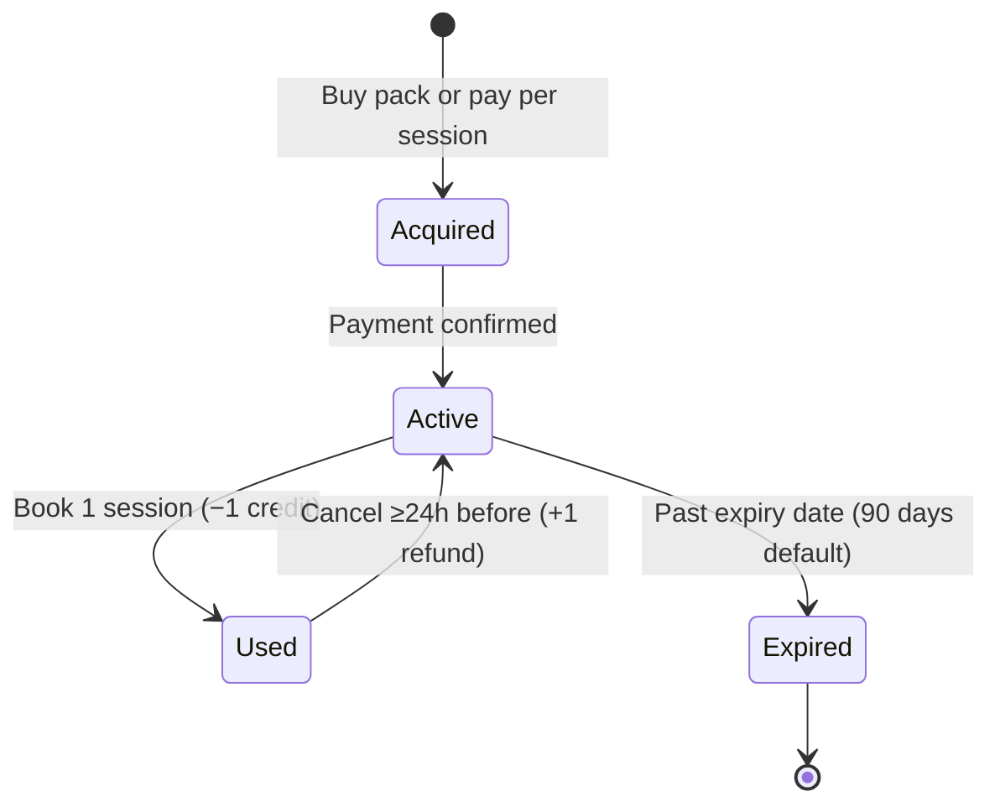

### 10.2 Example credit packs

Coaches set their own packs. Example:

| Pack | Credits | Price (VND) | Per session | Savings |
|------|---------|-------------|-------------|---------|
| Single | 1 | 500,000 | 500,000 | — |
| 5-Pack | 5 | 2,250,000 | 450,000 | 10% |
| 10-Pack | 10 | 4,000,000 | 400,000 | 20% |

### 10.3 Credit rules

| Rule | Policy |
|------|--------|
| Scope | One coach only |
| Refund on cancel | +1 credit if canceled ≥24h before session (coach-configurable) |
| Late cancel | No refund within 24h of session |
| Expiry | 90 days from purchase (coach-configurable, min 30 days) |
| Transfer | Not allowed between players or coaches |
| Cash refund | Never — credits only |

---

## 11. Payments

### 11.1 Two payment lanes

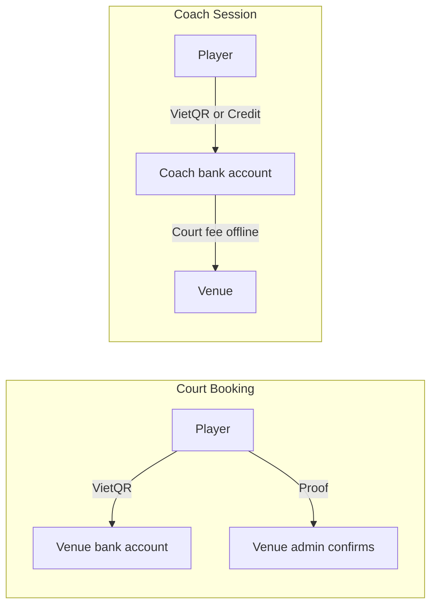

### 11.2 Court booking payment (player → venue)

| Step | Actor | Action |
|------|-------|--------|
| 1 | Player | Books slots, sees total |
| 2 | System | Shows VietQR + bank details + 5-min timer |
| 3 | Player | Transfers via banking app |
| 4 | Player | Taps "I have paid" + uploads screenshot |
| 5 | Venue admin | Reviews and confirms |
| 6 | System | Status → `paid`, player notified |

### 11.3 Coach session payment (player → coach)

| Step | Actor | Action |
|------|-------|--------|
| 1 | Player | Books session, sees coach fee + court fee |
| 2 | Player | Pays via VietQR to **coach's bank** OR uses credit |
| 3 | Player | Uploads proof (if VietQR) |
| 4 | Coach | Confirms receipt in app |
| 5 | Coach | Pays court fee to venue separately (Zalo, cash, etc.) |

### 11.4 Payment not received (coach flag)

If a player claims payment but the coach doesn't see it:

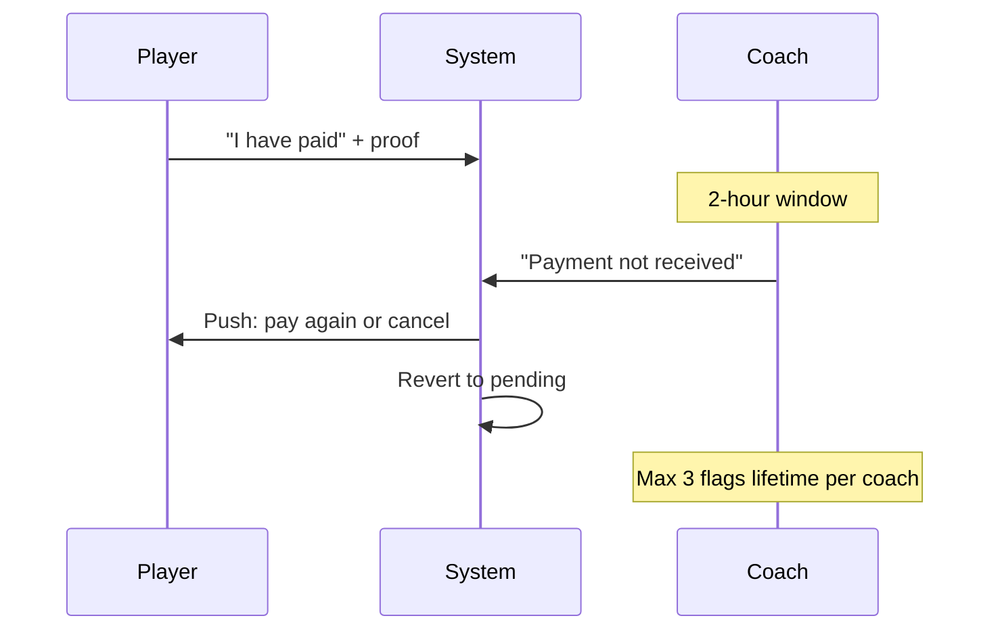

| Rule | Detail |
|------|--------|
| Flag window | 2 hours after player's "I've paid" |
| Max flags | 3 lifetime per coach (abuse prevention) |
| After 2 hours | Payment assumed confirmed |

### 11.5 Payment summary (player view)

```
┌─────────────────────────────────────┐
│         Payment Summary             │
├─────────────────────────────────────┤
│ Coach: Nguyen Van A                 │
│ Date: April 10, 2026               │
│ Time: 18:00 – 19:00                │
│ Court: Sân 1 (auto-assigned)        │
│ Session: 1-on-1                    │
├─────────────────────────────────────┤
│ Coach fee          350,000 VND      │
│ Court fee          150,000 VND      │
│ ─────────────────────────────       │
│ Total              500,000 VND      │
├─────────────────────────────────────┤
│ [Pay with Credit (3 remaining)]     │
│ [Pay with VietQR]                   │
└─────────────────────────────────────┘
```

---

## 12. Court Owner / Admin

### 12.1 Dashboard

Single-venue dashboard. No cross-venue comparison.

```
┌─────────────────────────────────────────────────────────────┐
│  65th Street Pickleball — Dashboard          June 12, 2026  │
├─────────────────────────────────────────────────────────────┤
│                                                             │
│  ┌────────────┐  ┌────────────┐  ┌────────────────────┐    │
│  │ 12         │  │ 85%        │  │ 4,200,000 VND      │    │
│  │ Bookings   │  │ Occupancy  │  │ Revenue today      │    │
│  │ today      │  │ today      │  │                    │    │
│  └────────────┘  └────────────┘  └────────────────────┘    │
│                                                             │
│  Booking sources                                            │
│  Direct (player)     ████████████████████  65%              │
│  Coach-mediated      ██████████            35%              │
│                                                             │
│  Today's timeline — all courts                              │
│  Sân 1  07 08 09 10 11 12 13 14 15 16 17 18 19 20 21       │
│         ██ ██ ██ ░░ ░░ ░░ ░░ ██ ██ ██ ██ ██ ██ ░░ ░░       │
│  Sân 2  07 08 09 10 11 12 13 14 15 16 17 18 19 20 21       │
│         ░░ ██ ██ ██ ░░ ░░ ░░ ░░ ██ ██ ░░ ██ ██ ██ ░░       │
│                                                             │
└─────────────────────────────────────────────────────────────┘
```

### 12.2 Admin capabilities

| Area | Capabilities |
|------|--------------|
| **Bookings** | View all court + coach bookings; filter by status, date, source |
| **Courts** | Add/edit courts, block slots, maintenance holds |
| **Coaches** | Invite, view roster, deactivate, see session counts |
| **Pricing** | Time-band tables, member rates, holiday overrides |
| **Payments** | Review and confirm court booking proofs |
| **Reports** | Daily/monthly revenue, utilization per court, direct vs coach split |
| **Settings** | Venue info, photos, bank details for VietQR |

### 12.3 Coach management flow

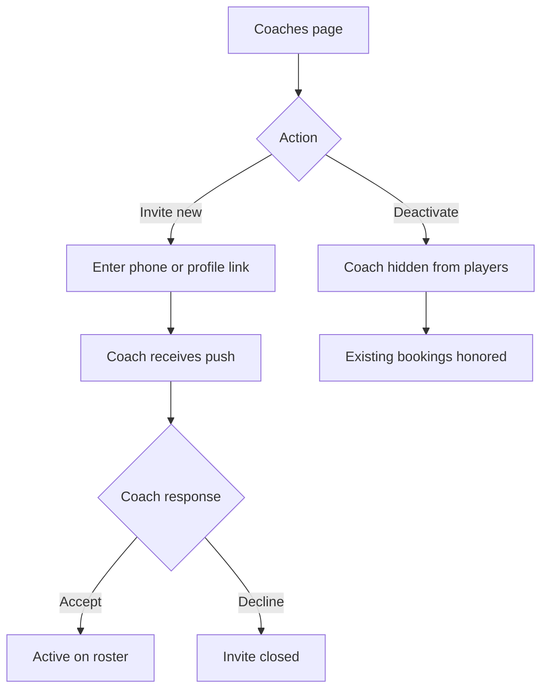

---

## 13. Trust & Safety

### 13.1 Brand promise

> **100% trusted platform** — all public reviews come from verified players who completed real sessions.

### 13.2 Phone verification (at first review)

OTP is **not** required at signup or booking. It triggers the **first time** a player submits a coach rating.

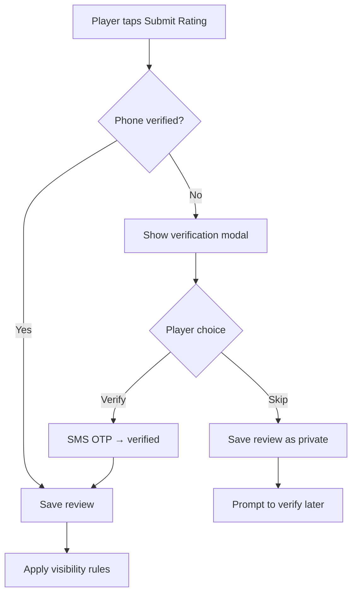

### 13.3 Review visibility (3 sessions rule)

Reviews are **private** until both conditions are met:

1. Player has completed **≥3 paid sessions** with that coach  
2. Player's phone is **verified**

When both are true → all past reviews for that coach go public at once; future reviews are public immediately.

**Before 3 sessions:** Player can still submit ratings (feels heard). UI shows: *"Your review will be visible after your 3rd session. [N of 3 completed]"*

### 13.4 Booking limit

| Rule | Limit |
|------|-------|
| Max coaching hours per player per day | **3 hours** (across all coaches) |
| Counted statuses | `pending` + confirmed |
| Excluded | Canceled sessions |

Error message: *"You can only book up to 3 hours of coaching per day."*

### 13.5 Trust controls summary

| Control | Purpose |
|---------|---------|
| Phone OTP at first review | Prevent fake reviews |
| 3-session visibility threshold | Prevent drive-by ratings |
| Coach payment flag limit (3 lifetime) | Prevent coach abuse |
| Auto-confirm bookings | Reduce friction; trust coach-venue relationship |
| Session completion required to rate | Reviews tied to real attendance |

---

## 14. Notifications

| Event | Recipient | Channel |
|-------|-----------|---------|
| Booking confirmed (court) | Player | Push |
| Payment proof received | Venue admin | Push / email |
| New coach session booked | Coach | Push |
| Payment not confirmed (flag) | Player | Push |
| Session reminder (24h / 1h) | Player + Coach | Push |
| Credit pack purchased | Coach | Push |
| Coach invite received | Coach | Push |
| Subscription expiring | Coach | Push |

**Out of scope for v1:** In-app chat between player and coach.

---

## 15. Success Metrics

### 15.1 North star

**Weekly confirmed bookings** (court + coach sessions) at the venue.

### 15.2 Player metrics

| Metric | Target (example) | Why it matters |
|--------|------------------|----------------|
| Booking completion rate | >70% | Pending → paid conversion |
| Repeat booking rate (30d) | >40% | Retention |
| Coach session attach rate | >15% of active players | Coaching revenue |
| Credit pack purchase rate | >20% of coach bookers | Prepaid commitment |
| Avg review score | >4.2 | Quality signal |

### 15.3 Venue metrics

| Metric | Target (example) | Why it matters |
|--------|------------------|----------------|
| Court utilization | >60% peak hours | Revenue efficiency |
| Direct vs coach revenue mix | Track trend | Coaching program health |
| Payment confirmation time | <2 hours median | Ops friction |
| Admin actions per booking | <1.5 | Automation quality |

### 15.4 Coach metrics

| Metric | Target (example) | Why it matters |
|--------|------------------|----------------|
| Active coaches | Venue-defined | Program scale |
| Sessions per coach per month | >20 | Coach engagement |
| Subscription renewal rate | >80% | Platform revenue |
| Cancellation rate | <5% | Reliability |

### 15.5 Funnel diagram

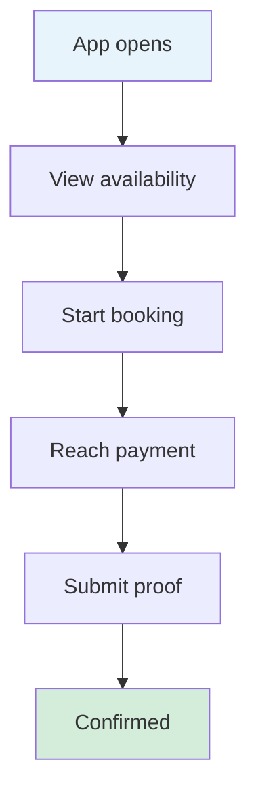

Track drop-off at each step. Biggest expected leak: **payment step** (VietQR friction).

---

## 16. Product Roadmap

Phases are **product milestones**, not engineering sprints.

### Phase 1 — Court booking MVP (Weeks 1–4)

**Goal:** Venue can accept self-serve court bookings.

| Deliverable | User value |
|-------------|------------|
| Branded venue home | Players see their club immediately |
| Slot grid per court | Real-time availability |
| VietQR payment + proof | Familiar payment flow |
| My Bookings | Players track status |
| Admin: courts, pricing, bookings | Venue runs operations |

**Success criteria:** 50+ confirmed court bookings in first month.

### Phase 2 — Coach program (Weeks 5–8)

**Goal:** Venue coaches are bookable in-app.

| Deliverable | User value |
|-------------|------------|
| Coaches tab | Discover venue coaches |
| Session booking (1-on-1 + group) | Coach + court in one flow |
| Coach mobile app (Today, Schedule) | Coaches manage their day |
| Admin: coach invite & roster | Venue controls coach list |
| Auto-confirm + payment to coach | Low-friction booking |

**Success criteria:** 3+ active coaches, 30+ coach sessions/month.

### Phase 3 — Credits & retention (Weeks 9–10)

**Goal:** Players prepay for coaching.

| Deliverable | User value |
|-------------|------------|
| Credit packs per coach | Discounted bulk purchase |
| My Credits dashboard | Balance visibility |
| Cancel → credit refund | Fair cancellation policy |
| Coach earnings view | Coach retention |

**Success criteria:** 20% of coach bookings use credits.

### Phase 4 — Trust, reviews & polish (Weeks 11–12)

**Goal:** Build trust and operational confidence.

| Deliverable | User value |
|-------------|------------|
| 4-dimension ratings | Quality transparency |
| Phone verify + 3-session visibility | Trusted reviews |
| Booking limit (3h/day) | Abuse prevention |
| Revenue reports | Venue insights |
| Push notifications | Timely updates |

**Success criteria:** >10 public reviews per coach, <5% payment disputes.

### Roadmap timeline

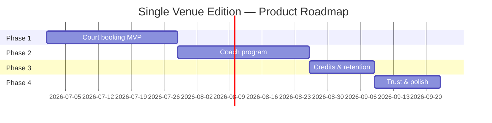

---

## 17. Open Questions

| # | Question | Options | Decision needed by |
|---|----------|---------|-------------------|
| 1 | Coach verification before going live? | Auto-live vs admin approval | Phase 2 kickoff |
| 2 | White-label branding per venue? | Generic CourtMap vs full club branding | Phase 1 |
| 3 | Web booking page for players without app? | Yes (PWA) vs app-only | Phase 1 |
| 4 | Member login / member pricing verification? | Honor system vs member ID check | Phase 1 |
| 5 | In-app messaging (player ↔ coach)? | v2 vs never | Phase 2 |
| 6 | Recurring weekly sessions? | v2 feature | Phase 3 |
| 7 | Vietnamese + English UI? | VI only vs bilingual | Phase 1 |
| 8 | Upgrade path to multi-venue CourtMap? | Same codebase vs separate product | Strategy |

---

## 18. Glossary

| Term | Definition |
|------|------------|
| **Credit** | One prepaid coaching session with a specific coach. |
| **Credit pack** | Bundle of credits at a discount. |
| **Coach fee** | Portion of session price paid to the coach. |
| **Court fee** | Portion covering court rental; coach settles with venue offline. |
| **Session** | Coaching appointment: 1 coach + 1–4 players at a court and time. |
| **Direct booking** | Player books court only, no coach involved. |
| **Coach-mediated booking** | Session booked through a coach (includes court time). |
| **VietQR** | Vietnamese QR standard for bank transfers. |
| **Auto-confirm** | Coach bookings confirmed immediately without manual accept. |
| **Payment proof** | Screenshot of bank transfer uploaded by player. |

---

## Appendix A — Full vs Single Venue Comparison

| Capability | Full CourtMap | Single Venue Edition |
|------------|---------------|----------------------|
| Venues | 1,976+ | **1** |
| Map explore | ✅ | ❌ |
| Venue search | ✅ | ❌ |
| Saved venues | ✅ | ❌ |
| Court booking | ✅ | ✅ |
| Coach marketplace | ✅ (any venue) | ✅ (this venue only) |
| Coach venue partnerships | Self-select + invite | **Invite only** |
| Credit packs | ✅ | ✅ |
| VietQR payments | ✅ | ✅ |
| 4-dimension reviews | ✅ | ✅ |
| Trust & safety rules | ✅ | ✅ |
| Admin dashboard | Multi-venue | **Single venue** |
| AloBo data sync | ✅ | ❌ |
| White-label potential | Low | **High** |

---

## Appendix B — Screen Inventory (Product View)

### Player app

| Screen | Phase | Notes |
|--------|-------|-------|
| Venue Home (Book tab) | 1 | Replaces search + map + venue detail |
| Court Booking Flow | 1 | Date → slots → pay |
| Payment (VietQR) | 1 | Shared pattern for court + coach |
| Bookings (Court + Coach tabs) | 1–2 | Segmented list |
| Coaches List | 2 | Venue coaches only |
| Coach Profile | 2 | Bio, pricing, availability, reviews |
| Session Booking | 2 | Date + time + type on one screen |
| Session Payment | 2 | VietQR or credit |
| My Credits | 3 | Per-coach balances |
| Rate Session | 4 | 4-dimension rating |
| Profile & Settings | 1 | Name, phone, preferences |

### Coach app

| Screen | Phase | Notes |
|--------|-------|-------|
| Today | 2 | Daily sessions + stats |
| Schedule | 2 | Week view + availability editor |
| Players | 3 | List + credits + earnings |
| Profile & Settings | 2 | Bio, pricing, bank, policies |
| Session Detail | 2 | Complete, flag payment |

### Venue admin (web)

| Page | Phase | Notes |
|------|-------|-------|
| Dashboard | 1 | Occupancy + timeline |
| Bookings | 1 | Court + coach filter |
| Courts & Slots | 1 | Existing admin features |
| Coaches | 2 | Roster + invite |
| Pricing & Schedule | 1 | Time bands + overrides |
| Reports | 4 | Revenue + utilization |
| Settings | 1 | Venue info + bank |

**Total screens (approx.):** 22 (vs 31 in full CourtMap)

---

*End of document*
