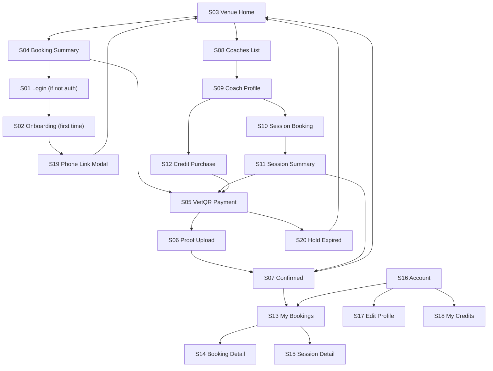

# CourtMap Single Venue -- UI/UX Screen Specification

**Version:** 1.0
**Date:** June 12, 2026
**Purpose:** Figma design handoff. Every screen the player sees, with layout, content, states, and navigation.
**Design target:** Mobile-first responsive web (PWA). Max-width 480px on mobile, fluid up to 1024px desktop.

---

## Table of Contents

1. [Navigation & Shell](#1-navigation--shell)
2. [S01 -- Login](#2-s01----login)
3. [S02 -- Onboarding](#3-s02----onboarding)
4. [S03 -- Venue Home (Book tab)](#4-s03----venue-home-book-tab)
5. [S04 -- Booking Summary](#5-s04----booking-summary)
6. [S05 -- VietQR Payment](#6-s05----vietqr-payment)
7. [S06 -- Payment Proof Upload](#7-s06----payment-proof-upload)
8. [S07 -- Booking Confirmed](#8-s07----booking-confirmed)
9. [S08 -- Coaches List (Coaches tab)](#9-s08----coaches-list-coaches-tab)
10. [S09 -- Coach Profile](#10-s09----coach-profile)
11. [S10 -- Coach Session Booking](#11-s10----coach-session-booking)
12. [S11 -- Coach Session Summary](#12-s11----coach-session-summary)
13. [S12 -- Credit Pack Purchase](#13-s12----credit-pack-purchase)
14. [S13 -- My Bookings (Bookings tab)](#14-s13----my-bookings-bookings-tab)
15. [S14 -- Booking Detail](#15-s14----booking-detail)
16. [S15 -- Coach Session Detail](#16-s15----coach-session-detail)
17. [S16 -- Account (Profile tab)](#17-s16----account-profile-tab)
18. [S17 -- Edit Profile](#18-s17----edit-profile)
19. [S18 -- My Credits](#19-s18----my-credits)
20. [S19 -- Phone Link Prompt (modal)](#20-s19----phone-link-prompt-modal)
21. [S20 -- Hold Expired (inline state)](#21-s20----hold-expired-inline-state)
22. [Design Tokens & Palette](#22-design-tokens--palette)

---

## 1. Navigation & Shell

### Bottom tab bar (persistent, 4 tabs)

```
┌──────────┬──────────┬───────────┬────────────┐
│   Book   │  Coaches │ Bookings  │  Profile   │
│    🏓   │    🎓   │    📋    │    👤     │
└──────────┴──────────┴───────────┴────────────┘
```

| Tab | Route | Requires login |
|-----|-------|---------------|
| Book | `/book` | No (read-only browse) |
| Coaches | `/book/coaches` | No (read-only browse) |
| Bookings | `/book/bookings` | Yes |
| Profile | `/book/account` | Yes |

- Tapping a tab that requires login when unauthenticated redirects to S01 Login with a `returnTo` URL.
- Active tab has a filled icon + accent-color label. Inactive tabs are muted.

### Top bar

```
┌──────────────────────────────────────┐
│  [Venue Logo]  Venue Name       [?]  │
└──────────────────────────────────────┘
```

- Venue logo: 32px circle, loaded from `Venue.logoUrl`.
- Venue name: bold, truncated at ~20 chars.
- `[?]` icon: info/help -- links to venue phone or Zalo.
- No back button on tab root screens. Sub-screens (S04, S09, S14...) show a `<-` back arrow in place of the logo.

---

## 2. S01 -- Login

**Route:** `/book/login`
**Trigger:** Player taps any action requiring auth (Book, Buy, view My Bookings, view Profile).

```
┌──────────────────────────────────────┐
│                                      │
│         [Venue Logo — large]         │
│         Venue Name                   │
│                                      │
│     Sign in to book courts and       │
│     coaching sessions                │
│                                      │
│  ┌──────────────────────────────┐   │
│  │  G  Continue with Google     │   │
│  └──────────────────────────────┘   │
│                                      │
│  ┌──────────────────────────────┐   │
│  │     Continue with Apple     │   │
│  └──────────────────────────────┘   │
│                                      │
│     By continuing you agree to       │
│     Terms of Service & Privacy       │
│                                      │
└──────────────────────────────────────┘
```

**Elements:**
- Venue logo: 80px, centered.
- Two full-width OAuth buttons, Google branded (white bg, Google G icon), Apple branded (black bg, Apple icon).
- Subtitle: muted text, 1-2 lines.
- Legal links: underlined, muted.

**States:**
- Loading after tap: button shows spinner, other button disabled.
- Error: red toast at top "Sign-in failed. Please try again."

---

## 3. S02 -- Onboarding

**Route:** `/book/onboarding`
**Trigger:** First-time OAuth sign-in (no `PlayerAccount` exists yet).

```
┌──────────────────────────────────────┐
│  <- Back                             │
│                                      │
│  Complete your profile               │
│  Just a few details to get started   │
│                                      │
│  Phone number                        │
│  ┌──────────────────────────────┐   │
│  │  +84  │ 0901 234 567        │   │
│  └──────────────────────────────┘   │
│                                      │
│  Gender                              │
│  ┌─────────┐  ┌─────────┐          │
│  │  Male   │  │ Female  │          │
│  └─────────┘  └─────────┘          │
│                                      │
│  Skill level                         │
│  ┌───────────┐ ┌──────────────┐    │
│  │ Beginner  │ │ Intermediate │    │
│  └───────────┘ └──────────────┘    │
│  ┌───────────┐ ┌──────────────┐    │
│  │ Advanced  │ │     Pro      │    │
│  └───────────┘ └──────────────┘    │
│                                      │
│  ┌──────────────────────────────┐   │
│  │       Continue               │   │
│  └──────────────────────────────┘   │
│                                      │
└──────────────────────────────────────┘
```

**Elements:**
- Phone input: country code prefix (+84 default), numeric keyboard.
- Gender: two toggle pills, single select. No "other" -- matches CourtPay Player model.
- Skill level: four toggle pills, single select. Maps to `SkillLevel` enum.
- Continue button: disabled until all three fields filled.

**States:**
- Phone match found: triggers S19 (Phone Link Prompt modal) before proceeding.
- Saving: button shows spinner.
- Error: inline red text below the failing field.

---

## 4. S03 -- Venue Home (Book tab)

**Route:** `/book`
**This is the landing page.** Anonymous access allowed.

```
┌──────────────────────────────────────┐
│  65th Street Pickleball              │
│  Open until 22:00                    │
│  123 Nguyen Van Linh, District 7     │
│                                      │
├──────────────────────────────────────┤
│                                      │
│  Book a Court                        │
│                                      │
│  ◀ Mon Jun 9  Tue Jun 10 [Wed Jun 11]│
│      Thu Jun 12  Fri Jun 13 ▶        │
│                                      │
│  ┌─────┬──────────────────────────┐  │
│  │     │ 08  09  10  11  12  13 →│  │
│  ├─────┼──────────────────────────┤  │
│  │Sân 1│ 🟢  🟢  ⬛  ⬛  🟢  🟢 │  │
│  │Sân 2│ 🟢  ⬛  ⬛  🟢  🟢  🟢 │  │
│  │Sân 3│ ⬛  🟢  🟢  🟢  ⬛  ⬛ │  │
│  │Sân 4│ 🟢  🟢  🟢  🟢  🟢  ⬛ │  │
│  └─────┴──────────────────────────┘  │
│  🟢 Available  ⬛ Booked  🟡 Selected│
│                                      │
├──────────────────────────────────────┤
│                                      │
│  Pricing                             │
│  ┌──────────────────────────────┐   │
│  │ Weekday  08–17   150,000 VND │   │
│  │ Weekday  17–22   250,000 VND │   │
│  │ Weekend  08–22   300,000 VND │   │
│  └──────────────────────────────┘   │
│                                      │
├──────────────────────────────────────┤
│                                      │
│  Our Coaches                         │
│  ┌────────────────────────────────┐ │
│  │ [photo] Coach Nguyen           │ │
│  │ From 400,000 VND/h  [Book ->] │ │
│  └────────────────────────────────┘ │
│  ┌────────────────────────────────┐ │
│  │ [photo] Coach Tran             │ │
│  │ From 600,000 VND/h  [Book ->] │ │
│  └────────────────────────────────┘ │
│  [See all coaches ->]               │
│                                      │
├──────────────────────────────────────┤
│                                      │
│  Venue Info                          │
│  Parking · Showers · Pro shop        │
│  [Call venue]  [Directions]          │
│                                      │
└──────────────────────────────────────┘
```

### Availability grid interaction

| Element | Behavior |
|---------|----------|
| Date selector | Horizontal scrollable strip. Today highlighted. Tap to switch date. Grid reloads. |
| Available cell (green) | Tap to select (turns yellow). |
| Booked cell (dark) | Not tappable. Shows "Booked" tooltip on tap. |
| Selected cell (yellow) | Tap again to deselect. Only one slot selectable at a time. |
| "Book" FAB | Appears fixed at bottom when a slot is selected. Shows court, time, price. Tap to go to S04. |
| Horizontal scroll | Grid scrolls horizontally for hours. Court labels are sticky left column. |

**States:**
- Loading: skeleton grid while API responds.
- No courts: "No bookable courts configured. Contact the venue."
- All booked: all cells dark, no FAB.

### Coach preview section

- Shows top 2-3 coaches, sorted by package price ascending.
- Each card: coach photo (48px circle), name, starting price.
- "Book ->" navigates to S09 (coach profile).
- "See all coaches ->" navigates to Coaches tab (S08).

---

## 5. S04 -- Booking Summary

**Route:** `/book/confirm` (or sheet/modal over S03)
**Trigger:** Player selects a slot and taps the FAB.

```
┌──────────────────────────────────────┐
│  <- Back                             │
│                                      │
│  Booking Summary                     │
│                                      │
│  ┌──────────────────────────────┐   │
│  │ Court       Sân 2            │   │
│  │ Date        Wed, Jun 11      │   │
│  │ Time        18:00 – 19:00    │   │
│  │ Duration    60 min           │   │
│  ├──────────────────────────────┤   │
│  │ Price       250,000 VND      │   │
│  └──────────────────────────────┘   │
│                                      │
│  Cancellation policy: free cancel    │
│  up to 24h before start time.        │
│                                      │
│  ┌──────────────────────────────┐   │
│  │    Confirm & Pay (250,000)   │   │
│  └──────────────────────────────┘   │
│                                      │
└──────────────────────────────────────┘
```

**Elements:**
- Summary card: court label, formatted date, time range, duration, price.
- Cancellation policy text: derived from venue settings (`cancellationHours`).
- Confirm button: full-width, accent color. Shows price. Tapping creates the booking (5-min hold) and navigates to S05.

**States:**
- Not logged in: tapping Confirm redirects to S01 Login with `returnTo`.
- Slot taken (409): red toast "This slot was just booked. Pick another."
- Creating: button spinner.

---

## 6. S05 -- VietQR Payment

**Route:** `/book/pay/:bookingId`
**Trigger:** Booking created with `paymentStatus = pending`.

```
┌──────────────────────────────────────┐
│  <- My Bookings                      │
│                                      │
│  Pay within                          │
│        04:32                         │
│  (countdown timer, large, centered)  │
│                                      │
│  ┌──────────────────────────────┐   │
│  │                              │   │
│  │      [VietQR Code Image]     │   │
│  │         250,000 VND          │   │
│  │                              │   │
│  │  Bank: MB Bank               │   │
│  │  Account: 0123456789         │   │
│  │  Name: NGUYEN VAN A          │   │
│  │  Ref: CF-BK-C5R9WT          │   │
│  │                              │   │
│  └──────────────────────────────┘   │
│                                      │
│  1. Open your banking app            │
│  2. Scan the QR code above           │
│  3. Confirm the transfer             │
│  4. Tap "I have paid" below          │
│                                      │
│  ┌──────────────────────────────┐   │
│  │      I have paid             │   │
│  └──────────────────────────────┘   │
│                                      │
│  [Cancel booking]                    │
│                                      │
└──────────────────────────────────────┘
```

**Elements:**
- Countdown timer: large, center-aligned. Counts down from 5:00. Red color below 1:00.
- QR image: generated by `buildVietQRUrl()`. Centered, ~240px.
- Bank details: text below QR as fallback for manual transfer.
- Payment ref: monospaced, for manual entry if QR fails.
- Step-by-step instructions: numbered list.
- "I have paid" button: navigates to S06.
- "Cancel booking" link: muted, below button. Cancels and returns to S03.

**States:**
- Timer reaches 0:00: transitions to S20 (Hold Expired state).
- Sepay auto-confirm: if payment is auto-confirmed while on this screen, skip S06 and go directly to S07.

---

## 7. S06 -- Payment Proof Upload

**Route:** `/book/pay/:bookingId/proof`
**Trigger:** Player taps "I have paid" on S05.

```
┌──────────────────────────────────────┐
│  <- Back                             │
│                                      │
│  Upload payment proof                │
│                                      │
│  Take a screenshot of your           │
│  banking app showing the transfer.   │
│                                      │
│  ┌──────────────────────────────┐   │
│  │                              │   │
│  │    [Upload area / preview]   │   │
│  │                              │   │
│  │  Tap to select photo         │   │
│  │  or drag & drop              │   │
│  │                              │   │
│  └──────────────────────────────┘   │
│                                      │
│  ┌──────────────────────────────┐   │
│  │      Submit Proof            │   │
│  └──────────────────────────────┘   │
│                                      │
└──────────────────────────────────────┘
```

**Elements:**
- Upload zone: tap opens camera/gallery picker. Shows image preview after selection.
- Submit button: disabled until image selected. Uploads and sets `paymentStatus = proof_submitted`.
- After submit: navigates to S07.

**States:**
- Uploading: progress indicator on the image.
- Error: "Upload failed. Try again."

---

## 8. S07 -- Booking Confirmed

**Route:** `/book/pay/:bookingId/success`
**Trigger:** Proof submitted (or Sepay auto-confirmed).

```
┌──────────────────────────────────────┐
│                                      │
│           ✓                          │
│                                      │
│  Booking confirmed!                  │
│  (or "Payment submitted")            │
│                                      │
│  Court: Sân 2                        │
│  Date: Wed, Jun 11                   │
│  Time: 18:00 – 19:00                │
│                                      │
│  Payment status:                     │
│  ● Verifying (orange)               │
│  or                                  │
│  ● Paid (green)                      │
│                                      │
│  ┌──────────────────────────────┐   │
│  │    View My Bookings          │   │
│  └──────────────────────────────┘   │
│                                      │
│  ┌──────────────────────────────┐   │
│  │    Book Another Court        │   │
│  └──────────────────────────────┘   │
│                                      │
└──────────────────────────────────────┘
```

**Elements:**
- Check icon: large, green, centered.
- Title: "Booking confirmed!" if already paid, "Payment submitted" if proof_submitted.
- Payment status pill: orange "Verifying" or green "Paid".
- Two CTAs: primary "View My Bookings" (to S13), secondary "Book Another Court" (to S03).

---

## 9. S08 -- Coaches List (Coaches tab)

**Route:** `/book/coaches`
**Anonymous access allowed.**

```
┌──────────────────────────────────────┐
│  Our Coaches                         │
│                                      │
│  🔍 Search by name...               │
│                                      │
│  Sort: [Price ↑]  [Name A-Z]        │
│                                      │
│  ┌──────────────────────────────┐   │
│  │ [photo]                      │   │
│  │ Coach Nguyen Van A           │   │
│  │ Beginner · Drills            │   │
│  │ From 400,000 VND/h           │   │
│  │ 15 sessions completed        │   │
│  └──────────────────────────────┘   │
│                                      │
│  ┌──────────────────────────────┐   │
│  │ [photo]                      │   │
│  │ Coach Tran Thi B             │   │
│  │ Advanced · Match Play        │   │
│  │ From 600,000 VND/h           │   │
│  └──────────────────────────────┘   │
│                                      │
│  ┌──────────────────────────────┐   │
│  │ [photo]                      │   │
│  │ Coach Le Van C               │   │
│  │ Kids · Beginner              │   │
│  │ From 350,000 VND/h           │   │
│  └──────────────────────────────┘   │
│                                      │
└──────────────────────────────────────┘
```

**Elements:**
- Search: text input, filters by coach name.
- Sort pills: toggle between Price and Name.
- Coach cards: photo (56px circle), name, specialties (tags), starting price, session count.
- Tap card: navigates to S09.

**States:**
- Loading: skeleton cards.
- No coaches: "No coaches available at this venue."

---

## 10. S09 -- Coach Profile

**Route:** `/book/coaches/:coachId`
**Anonymous access allowed.**

```
┌──────────────────────────────────────┐
│  <- Back                             │
│                                      │
│  ┌──────────────────────────────┐   │
│  │  [Coach Photo — large hero]  │   │
│  │                              │   │
│  │  Coach Nguyen Van A          │   │
│  │  Beginner · Drills · Kids    │   │
│  └──────────────────────────────┘   │
│                                      │
│  About                               │
│  Certified IPTPA Level 2 coach with  │
│  5 years of experience...            │
│                                      │
├──────────────────────────────────────┤
│                                      │
│  Session Packages                    │
│                                      │
│  ┌──────────────────────────────┐   │
│  │ 1-on-1 Private               │   │
│  │ 60 min · 500,000 VND         │   │
│  │                [Book ->]     │   │
│  └──────────────────────────────┘   │
│                                      │
│  ┌──────────────────────────────┐   │
│  │ Group Session (2-4 players)  │   │
│  │ 90 min · 800,000 VND         │   │
│  │                [Book ->]     │   │
│  └──────────────────────────────┘   │
│                                      │
├──────────────────────────────────────┤
│                                      │
│  Credit Packs         [See all ->]  │
│                                      │
│  ┌────────┐ ┌────────┐ ┌────────┐  │
│  │ 1x     │ │ 5x     │ │ 10x    │  │
│  │500,000 │ │2,250k  │ │4,000k  │  │
│  │        │ │10% off │ │20% off │  │
│  │ [Buy]  │ │ [Buy]  │ │ [Buy]  │  │
│  └────────┘ └────────┘ └────────┘  │
│                                      │
└──────────────────────────────────────┘
```

**Elements:**
- Hero: coach photo (full-width or large circle), name, specialty tags.
- Bio: `StaffMember.coachBio`, expandable if long.
- Session Packages: list of `CoachPackage` records. Each shows type, duration, price, "Book" CTA.
- Credit Packs: horizontal scroll of buy options. Each shows session count, total price, discount %. "Buy" CTA.
- "Book" on a package: navigates to S10.
- "Buy" on a credit pack: navigates to S12 (or triggers login first if anonymous).

---

## 11. S10 -- Coach Session Booking

**Route:** `/book/coaches/:coachId/book?packageId=...`
**Requires login.**

```
┌──────────────────────────────────────┐
│  <- Back                             │
│                                      │
│  Book with Coach Nguyen              │
│  1-on-1 Private · 60 min            │
│                                      │
│  Select date                         │
│  ◀ Mon 9  Tue 10  [Wed 11] Thu 12 ▶ │
│                                      │
│  Available times                     │
│  ┌──────┐ ┌──────┐ ┌──────┐        │
│  │08:00 │ │09:00 │ │10:00 │        │
│  └──────┘ └──────┘ └──────┘        │
│  ┌──────┐ ┌──────┐ ┌──────┐        │
│  │14:00 │ │15:00 │ │16:00 │        │
│  └──────┘ └──────┘ └──────┘        │
│  ┌──────┐                           │
│  │18:00 │  (greyed out = busy)      │
│  └──────┘                           │
│                                      │
│  Selected: Wed Jun 11, 14:00–15:00   │
│  Court: auto-assigned               │
│                                      │
│  ┌──────────────────────────────┐   │
│  │       Continue               │   │
│  └──────────────────────────────┘   │
│                                      │
└──────────────────────────────────────┘
```

**Elements:**
- Package summary: name, type, duration at top.
- Date strip: same horizontal scroll as S03.
- Time slots: grid of available hours. Greyed-out = coach busy. Tappable to select (highlight).
- Selection summary: shows formatted date, time range, "Court: auto-assigned."
- Continue: navigates to S11.

**States:**
- No availability on date: "Coach is fully booked on this date. Try another day."
- Loading slots: skeleton pills.

---

## 12. S11 -- Coach Session Summary

**Route:** `/book/coaches/:coachId/confirm`
**Requires login.**

```
┌──────────────────────────────────────┐
│  <- Back                             │
│                                      │
│  Session Summary                     │
│                                      │
│  ┌──────────────────────────────┐   │
│  │ Coach       Nguyen Van A     │   │
│  │ Package     1-on-1 Private   │   │
│  │ Date        Wed, Jun 11      │   │
│  │ Time        14:00 – 15:00    │   │
│  │ Court       Sân 1 (auto)     │   │
│  ├──────────────────────────────┤   │
│  │ Session fee    500,000 VND   │   │
│  │ ─────────────────────        │   │
│  │ Total          500,000 VND   │   │
│  └──────────────────────────────┘   │
│                                      │
│  ┌──────────────────────────────┐   │
│  │  Pay with Credit (3 left)   │   │
│  └──────────────────────────────┘   │
│                                      │
│  ┌──────────────────────────────┐   │
│  │  Pay with VietQR (500,000)  │   │
│  └──────────────────────────────┘   │
│                                      │
└──────────────────────────────────────┘
```

**Elements:**
- Summary card: coach name, package, date, time, court, price breakdown.
- Two payment options:
  - "Pay with Credit": shown only if player has remaining credits for this coach. Shows count. Tap deducts credit atomically and goes to S07.
  - "Pay with VietQR": always shown. Tap creates lesson and goes to S05 (VietQR Payment, same screen reused for coach sessions).
- If no credits: only VietQR button shown.

**States:**
- Credit spend fails (exhausted): red toast "No credits remaining."
- Slot conflict: "This time slot is no longer available."

---

## 13. S12 -- Credit Pack Purchase

**Route:** `/book/coaches/:coachId/buy-credits?packageId=...`
**Requires login.**

```
┌──────────────────────────────────────┐
│  <- Back                             │
│                                      │
│  Buy Credit Pack                     │
│                                      │
│  ┌──────────────────────────────┐   │
│  │ Coach       Nguyen Van A     │   │
│  │ Pack        5 sessions       │   │
│  │ Price       2,250,000 VND    │   │
│  │ Savings     10%              │   │
│  │ Expires     90 days          │   │
│  └──────────────────────────────┘   │
│                                      │
│  Credits can only be used with       │
│  Coach Nguyen Van A at this venue.   │
│  No refunds. Expires 90 days after   │
│  payment confirmation.               │
│                                      │
│  ┌──────────────────────────────┐   │
│  │  Pay with VietQR (2,250,000) │   │
│  └──────────────────────────────┘   │
│                                      │
└──────────────────────────────────────┘
```

**Elements:**
- Pack details: coach, session count, total price, discount %, expiry policy.
- Policy text: non-refundable, coach-specific, expiry.
- Pay button: creates `PlayerCoachCredit` with `paymentStatus = pending` and navigates to S05 (VietQR, reused).

---

## 14. S13 -- My Bookings (Bookings tab)

**Route:** `/book/bookings`
**Requires login.**

```
┌──────────────────────────────────────┐
│  My Bookings                         │
│                                      │
│  [Court Bookings]  [Coach Sessions]  │
│                                      │
│  ── Upcoming ──                      │
│                                      │
│  ┌──────────────────────────────┐   │
│  │ Sân 2 · Wed, Jun 11         │   │
│  │ 18:00 – 19:00               │   │
│  │ 250,000 VND   ● Verifying   │   │
│  └──────────────────────────────┘   │
│                                      │
│  ┌──────────────────────────────┐   │
│  │ Sân 1 · Fri, Jun 13         │   │
│  │ 08:00 – 09:00               │   │
│  │ 150,000 VND   ● Paid        │   │
│  └──────────────────────────────┘   │
│                                      │
│  ── Past ──                          │
│                                      │
│  ┌──────────────────────────────┐   │
│  │ Sân 3 · Mon, Jun 2          │   │
│  │ 10:00 – 11:00               │   │
│  │ 150,000 VND   ● Completed   │   │
│  └──────────────────────────────┘   │
│                                      │
└──────────────────────────────────────┘
```

**Elements:**
- Segment control: "Court Bookings" / "Coach Sessions" toggle.
- Sections: "Upcoming" (startTime >= now, status confirmed), "Past" (startTime < now or completed/cancelled).
- Booking card: court label, date, time, price, payment status pill.
- Tap card: navigates to S14 (court) or S15 (coach session).

**Payment status pills:**
| Status | Color | Label |
|--------|-------|-------|
| pending | yellow | Pending payment |
| proof_submitted | orange | Verifying |
| paid | green | Paid |
| null (admin) | green | Confirmed |

**Coach Sessions sub-tab** shows the same layout but with coach name + package name instead of court label.

**States:**
- Empty: "No bookings yet. Book a court to get started!"
- Loading: skeleton cards.

---

## 15. S14 -- Booking Detail

**Route:** `/book/bookings/:id`
**Requires login.**

```
┌──────────────────────────────────────┐
│  <- Back                             │
│                                      │
│  Court Booking                       │
│                                      │
│  ┌──────────────────────────────┐   │
│  │ Court       Sân 2            │   │
│  │ Date        Wed, Jun 11      │   │
│  │ Time        18:00 – 19:00    │   │
│  │ Duration    60 min           │   │
│  │ Price       250,000 VND      │   │
│  │ Status      Confirmed        │   │
│  │ Payment     ● Verifying      │   │
│  └──────────────────────────────┘   │
│                                      │
│  Payment ref: CF-BK-C5R9WT          │
│                                      │
│  ┌──────────────────────────────┐   │
│  │  Cancel Booking              │   │
│  └──────────────────────────────┘   │
│                                      │
│  Free cancellation until Jun 10,     │
│  18:00 (24h before start).           │
│                                      │
└──────────────────────────────────────┘
```

**Elements:**
- Detail card: all booking fields.
- Cancel button: red outline, only shown if cancellation policy allows.
- Policy text: calculated from venue `cancellationHours`.

**States:**
- Cancel window passed: button hidden, text "Cancellation window has passed."
- Already cancelled: grey status pill, no cancel button.
- Cancel confirmation: modal "Are you sure? This cannot be undone." [Keep] [Cancel]

---

## 16. S15 -- Coach Session Detail

**Route:** `/book/bookings/session/:id`
**Requires login.**

```
┌──────────────────────────────────────┐
│  <- Back                             │
│                                      │
│  Coach Session                       │
│                                      │
│  ┌──────────────────────────────┐   │
│  │ Coach       Nguyen Van A     │   │
│  │ Package     1-on-1 Private   │   │
│  │ Date        Wed, Jun 11      │   │
│  │ Time        14:00 – 15:00    │   │
│  │ Court       Sân 1            │   │
│  │ Price       500,000 VND      │   │
│  │ Status      Confirmed        │   │
│  │ Payment     ● Paid (credit)  │   │
│  └──────────────────────────────┘   │
│                                      │
│  ┌──────────────────────────────┐   │
│  │  Cancel Session              │   │
│  └──────────────────────────────┘   │
│                                      │
└──────────────────────────────────────┘
```

Same layout as S14 but with coach info. Payment pill shows "(credit)" or "(VietQR)".

---

## 17. S16 -- Account (Profile tab)

**Route:** `/book/account`
**Requires login.**

```
┌──────────────────────────────────────┐
│  My Account                          │
│                                      │
│  ┌──────────────────────────────┐   │
│  │  [Google/Apple avatar — 64px]│   │
│  │  Nguyen Van A                │   │
│  │  nguyen@gmail.com            │   │
│  │  +84 901 234 567             │   │
│  │  Male · Intermediate         │   │
│  │                  [Edit ->]   │   │
│  └──────────────────────────────┘   │
│                                      │
│  ┌──────────────────────────────┐   │
│  │  My Credits              ->  │   │
│  │  3 sessions remaining        │   │
│  └──────────────────────────────┘   │
│                                      │
│  ┌──────────────────────────────┐   │
│  │  My Bookings             ->  │   │
│  │  2 upcoming                  │   │
│  └──────────────────────────────┘   │
│                                      │
│  ┌──────────────────────────────┐   │
│  │  Sign Out                    │   │
│  └──────────────────────────────┘   │
│                                      │
└──────────────────────────────────────┘
```

**Elements:**
- Profile card: avatar (from Google/Apple), name, email, phone, gender, skill level.
- "Edit" navigates to S17.
- Quick links: My Credits (S18), My Bookings (S13).
- Sign Out: clears NextAuth session, returns to S03.

---

## 18. S17 -- Edit Profile

**Route:** `/book/account/edit`
**Requires login.**

```
┌──────────────────────────────────────┐
│  <- Back                             │
│                                      │
│  Edit Profile                        │
│                                      │
│  Name                                │
│  ┌──────────────────────────────┐   │
│  │  Nguyen Van A                │   │
│  └──────────────────────────────┘   │
│                                      │
│  Phone                               │
│  ┌──────────────────────────────┐   │
│  │  +84 901 234 567             │   │
│  └──────────────────────────────┘   │
│                                      │
│  Gender                              │
│  ┌─────────┐  ┌─────────┐          │
│  │ [Male]  │  │ Female  │          │
│  └─────────┘  └─────────┘          │
│                                      │
│  Skill Level                         │
│  ┌───────────┐ ┌──────────────┐    │
│  │ Beginner  │ │[Intermediate]│    │
│  └───────────┘ └──────────────┘    │
│  ┌───────────┐ ┌──────────────┐    │
│  │ Advanced  │ │     Pro      │    │
│  └───────────┘ └──────────────┘    │
│                                      │
│  ┌──────────────────────────────┐   │
│  │        Save Changes          │   │
│  └──────────────────────────────┘   │
│                                      │
└──────────────────────────────────────┘
```

Same field types as S02 but pre-filled. Email is shown read-only (from OAuth, not editable).

---

## 19. S18 -- My Credits

**Route:** `/book/account/credits`
**Requires login.**

```
┌──────────────────────────────────────┐
│  <- Back                             │
│                                      │
│  My Credits                          │
│                                      │
│  ┌──────────────────────────────┐   │
│  │ Coach Nguyen Van A           │   │
│  │ 3 of 5 sessions remaining    │   │
│  │ ████████░░░░  60%            │   │
│  │ Expires: Sep 11, 2026        │   │
│  │ Payment: ● Paid              │   │
│  └──────────────────────────────┘   │
│                                      │
│  ┌──────────────────────────────┐   │
│  │ Coach Tran Thi B             │   │
│  │ 1 of 1 session remaining     │   │
│  │ ████████████  100%           │   │
│  │ Expires: Jul 20, 2026        │   │
│  │ Payment: ● Verifying         │   │
│  └──────────────────────────────┘   │
│                                      │
│  ── Expired ──                       │
│                                      │
│  ┌──────────────────────────────┐   │
│  │ Coach Le Van C (expired)     │   │
│  │ 0 of 10 sessions remaining   │   │
│  │ Expired: May 1, 2026         │   │
│  └──────────────────────────────┘   │
│                                      │
└──────────────────────────────────────┘
```

**Elements:**
- Credit card per coach: coach name, usage bar, remaining/total, expiry date, payment status.
- Expired credits shown greyed out at bottom.
- Empty state: "No credits purchased yet."

---

## 20. S19 -- Phone Link Prompt (modal)

**Trigger:** During S02 onboarding, entered phone matches an existing Player.

```
┌──────────────────────────────────────┐
│                                      │
│  ┌──────────────────────────────┐   │
│  │                              │   │
│  │  Account found               │   │
│  │                              │   │
│  │  A player account with       │   │
│  │  phone 0901 234 567 already  │   │
│  │  exists.                     │   │
│  │                              │   │
│  │  Would you like to link your │   │
│  │  Google account to it?       │   │
│  │                              │   │
│  │  ┌────────────────────────┐ │   │
│  │  │   Yes, link accounts   │ │   │
│  │  └────────────────────────┘ │   │
│  │                              │   │
│  │  ┌────────────────────────┐ │   │
│  │  │   No, create new       │ │   │
│  │  └────────────────────────┘ │   │
│  │                              │   │
│  └──────────────────────────────┘   │
│                                      │
└──────────────────────────────────────┘
```

**Elements:**
- Bottom sheet or centered modal with overlay.
- Shows matched phone number.
- "Yes, link accounts": merges PlayerAccount to existing Player, refreshes JWT, continues.
- "No, create new": keeps the new Player record, saves profile, continues.

---

## 21. S20 -- Hold Expired (inline state)

**Trigger:** Countdown on S05 reaches 0:00, or player returns to an expired hold.

```
┌──────────────────────────────────────┐
│                                      │
│           ⏱ Expired                  │
│                                      │
│  Your payment window has expired.    │
│  The slot is now available for       │
│  others to book.                     │
│                                      │
│  ┌──────────────────────────────┐   │
│  │    Book Again                │   │
│  └──────────────────────────────┘   │
│                                      │
└──────────────────────────────────────┘
```

**Elements:**
- Clock icon, "Expired" label.
- Explanation text.
- "Book Again": returns to S03 (Venue Home).

---

## 22. Design Tokens & Palette

### Target aesthetic

Mobile-first, clean, modern. White/light background for the player portal (contrasts with the dark admin panel). The venue brand color can be injected per deployment.

### Suggested palette

| Token | Value | Usage |
|-------|-------|-------|
| `--bg-primary` | `#FFFFFF` | Page background |
| `--bg-surface` | `#F5F5F5` | Cards, input backgrounds |
| `--bg-surface-hover` | `#EBEBEB` | Card hover/press |
| `--text-primary` | `#1A1A1A` | Headings, body |
| `--text-secondary` | `#737373` | Subtitles, muted text |
| `--accent` | `#7C3AED` | Primary buttons, selected states, links (purple, matches CourtFlow brand) |
| `--accent-hover` | `#6D28D9` | Button hover |
| `--success` | `#10B981` | Paid, available, confirmed |
| `--warning` | `#F59E0B` | Verifying, pending |
| `--danger` | `#EF4444` | Expired, error, cancel |
| `--border` | `#E5E5E5` | Card borders, dividers |

### Typography

| Element | Size | Weight |
|---------|------|--------|
| Page title | 24px | 700 |
| Section heading | 18px | 600 |
| Card title | 16px | 600 |
| Body | 14px | 400 |
| Caption / muted | 12px | 400 |
| Button label | 16px | 600 |

### Spacing

- Page padding: 16px horizontal.
- Card padding: 16px.
- Card gap: 12px.
- Section gap: 24px.
- Button height: 48px (touch target).
- Bottom tab bar height: 56px + safe area inset.

### Component notes

| Component | Notes |
|-----------|-------|
| Date strip | Horizontal scroll, pill-shaped day items, today highlighted with accent border |
| Availability grid | Sticky left column (court labels), horizontally scrollable time columns, cell size ~48x48px |
| Toggle pills | Border style when unselected, filled accent when selected |
| Payment status pill | Small rounded badge, color-coded per status table above |
| VietQR image | 240px square, centered, loaded from vietqr.io URL |
| OAuth buttons | Follow Google/Apple brand guidelines exactly (colors, logo placement, minimum size) |
| Bottom sheet modal | For S19 link prompt, 8px top radius, overlay 50% black |

---

## Screen Flow Map


