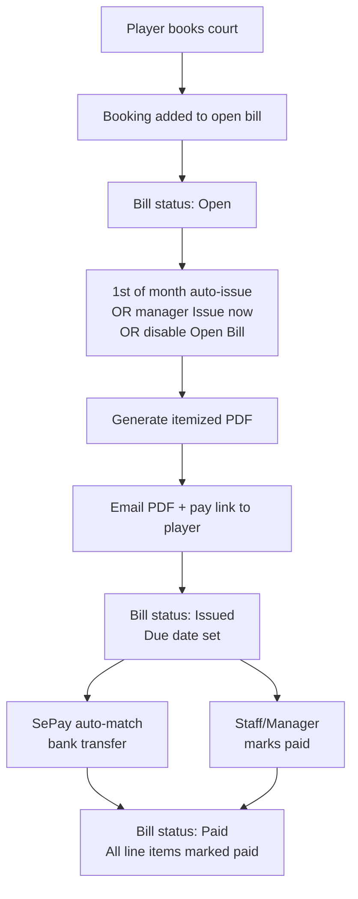

# Open Bill Client Accounts — Product Specification

**Version:** 1.0  
**Last updated:** 7 July 2026  
**Status:** Approved for development (pending client sign-off)

---

## 1. Summary

Open Bill is a deferred-payment mode for selected **Player accounts** in CourtPass. Typical clients are external coaches, academies, or other regular renters who book court time throughout the month and pay **once** at month-end instead of after each booking.

The venue **Manager** enables Open Bill on a player profile. That player books courts normally in CourtPass without immediate payment. Bookings accumulate on a monthly statement. At month-end (automatically on the 1st, or on demand), the system generates an **itemized PDF**, emails it to the client, and collects payment via **VietQR / SePay** or **manual bank transfer** confirmed by venue staff.

This feature applies to **court bookings only**. It is not linked to internal staff coaches, coach lessons, or open play.

---

## 2. Who is involved

| Role | Responsibility |
|------|----------------|
| **Player (Open Bill client)** | Books courts via CourtPass; receives monthly statement; pays the consolidated bill |
| **Manager** | Enables/disables Open Bill on a player profile; can issue statements manually; can mark bills paid |
| **Staff (with CourtPass admin access)** | Can issue statements and mark bills paid (same as manager for payment actions) |
| **System (cron)** | Auto-issues statements on the 1st of each month for the previous period |

**Important:** Staff members and internal coaches are **not** the billed party. Billing is always to the **Player account** (e.g. an academy or external coach operating as a business client).

---

## 3. Agreed business rules

| Topic | Decision |
|-------|----------|
| **Who books** | The player themselves via CourtPass (self-service) |
| **Who enables Open Bill** | Manager (admin panel → CourtPass Players → player profile) |
| **What is billed** | Court bookings only |
| **Payment methods** | VietQR / SePay auto-match **and** manual transfer + staff/manager confirmation |
| **Statement format** | Itemized (one line per booking); PDF generated and emailed to client |
| **Auto-issue** | Yes — statements auto-issued on the **1st of each month** for the closed period (configurable per venue) |
| **Running balance** | Player sees current-month total in CourtPass while the bill is still open |
| **First bill period** | If Open Bill is enabled mid-month, the first period **starts from the enable date** (not the 1st of the month) |
| **Cancelled bookings** | Remain on the statement as a **0 VND line** (not removed) |
| **Overdue blocking** | **Off by default**; venue can enable blocking new bookings after N days unpaid (default: 14 days) |
| **Who can mark paid** | Manager, superadmin, and staff with CourtPass admin access |
| **Scope** | Per-player flag only — any player can be an Open Bill client; not tied to coach/staff records |

---

## 4. Enabling an Open Bill client

### 4.1 Turn on

1. Manager opens **Admin → CourtPass Players** and selects the player.
2. Manager toggles **“Open Bill client”** on the player profile.
3. System records when and by whom it was enabled.
4. From that moment, new court bookings by this player skip per-booking payment and attach to the current open bill.

### 4.2 Turn off (close account)

When the manager **disables** Open Bill:

1. System checks whether there is an **open** bill with bookings for this player at this venue.
2. **If there are bookings:** the system **immediately issues** the statement (PDF + email + payment reference), same as month-end. The manager sees a confirmation before disabling: *“This will issue and email the current statement immediately.”*
3. **If the open bill is empty:** the empty bill is removed; nothing is sent.
4. `Open Bill client` is set to **off**.
5. **Future bookings** follow the normal pay-per-booking flow (VietQR, 5-minute hold, etc.).

This ensures no balance is left unbilled when an account is closed.

---

## 5. Booking experience (player)

### 5.1 Normal player vs Open Bill client

| Step | Normal player | Open Bill client |
|------|---------------|------------------|
| Select court, date, time | Same | Same |
| Confirm booking | VietQR + 5 min payment hold | **No payment** — booking confirmed immediately |
| Court reserved | After payment or hold | **Immediately** |
| Email | Pay-now link | Booking confirmed only (no pay link) |
| Booking status | Pending payment → Paid | **On account** (billed monthly) |

### 5.2 What the player sees in CourtPass

- **My bookings:** each open-bill booking shows **“On account”** instead of “Pay now”.
- **Open Bill page** (new section under account):
  - Current period label (e.g. “July 2026” or “15 Jul – 31 Jul 2026” for a partial first month)
  - List of bookings on the current bill (court, date, time, amount)
  - **Running total** for the month so far
  - History of past statements (status, PDF download, pay link when unpaid)

### 5.3 Overdue block (optional, venue setting)

If the venue enables **“Block new bookings if unpaid”** and the player has an unpaid statement past the due date by more than **N days** (default 14):

- New court bookings are **rejected** with a clear message to contact the venue.
- Default: **blocking is off** — players can keep booking even with an old unpaid bill.

---

## 6. Monthly bill lifecycle

### 6.1 Bill statuses

| Status | Meaning |
|--------|---------|
| **Open** | Month in progress; bookings still accumulating |
| **Issued** | Statement sent; payment due |
| **Paid** | Full amount received and confirmed |
| **Overdue** | Past due date and still unpaid (used for blocking logic if enabled) |

### 6.2 When a statement is issued

A statement is generated when **any** of these happen:

1. **Automatic:** 1st of each month (cron) for all Open Bill clients with an open bill for the **previous** period.
2. **Manual:** Manager or staff clicks **“Issue statement now”** on the player profile.
3. **Account closure:** Manager disables Open Bill and there are unbilled bookings.

### 6.3 Statement contents (PDF + email)

Each statement includes:

| Section | Content |
|---------|---------|
| Header | Venue name, logo, bank details |
| Bill to | Player name, phone, email |
| Period | Start and end dates (e.g. 1 Jul 2026 – 31 Jul 2026, or partial month from enable date) |
| Line items | One row per booking: date, court, time slot, duration, amount |
| Cancelled bookings | Shown with **0 VND** (line kept for audit) |
| Total | Sum of non-cancelled lines |
| Payment | Single transfer reference (e.g. `CF-OB-XXXXXX`), VietQR, due date |
| Footer | Venue contact details |

The PDF is attached or linked in the email sent to the player. A copy can be downloaded from the admin panel and the player portal.

### 6.4 First period (mid-month enable)

Example: Open Bill enabled on **15 July 2026**.

- First bill period: **15 Jul – 31 Jul 2026** (not 1 Jul – 31 Jul).
- Bookings from 15 Jul onward attach to this bill.
- On **1 August**, this bill is auto-issued (if auto-issue is on).
- The **next** open bill starts **1 Aug – 31 Aug 2026** (full calendar month).

---

## 7. Payment

### 7.1 Single payment per statement

The client pays **one amount** for the whole month, not per booking.

- **Payment reference:** one code per statement (e.g. `CF-OB-XXXXXX`) for bank transfer matching.
- **VietQR:** player opens pay page from email or portal; scans QR for the **total** amount.

### 7.2 SePay auto-confirmation

If the venue has SePay auto-payment enabled:

- Incoming transfer matching the statement reference and amount (within tolerance) marks the bill **Paid** automatically.
- All bookings on that statement are marked paid at once.

### 7.3 Manual confirmation

If auto-match does not apply or the client paid outside SePay:

- Manager or staff (with CourtPass access) opens the statement in admin.
- Clicks **Mark paid**, enters method (cash, transfer, etc.), optional reference and proof.
- Bill and all linked bookings are marked paid.

### 7.4 Proof upload

Player can upload payment proof from the pay page (same pattern as existing bookings). Statement stays **Issued** until staff/manager confirms.

---

## 8. Venue settings — Open Bill setup

New tab under **Admin → General Settings → Open Bill** (per venue):

| Setting | Default | Description |
|---------|---------|-------------|
| **Auto-issue on 1st of month** | On | Generate and email statements automatically on the 1st for the previous period |
| **Payment due (days)** | 7 | Days after issue until payment is due |
| **Block new bookings if unpaid** | Off | Prevent new court bookings when overdue |
| **Block after (days)** | 14 | Only if blocking is on — days after due date before blocking applies |

---

## 9. Manager / staff workflows

### 9.1 CourtPass Players — player detail

When **Open Bill client** is enabled:

- **Badge** “Open Bill” on player header and list (optional).
- **Running total** for the current open period.
- **Issue statement now** button.
- **Bill history** table: period, total, status, issued date, paid date, PDF download, Mark paid.

When disabled:

- Confirmation modal before closing account (triggers immediate issue if balance exists).

### 9.2 Permissions

| Action | Manager | Superadmin | Staff (CourtPass admin access) |
|--------|---------|------------|-------------------------------|
| Enable / disable Open Bill on player | Yes | Yes | No |
| Issue statement manually | Yes | Yes | Yes |
| Mark statement paid | Yes | Yes | Yes |
| Configure Open Bill venue settings | Yes | Yes | Yes (if admin access) |

---

## 10. Example scenario

**Client:** Academy “Pickle Pro” (Player account with email).

1. **1 July** — Manager enables Open Bill on Pickle Pro’s profile.
2. **July** — Pickle Pro books Court 2 twenty-five times (1 hour each) via CourtPass. Each booking shows “On account”. Running total in portal: e.g. 12,500,000 VND.
3. **1 August 00:00** — System auto-issues July statement: 25 line items, total 12,500,000 VND, PDF emailed with VietQR and ref `CF-OB-A1B2C3`.
4. **3 August** — Academy transfers 12,500,000 VND with the reference. SePay marks bill Paid; all 25 bookings marked paid.
5. **Alternative:** Transfer without auto-match → staff marks paid in admin with transfer ref.

**Mid-month close example:**

- Open Bill enabled 10 July; 8 bookings by 20 July.
- Manager disables Open Bill on 20 July → system immediately issues statement for 10–20 July (8 lines), emails PDF, then turns off Open Bill.
- Next booking by that player requires normal upfront payment.

---

## 11. Out of scope (v1)

- Coach lessons, open play, or staff-created bookings as a separate flow (unless booked under the same Open Bill player account via portal).
- Linking Open Bill to internal staff/coach records (`coachStaffId`).
- Per-booking VietQR for Open Bill clients.
- Mobile staff app changes (admin PWA + player portal only for v1).
- Automatic blocking of new bookings when overdue (available as opt-in setting only).

---

## 12. Implementation phases (estimate)

| Phase | Deliverable | Estimate |
|-------|-------------|----------|
| 1 | Database + core booking logic (open bill attachment, no pay at booking) | 1–2 days |
| 2 | Manager toggle + disable/close flow with immediate issue | 1 day |
| 3 | Statement issue: itemized PDF + email | 1.5 days |
| 4 | Payment: SePay + manual mark paid + player pay page | 1 day |
| 5 | Admin UI: player profile, bill history, settings tab | 1.5 days |
| 6 | Player portal: on-account status, running balance, history | 1 day |
| 7 | Auto-issue cron (1st of month) + translations (EN/VI) | 0.5 day |

**Total:** approximately **6–8 working days**

---

## 13. Sign-off checklist

Please confirm before development starts:

- [ ] Open Bill is per **Player account**, managed by **Manager**, billed to the **player/client**.
- [ ] **Court bookings only**; player self-books in CourtPass.
- [ ] **Auto-issue on 1st**; **itemized PDF + email**; **SePay + manual** payment.
- [ ] **First period starts on enable date** if mid-month.
- [ ] **Cancelled bookings = 0 VND line** on statement.
- [ ] **Disable Open Bill** → immediate issue if balance exists.
- [ ] **Overdue block** optional, default off, 14-day threshold configurable in General Settings.
- [ ] **Mark paid:** Manager + staff with CourtPass admin access.

---

*Document prepared for client review. Implementation will begin after sign-off.*
