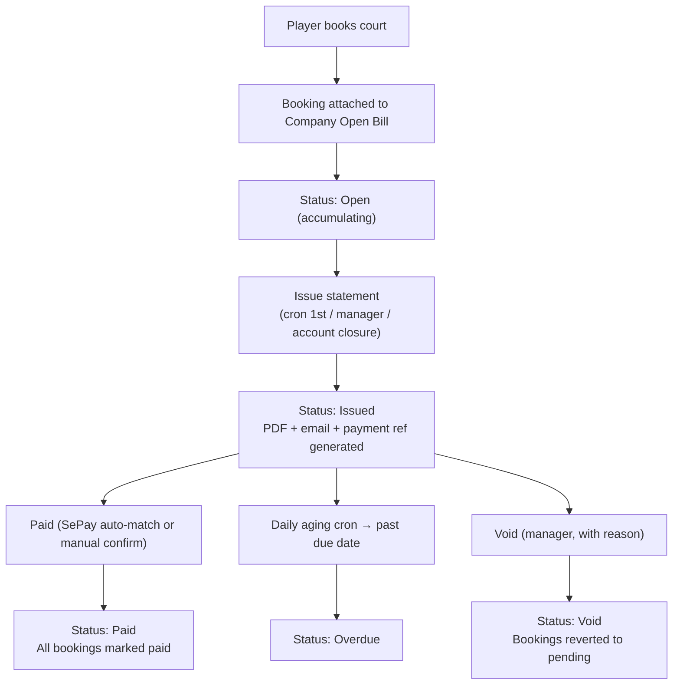

# Open Bill Client Accounts — Product Specification

**Version:** 2.0 (B2B)
**Last updated:** 9 July 2026
**Status:** Approved for development

---

## 1. Summary

Open Bill is a deferred-payment mode for business and individual clients in CourtPass. Typical clients are external academies, coaches booking regularly, or any business client who prefers to pay once at month-end rather than per-booking.

CourtPass uses a **company-first ownership model**: billing is owned by a **Company Account**, not directly by a player. A single company account can have multiple linked players. Solo external coaches are a degenerate case of the same model with simplified display.

**Important: the venue Manager creates Company Accounts and links players. Clients do not self-register.**

This feature applies to **court bookings only**.

---

## 2. Who is involved

| Role | Responsibility |
|------|----------------|
| **Manager / Superadmin** | Creates company accounts, links/unlinks players, configures billing terms, issues statements, marks bills paid, voids bills |
| **Staff (with CourtPass admin access)** | Can issue statements and mark bills paid (same as manager for payment actions) |
| **Player (Open Bill client)** | Books courts normally via CourtPass; bookings are automatically added to the company's open bill; receives and pays consolidated monthly statement |
| **System (cron)** | Auto-issues statements on the 1st of each month for all open bills from the previous period (when venue setting enabled) |

---

## 3. Locked Product Rules

- **Manager provisions everything.** Company accounts and player linkages are created and maintained exclusively by the venue manager. Clients cannot self-create accounts.
- **Company-first ownership.** Every bill is owned by a `company_account`, not a player. Multiple players can be linked to one account (e.g. a whole academy).
- **Solo players use the same model.** An external coach with a solo account gets a `company_account` record with `is_solo = true`. The PDF and admin UI suppress the company/VAT fields for solo accounts.
- **Binary settlement.** Payment status is `open → issued → paid` (or `overdue` if late, `void` if cancelled). Partial payments and credit carry-forward are out of scope for this version.
- **Court bookings only.** Open Bill does not apply to coach lessons, open play, or staff-created sessions.

---

## 4. Account types

### 4.1 Business Account

Used for companies, academies, or any entity with billing identity:

- Company name, Tax ID, billing address, billing email
- VAT % (default 10%) and VAT mode (excluded = added on top, included = derived from gross)
- Fixed discount applied per statement (e.g. regular client discount in VND)
- Multiple linked players — each player's bookings accumulate under the same statement
- Statement PDF includes legal/billing block, VAT breakdown, and a **Booker** column for line-item reconciliation (showing which player made each booking)

### 4.2 Solo Player Account

Used for individual external coaches:

- Account name = player name
- No tax ID, no billing address, no VAT
- Single linked player
- Statement PDF uses simplified layout (no company block, no Booker column, no VAT)

---

## 5. Booking experience (player)

| Step | Normal player | Open Bill client |
|------|---------------|------------------|
| Select court, date, time | Same | Same |
| Confirm booking | VietQR + 5 min hold | **No payment** — confirmed immediately |
| Court reserved | After payment/hold | **Immediately** |
| Booking status | Pending → Paid | **On account** |
| CourtPass display | Pay now link | "On account · Added to {Account Name}" |

### Overdue block (optional, venue setting)

If the venue enables **"Block bookings when overdue"**, players on an account with an overdue unpaid statement will see an error at booking time and must contact the venue. Default: off.

---

## 6. Monthly bill lifecycle

### 6.1 Bill statuses

| Status | Meaning |
|--------|---------|
| **Open** | Month in progress; bookings still accumulating |
| **Issued** | Statement generated; payment due |
| **Paid** | Full amount received and confirmed |
| **Overdue** | Past due date, still unpaid; triggers optional block |
| **Void** | Cancelled by manager (reason required) |

### 6.2 When a statement is issued

1. **Automatic:** 1st of each month (cron) for all open bills from the previous period (venue setting: `autoIssueOnFirst`, default on)
2. **Manual:** Manager or staff clicks **"Issue statement now"**
3. **Account closure:** Manager deactivates the company account — any open bill with bookings is immediately issued before closure

### 6.3 Statement contents (PDF)

| Section | Business Account | Solo Account |
|---------|-----------------|--------------|
| Header | Venue name, logo, address, tax ID | Same |
| Bill To | Company name, Tax ID, billing address, contact | Player name, contact |
| Period | Start – end dates | Same |
| Line items (per booking) | Date, Court, Time, **Booker name**, Amount | Date, Court, Time, Amount |
| Cancelled bookings | 0 ₫ line (kept for audit) | Same |
| Totals | Subtotal, Fixed Discount, Taxable Base, VAT%, VAT Amount, **Total Due** | Subtotal, **Total Due** |
| Payment | Reference (CF-OB-XXXXXX), bank details, due date | Same |

---

## 7. B2B financial calculations

Calculation order per statement:

1. **Subtotal** — sum of non-cancelled booking prices
2. **Fixed Discount** — subtract fixed amount (clamped: discount ≤ subtotal)
3. **Taxable Base** — subtotal − discount (minimum 0)
4. **VAT** — applied based on mode:
   - `excluded` (default): `vatAmount = taxableBase × vatPercent / 100`; `total = taxableBase + vatAmount`
   - `included`: `vatAmount = taxableBase − taxableBase / (1 + vatPercent/100)`; `total = taxableBase`

For **solo accounts**: VAT is always 0; total = subtotal − discount.

---

## 8. Payment

### 8.1 Payment reference

Each issued statement gets a unique reference: `CF-OB-XXXXXX` (6 alphanumeric characters).

### 8.2 SePay auto-confirmation

If the venue has SePay enabled, incoming transfers matching the reference and amount (±5,000 ₫ tolerance) automatically mark the bill **Paid** and all linked bookings paid.

### 8.3 Manual confirmation

Manager or staff (with CourtPass admin access) opens the statement in the admin panel, clicks **Mark Paid**, selects method (cash, transfer, etc.) and optionally adds a note.

---

## 9. Manager / Staff workflows

### 9.1 Admin → Open Bill Accounts

New top-level admin page at `Admin → Open Bill Accounts`:

- Lists all company accounts for the venue
- Shows current open bill running balance and any issued/overdue amounts
- **Create** new account (company or solo)
- **Edit** account details (billing info, VAT, discount, payment terms)
- **Link / Unlink** players by Player ID
- Per-bill actions: Issue, Mark Paid, Void, Download PDF

### 9.2 Account closure flow

When a manager deactivates an account:
1. If the current open bill has any bookings → system issues it immediately (same as month-end)
2. If the open bill is empty → it is voided silently
3. Account status = inactive; existing bills remain accessible for audit

### 9.3 Permissions

| Action | Manager | Superadmin | Staff (CourtPass admin access) |
|--------|---------|------------|-------------------------------|
| Create / edit company accounts | ✓ | ✓ | ✗ |
| Link / unlink players | ✓ | ✓ | ✗ |
| Issue statement | ✓ | ✓ | ✓ |
| Mark statement paid | ✓ | ✓ | ✓ |
| Void statement | ✓ | ✓ | ✗ |
| Configure venue Open Bill settings | ✓ | ✓ | ✓ |
| Download PDF | ✓ | ✓ | ✓ |

---

## 10. Venue settings (Admin → General Settings → Open Bill)

| Setting | Default | Description |
|---------|---------|-------------|
| **Auto-issue on 1st of month** | On | Generate and email statements automatically on the 1st |
| **Payment due (days)** | 7 | Days after issue until payment is due |
| **Block bookings when overdue** | Off | Prevent new bookings when account has overdue balance |
| **Block after (days)** | 14 | Days after due date before blocking applies |

Account-level **Payment Terms (days)** override the venue default when set.

---

## 11. Example scenarios

### 11.1 Business account (academy)

1. **Manager** creates "Pickle Pro Academy" company account with Tax ID, 10% VAT excluded, 500,000 ₫ fixed discount.
2. Manager links two players: **Coach A** and **Coach B**.
3. During July: Coach A books 15 courts; Coach B books 10 courts.
4. **1 August**: Cron auto-issues July statement. Statement shows 25 line items with a Booker column, subtotal X, discount 500,000 ₫, taxable base Y, VAT 10%, **Total Due Z**, payment ref `CF-OB-A1B2C3`.
5. Academy transfers total with reference. SePay auto-matches → bill Paid, all 25 bookings marked paid.

### 11.2 Solo external coach

1. Manager creates solo account "Nguyen Van A" (is_solo = true), links player Nguyen Van A.
2. Coach books 20 courts in August.
3. 1 September: Statement issued with 20 lines, no Booker column, no VAT. Total = subtotal.
4. Coach pays via bank transfer; staff marks paid manually.

### 11.3 Mid-month closure

1. Open Bill enabled for "Academy B" on 10 July; 8 bookings by 20 July.
2. Manager deactivates account on 20 July.
3. System immediately issues statement for 10–20 July (8 lines), then sets account inactive.
4. Future bookings by linked players require normal upfront VietQR payment.

---

## 12. Out of scope (v1)

- Partial payments and line-level dispute settlement
- Overpayment / credit carry-forward
- Coach lessons, open play, or staff-created sessions under Open Bill
- Mobile app (RN) changes — admin PWA and player portal only for v1
- Email delivery of PDF (statement generation is implemented; email hook is a TODO)

---

## 13. Implementation phases

| Phase | Deliverable |
|-------|-------------|
| 1 | Database schema (company_accounts, company_open_bills, company_account_players, company_open_bill_events) + migration |
| 2 | Core business logic (issueBill, markBillPaid, voidBill, recalcOpenBill, attachBookingToOpenBill) |
| 3 | Public booking flow: detect open-bill player, skip payment hold, attach to bill |
| 4 | Admin API routes: CRUD accounts, link/unlink players, issue/mark-paid/void/pdf |
| 5 | PDF generation: OpenBillStatementPDF with Booker column and VAT breakdown |
| 6 | SePay handler: CF-OB- prefix matching |
| 7 | Admin UI: Open Bill Accounts page |
| 8 | Cron: daily overdue aging + 1st-of-month auto-issue |
| 9 | Player portal API: /api/public/open-bill |

---

*Document updated for B2B company-first model with manager-controlled provisioning.*
