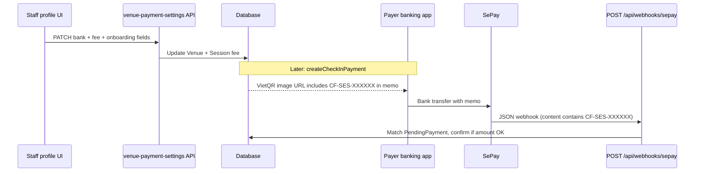

# Staff profile payment block — porting guide (VietQR + SePay, no subscriptions)

This document describes everything the **CourtFlow staff profile** screen uses for **venue payment settings** and how that ties into **VietQR** and **SePay** auto-confirmation. It intentionally **excludes subscription packages, kiosk subscription purchase, and `CF-SUB-*` flows**; only the pieces needed to collect bank details, preview QR, persist settings, create **session** pending payments, and match **SePay** webhooks are covered.

---

## 1. Where it lives in this repo

| Layer | Path |
|--------|------|
| Staff UI (embedded in profile, not a standalone component) | `src/app/(staff)/staff/profile/page.tsx` (payment card ~lines 359–483) |
| Staff API | `src/app/api/staff/venue-payment-settings/route.ts` |
| VietQR URL builder + bank BIN list | `src/lib/vietqr.ts` |
| Pending payment + QR for payer | `src/modules/courtpay/lib/check-in.ts` (`createCheckInPayment`) |
| Payment reference for transfer description | `src/modules/courtpay/lib/payment-reference.ts` |
| SePay webhook HTTP handler | `src/app/api/webhooks/sepay/route.ts` |
| SePay validation + matching logic | `src/modules/courtpay/lib/sepay.ts` |
| Types for webhook JSON | `src/modules/courtpay/types.ts` (`SepayWebhookPayload`) |
| English copy keys | `src/i18n/locales/staff/en.json` under `staff.profile.*` |
| Env | `.env.example` — `SEPAY_WEBHOOK_SECRET` |

There is **no** separate React component file; the block is inline JSX. To reuse elsewhere, extract the **state**, **handlers**, **layout**, and **imports** from that section into your own component.

---

## 2. UI behaviour (what to replicate)

### 2.1 Fields

1. **Session fee (VND)** — numeric text input; display uses thousands separators; internal state is digits-only string.
2. **Bank** — `<select>` of Vietnamese banks; **stored value is the NAPAS BIN** (e.g. `970436` for Vietcombank), not the display name.
3. **Account number** — plain text.
4. **Account holder name** — plain text (VietQR `accountName`).
5. **Automatic payment approval (optional)** — styled subsection with:
   - **Phone** (`autoApprovalPhone`)
   - **CCCD** / citizen ID (`autoApprovalCCCD`)  
   In this codebase these are **persisted on the venue** for onboarding / future automation; they are **not** wired to SePay logic today.

### 2.2 VietQR preview

- After bank BIN + account + fee are present, the UI builds a preview image URL with `buildVietQRUrl` from `@/lib/vietqr`.
- Preview uses a dummy description (`"Preview"`); **production payer QR** must use the real **`paymentRef`** as `description` (see §5).

### 2.3 Save

- `PATCH /api/staff/venue-payment-settings` with JSON body (see §4).
- Loading / success (checkmark) / error states mirror the profile page.

### 2.4 Dependencies (frontend)

- Authenticated `fetch` wrapper (here: `api` from `@/lib/api-client`) sending `Authorization: Bearer <staff JWT>` and `Content-Type: application/json`.
- `venueId` from your session/store (staff must be assigned to that venue).
- Optional: `react-i18next` and the `staff.profile.*` keys; or replace with static strings.

---

## 3. Load path (initial data)

On profile load, the app runs (among other calls):

`GET /api/staff/venue-payment-settings?venueId=<venueId>`

Response shape used by the UI:

```ts
{
  sessionFee: number;
  bankName: string;        // actually BIN
  bankAccount: string;
  bankOwnerName: string;
  autoApprovalPhone?: string;
  autoApprovalCCCD?: string;
}
```

**Important:** `sessionFee` is **not** read from `Venue` directly. The API resolves it from the **latest open `Session`** for the venue, else the **latest closed `Session`** (see route implementation). Bank fields come from `Venue` columns.

---

## 4. API contract — `venue-payment-settings`

**File:** `src/app/api/staff/venue-payment-settings/route.ts`

### Auth

- Uses `requireStaff(request.headers)` — expects the same staff JWT pattern as the rest of the staff app.

### `GET`

- Query: `venueId` (required).
- Ensures staff is assigned to that venue.
- Returns bank fields from `Venue`, onboarding strings from `Venue.settings` JSON (`autoApprovalPhone`, `autoApprovalCCCD`), and `sessionFee` from session logic above.

### `PATCH`

Body (all fields optional except `venueId`):

```ts
{
  venueId: string;
  sessionFee?: number;           // >= 0; updates fee on open or latest closed session
  bankName?: string;             // BIN string
  bankAccount?: string;
  bankOwnerName?: string;
  autoApprovalPhone?: string;
  autoApprovalCCCD?: string;
}
```

- Bank columns map to Prisma `Venue.bankName`, `bankAccount`, `bankOwnerName` (nullable strings).
- Auto-approval fields merge into `Venue.settings` JSON (trimmed; empty string → `null`).

---

## 5. Data model (minimal)

**Venue** (`prisma/schema.prisma`):

- `bankName` — stores **VietQR BIN** (misnamed “bankName” historically).
- `bankAccount`, `bankOwnerName`.
- `settings` (`Json`) — keys `autoApprovalPhone`, `autoApprovalCCCD` (and possibly others).

**Session** (for fee edited in profile):

- `sessionFee` — updated when staff saves `sessionFee` if an open or latest closed session exists.

**PendingPayment** (runtime payer flow, not the profile form):

- `paymentRef` — unique; must appear in bank transfer **content** for SePay matching.
- `amount`, `status`, `venueId`, `checkInPlayerId`, etc.

---

## 6. VietQR — specification used here

**File:** `src/lib/vietqr.ts`

- Builds an image URL: `https://img.vietqr.io/image/{bankBin}-{accountNumber}-compact2.png?amount=...&addInfo={encodedDescription}&accountName=...`
- `description` is truncated to **50 characters** server-side before encoding.
- **`VIETQR_BANKS`** is the canonical list of `{ bin, name }` for the staff `<select>`.

**Session payment QR** (when a player actually pays) is built in `createCheckInPayment`:

- `bankBin` = `venue.bankName`
- `accountNumber` = `venue.bankAccount`
- `accountName` = `venue.bankOwnerName || ""`
- `amount` = pending payment amount
- **`description` = `paymentRef`** (e.g. `CF-SES-AB12CD`) so the payer’s app puts the ref in the transfer memo; SePay then posts that string back in the webhook.

---

## 7. SePay integration (payment-only slice)

### 7.1 Environment

- `SEPAY_WEBHOOK_SECRET` — if set, incoming requests must send the same value in `x-sepay-key` or `Authorization` / `Bearer …`. If unset (local dev), validation is skipped (`validateSepayWebhook` returns `true`).

### 7.2 HTTP endpoint

- **POST** `/api/webhooks/sepay`
- **File:** `src/app/api/webhooks/sepay/route.ts`
- Parses JSON as `SepayWebhookPayload`; uses `content` or falls back to `description` for matching.

### 7.3 Payload shape

From `src/modules/courtpay/types.ts`:

```ts
interface SepayWebhookPayload {
  id: number;
  gateway: string;
  transactionDate: string;
  accountNumber: string;
  subAccount: string | null;
  transferType: string;
  transferAmount: number;
  accumulated: number;
  code: string | null;
  content: string;
  referenceCode: string;
  description: string;
}
```

### 7.4 Matching rules (`processSepayWebhook`)

**File:** `src/modules/courtpay/lib/sepay.ts`

1. `extractPaymentRef(content)` — regex on transfer text for `CF-(SUB|SES)-[A-Z0-9]{6,8}`.
2. For **session-only reuse**, your product only needs **`CF-SES-*`** refs (`generatePaymentRef("session")` / `isSessionRef`).
3. Load `PendingPayment` by `paymentRef`; require `status === "pending"`.
4. Require `payload.transferAmount >= pending.amount`.
5. Mark payment confirmed (`confirmedBy: "sepay"`, `paymentMethod: "vietqr"`), create downstream records (here: `CheckInRecord`), emit realtime event `payment:confirmed`.

**Subscription-specific branch:** when `isSubscriptionRef(ref)` is true, the same file branches for `PlayerSubscription` / `source: "subscription"`. **Omit that branch** in a minimal port if you only support per-session check-in payments.

### 7.5 Generating refs (session)

**File:** `src/modules/courtpay/lib/payment-reference.ts`

- Session refs: `CF-SES-` + random alphanumeric suffix (6 chars, retry on collision).
- `extractPaymentRef` scans the webhook `content` / `description` for that pattern.

---

## 8. Operational checklist for another app

1. **Database:** venue bank BIN + account + owner name; optional JSON settings for phone/CCCD; pending payments table with unique `paymentRef` and amount/status.
2. **Staff auth:** protect GET/PATCH settings routes the same way as `requireStaff`.
3. **Copy UI:** form grid, optional onboarding subsection, QR preview toggle, save button states.
4. **VietQR:** vendor `vietqr.ts` (or equivalent) + bank list; ensure payer QR uses **`paymentRef` as `addInfo`/description**, not `"Preview"`.
5. **Create pending payment:** when a session fee is due, create row + `CF-SES-*` ref + build VietQR URL from venue bank fields (see `createCheckInPayment` with `type: "checkin"`).
6. **SePay:** expose `POST /api/webhooks/sepay` publicly; configure SePay dashboard to send the secret header; verify `transferAmount` and memo parsing.
7. **Manual fallback:** staff confirm/cancel endpoints in this repo (`/api/staff/confirm-payment`, `/api/staff/cancel-payment`) mirror non-SePay flows — copy if you need cash or manual approval.

---

## 9. File copy list (minimal set for “payment integration only”)

| Purpose | File(s) |
|---------|---------|
| VietQR helper | `src/lib/vietqr.ts` |
| Ref generation + parse | `src/modules/courtpay/lib/payment-reference.ts` |
| Create pending + VietQR | `src/modules/courtpay/lib/check-in.ts` — **only** `createCheckInPayment` path with `type: "checkin"` (drop subscription imports/usages if you split the file) |
| Webhook | `src/app/api/webhooks/sepay/route.ts` + `src/modules/courtpay/lib/sepay.ts` (trim subscription branch if desired) |
| Venue settings API | `src/app/api/staff/venue-payment-settings/route.ts` |
| UI reference | `src/app/(staff)/staff/profile/page.tsx` (extract the payment card) |

---

## 10. i18n keys (English) used by the payment card

Under `staff.profile` in `src/i18n/locales/staff/en.json`:

- `paymentSettings`, `sessionFee`, `bankName`, `bankAccount`, `bankOwnerName`
- `autoApprovalSectionTitle`, `autoApprovalPhone`, `autoApprovalPhonePlaceholder`, `autoApprovalCCCD`, `autoApprovalCCCDPlaceholder`
- `paymentSettingsSaved`, `paymentSettingsSaveError`, `savePaymentSettings`

Note: some hint strings in the JSX (QR preview labels, “Fill bank…”) are **hardcoded in English** in `page.tsx`, not in JSON.

---

## 11. Diagram (session payment + SePay)



---

*Generated from the CourtFlow codebase as of the document date; line numbers in source files may shift.*
